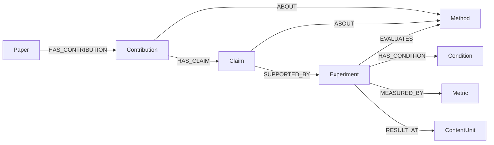
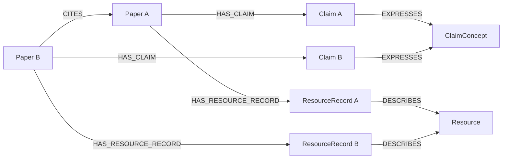
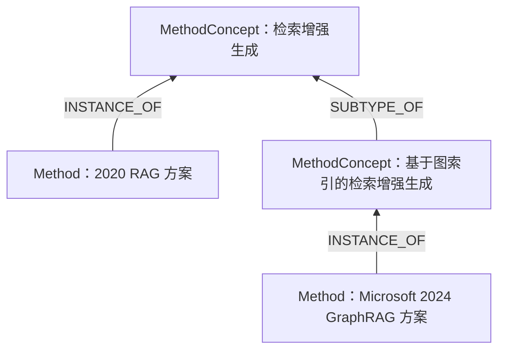

# 论文理解经验 Graph Model

本稿设计一个面向研究 Agent 的论文知识图：保存阅读后形成的理解，通过论文引用、共享方法、资源和命题连接不同论文，让后续研究能够查找、比较和复用已有经验。

采用 Neo4j 的 Labeled Property Graph 模型，统一使用 `Node`、`Relationship`、`Label`、`Type`、`Property` 描述。概念依据见 [Neo4j 图模型](https://neo4j.com/docs/getting-started/appendix/graphdb-concepts/)。

```text
Graph Model
│
├── Node
│    ├── Label
│    └── Property
│
├── Relationship
│    ├── Type
│    └── Property
│
└── Query
     ├── Pattern matching
     ├── Traversal
     └── Path query
```

以下为概念设计，Cypher 仅用于展示结构与查询意图，尚未实施。

## 设计思路

- **保留研究对象及其关系。** 论文中的贡献、主张、方法、实验和依据，以及跨论文联系，共同构成可复用的理解。
- **简化 Property。** 节点保留必要名称、Agent 描述和原文锚点；不以减少节点或关系类型作为精简目标。
- **用 Agent 撰写的描述保存理解。** 图中保留元数据和加工后的理解；已获取的原文整理成 Markdown，摘要、正文和表格等原始内容通过工具按需读取。
- **从论文及其引用逐步入图。** 被引文献尚未获取全文时，可以先凭已知标题建立 Paper 和引用关系，后续再补充材料与理解。
- **围绕跨论文联系组织图。** 同一方法、资源或命题可以连接多篇论文；各论文中的具体说法和使用经验分别保留。
- **按需展开篇内内容。** 不要求每篇论文建立完整内部子图，也不要求抽齐所有节点类型。

Node 按其表达的内容分为：

- 论文与研究内容：`Paper`、`Contribution`、`Method`、`MethodConcept`、`Claim`、`ClaimConcept`。
- 实验与评测：`Experiment`、`Metric`、`Condition`。
- 资源与使用经验：`Resource`、`ResourceRecord`。
- 原文依据：`ContentUnit`。

## Property 的共同约定

每个 Node 有一个 `id` 用于引用，Paper 示例显式列出，其余示例省略。内容属性主要是：

- `text` / `description`：Agent 整理后的主张或描述，可以概括和改写，保留影响含义的条件、版本和局限；Agent 自己的推断在文字中说明。
- `anchor`：指向已处理 Markdown 的原文位置，统一采用 `<文件路径::章节::start:end>`。区间沿用 Markdown 读取工具的定位口径；多处依据可列出多个锚点，示例统一用列表表示。

原文的文字、表格和图片所在位置均使用同一种锚点。来源可沿已连接节点回溯时，不必重复存放。示例文字仅展示表达方式，不代表已有研究结论。

抽取模型、提示词、运行记录等需要复现时保存在实验日志中，本图暂不展开这些工程字段。

## Node

### Paper

一篇论文在图中的入口，可以先只有已知元数据，再随材料获取和阅读补充理解。阅读概述由 Agent 撰写，可包含研究问题、贡献和重要局限。

```cypher
(:Paper {
    id: "<paper_id>",
    title: "<论文标题>",
    year: 2026,
    s2_id: "<Semantic Scholar ID>",
    paper_type: "method",
    description: "<Agent 对论文的概述>",
    markdown_path: "<文件路径>",
    anchor: ["<文件路径::引言::start:end>"],
    arxiv_id: ""
})
```

`id` 是图内论文标识，不依赖是否已获取全文、S2 或 arXiv 记录。`s2_id`、`arxiv_id` 等元数据已知时填写；`paper_type` 可先使用 method / dataset / benchmark / empirical / survey / other。概述中需要核对的内容可通过 `anchor` 定位。

从引用条目中仅获得标题时，也可以先建立节点：

```cypher
(:Paper {
    id: "<paper_id>",
    title: "<引用条目中的论文标题>"
})
```

此时不要求填写 `description`、`markdown_path` 或其他未知属性，也不据标题生成全文阅读结论。标题用于发现和匹配文献，不直接作为唯一 ID；后续确认对应文献并获得材料时，在同一节点上补充信息，保持 `id` 不变。

### Contribution

论文声明的一项贡献，由 Agent 整理其内容与意义，并连接它涉及的方法、资源、实验和具体主张。

```cypher
(:Contribution {
    text: "<Agent 整理后的贡献描述>",
    anchor: ["<文件路径::引言::start:end>"]
})
```

Contribution 回答“这篇论文贡献了什么”；Claim 表达其中可以单独讨论或检查依据的具体主张。例如，“提出方法 M 并改善任务表现”可以连接方法 M，以及描述其效果的 Claim。一项贡献不必同时关联所有类型，也不要求一定有实验支持。

### Method

可以被提出、沿用、扩展或比较的具体方法方案或明确变体。描述保存其主要思想和机制；某篇论文如何使用它，由该论文与方法的关系说明。

```cypher
(:Method {
    name: "<方法名称>",
    description: "<Agent 对方法机制与用途的描述>",
    anchor: ["<文件路径::方法::start:end>"]
})
```

确认指向同一方法时，跨论文共用节点；有实质变化的方法可另建节点并关联其来源。方法方案与可下载的模型、代码资源分别表示，后者属于 Resource。

### MethodConcept

跨论文共享的方法类别，描述一类方法的共同机制和范围。具体 Method 通过 `INSTANCE_OF` 连接到类别，类别之间通过关系表达层级或重叠。

```cypher
(:MethodConcept {
    name: "<方法类别名称>",
    description: "<该类别的共同机制、适用范围与区分边界>"
})
```

例如，“检索增强生成”和“基于图索引的检索增强生成”可作为 MethodConcept；某篇论文提出的具体 RAG 或 GraphRAG 方案属于 Method。类别归属由定义与方法内容确定，可以有多个类别，不要求组织成单一树形。

MethodConcept 的类别层级与 Method 的沿用谱系分别表达：属于同类不自动表示直接改进自另一方法。方法类别和共同命题也有不同含义：

| 具体内容 | 归一化概念 | 两层之间的关系 |
|---|---|---|
| `Method`：具体方案或变体，多篇论文可沿用同一方案 | `MethodConcept`：具有定义的方法类别 | `INSTANCE_OF`：方案属于该类别 |
| `Claim`：某篇论文的具体主张，保留条件和依据 | `ClaimConcept`：跨论文共同表达的完整命题 | `EXPRESSES`：具体说法表达该命题 |

### Claim

Agent 根据一篇论文整理的一条具体主张，保留其适用条件与原文依据。它可以被后续论文的主张参照，也可以连接所讨论的方法、资源及支持实验。

```cypher
(:Claim {
    text: "在本文考察的多跳检索任务中，结构化记忆改善了回答质量。",
    anchor: ["<文件路径::实验结果::start:end>"]
})
```

每篇论文的具体说法分别保存；只有论文的发布声明或作者判断时，在 text 中明确写出。原文锚点支持回看，不单独代表主张已被验证。

### ClaimConcept

跨论文共享的归一化命题，用来关联表达同一命题的 Claim。其 text 由 Agent 归纳，依据通过关联的 Claim 回溯。

```cypher
(:ClaimConcept {
    text: "<保留必要适用范围的共同命题>"
})
```

归并要求命题含义与适用范围相容，不能通过删掉关键条件来制造一致性。仅仅讨论相同主题，不足以连接到同一个 ClaimConcept；无法确认时先保留独立 Claim。

本稿先按“共同命题”设计。若后续需要聚合对同一问题给出不同答案的主张，再讨论 Question / Issue 的表示。

### Resource

可被多篇论文共同使用或讨论的资源，如数据集、基准、代码、模型和工具。

```cypher
(:Resource {
    name: "<资源名称>",
    kind: "dataset",
    url: "<资源地址>",
    description: "<Agent 对资源用途的简要描述>"
})
```

`kind` 可使用 dataset / benchmark / code / model / tool。确认是同一资源时共用节点；同名或共用仓库 URL 不自动视为同一资源。

### ResourceRecord

某篇论文对一个资源的具体描述或使用经验。它将论文中的说法连接到共同资源，保留不同论文对该资源的用法和认识。

```cypher
(:ResourceRecord {
    url: "<本记录对应的资源链接>",
    description: "<本文如何介绍、处理或使用该资源，以及相关发现或局限>",
    anchor: ["<文件路径::数据与设置::start:end>"]
})
```

`url` 保留该记录中出现或使用的资源地址，可以是论文给出的仓库、版本或数据下载链接；Resource 的 `url` 保存资源的通用入口，两者可以相同，也可以不同。

影响理解的版本、切分和修改写在 description 中。论文声称资源公开时，按声明保存；外部检查或实际运行得到的结论需在描述中说明其依据。

### Experiment

论文报告的一项实验，连接被测对象、资源、条件、指标和结果，并作为相关主张的依据。描述概括实验目的、设置、主要发现和局限。

```cypher
(:Experiment {
    description: "<Agent 对实验设置、主要发现及其边界的总结>",
    anchor: [
        "<文件路径::实验设置::start:end>",
        "<文件路径::实验结果::start:end>"
    ]
})
```

实验的条件、指标和结果可以单独连接，也可在 description 中概括。不同实验能否比较，需要结合被测对象、条件和指标定义判断。

### Metric

实验或资源评测使用的指标。共享指标可以帮助查找采用相同评测口径的工作。

```cypher
(:Metric {
    name: "<指标名称>",
    description: "<指标衡量什么及其计算口径>",
    anchor: ["<文件路径::评测指标::start:end>"]
})
```

同名且定义、口径一致时才共用节点；具体实验如何使用指标可在关系描述中说明。

### Condition

一项实验的具体条件，用来保留结果的适用范围。

```cypher
(:Condition {
    dimension: "context_length",
    description: "<Agent 整理的条件取值及含义>",
    anchor: ["<文件路径::实验设置::start:end>"]
})
```

Condition 属于具体实验；同名条件不必跨实验合并。

### ContentUnit

被引用的原文表、图或段落，是结果和依据的可访问位置。

```cypher
(:ContentUnit {
    kind: "table",
    label: "Table 2",
    description: "<Agent 对该内容及其用途的简要说明>",
    anchor: ["<文件路径::实验结果::start:end>"]
})
```

`kind` 可使用 table / figure / paragraph。ContentUnit 支持多项实验指向同一份结果材料，具体内容通过 Markdown 锚点读取，无需保存表体格式或解析状态。

## Relationship

Relationship 表达对象间的联系。需要解释关系含义时使用 `description`；需要原文依据时使用 `anchor`，与 Node 沿用相同约定。简单归属关系不必重复附加描述和锚点。

### 论文、贡献与具体内容

```cypher
(:Paper)-[:HAS_CONTRIBUTION]->(:Contribution)
(:Contribution)-[:ABOUT]->(:Method)
(:Contribution)-[:ABOUT]->(:Resource)
(:Contribution)-[:ABOUT]->(:Experiment)
(:Contribution)-[:HAS_CLAIM]->(:Claim)
```

`ABOUT` 说明贡献涉及哪个对象：例如提出方法、发布数据集或开展一项实验研究。`HAS_CLAIM` 连接该贡献包含的具体主张，进一步可沿 Claim 查看实验依据。

这些联系由贡献内容及原文依据确定，不因出现在同一篇论文中就自动建立；Contribution 与 Claim 也不要求一一对应。

### 论文与主张

```cypher
(:Paper)-[:HAS_CLAIM]->(:Claim)
(:Claim)-[:EXPRESSES]->(:ClaimConcept)
(:Claim)-[:ABOUT]->(:Method)
(:Claim)-[:ABOUT]->(:Resource)
```

`EXPRESSES` 将具体说法关联到共同命题；`ABOUT` 标明主张讨论的对象。共享 ClaimConcept 提供跨论文查找入口，各 Claim 的条件和依据仍需分别阅读。

### 论文与方法

```cypher
(:Paper)
    -[:HAS_METHOD {
        role: "reused",
        description: "<本文如何使用或修改该方法>",
        anchor: ["<文件路径::方法::start:end>"]
    }]->
(:Method)

(:Method)-[:DERIVED_FROM]->(:Method)
(:Method)-[:DERIVED_FROM]->(:Resource)
(:Method)-[:PRODUCES]->(:Resource)
(:Method)-[:INSTANCE_OF]->(:MethodConcept)
```

`HAS_METHOD.role` 可使用 proposed / reused / extended / compared。`DERIVED_FROM` 表达有依据的来源或沿用，`PRODUCES` 表达方法的资源产物，`INSTANCE_OF` 表达具体方案的类别归属；具体联系通过关系描述与锚点解释。

### 论文与资源经验

```cypher
(:Paper)-[:HAS_RESOURCE_RECORD]->(:ResourceRecord)
(:ResourceRecord)-[:DESCRIBES]->(:Resource)
(:ResourceRecord)-[:HAS_METRIC]->(:Metric)

(:Paper)
    -[:RELATES_TO {
        role: "used",
        description: "<本文与该资源的联系>",
        anchor: ["<文件路径::数据与设置::start:end>"]
    }]->
(:Resource)
```

`RELATES_TO.role` 可使用 introduced / used / evaluated / cited_only，表示论文与资源的直接联系；ResourceRecord 保存具体描述和使用经验。多篇论文的记录可以指向同一 Resource，从而并列查看不同认识。

`HAS_METRIC` 连接资源所采用的评测指标；某次实验实际使用的指标则由该 Experiment 的 `MEASURED_BY` 表达。

### 实验与依据

```cypher
(:Paper)-[:REPORTS]->(:Experiment)
(:Claim)-[:SUPPORTED_BY]->(:Experiment)
(:Experiment)-[:HAS_CONDITION]->(:Condition)
(:Experiment)-[:MEASURED_BY]->(:Metric)
(:Experiment)-[:RESULT_AT]->(:ContentUnit)
(:Paper)-[:HAS_CONTENT]->(:ContentUnit)

(:Experiment)-[:EVALUATES {role: "target"}]->(:Method)
(:Experiment)-[:EVALUATES {role: "baseline"}]->(:Method)
(:Experiment)-[:EVALUATES {role: "target"}]->(:Resource)
(:Experiment)-[:EVALUATES {role: "baseline"}]->(:Resource)

(:Experiment)-[:USES {role: "evaluation_data"}]->(:Resource)
```

`EVALUATES` 连接被测方法或模型等资源，区分 target / baseline；`USES` 连接所用数据、工具等，role 可使用 training_data / evaluation_data / analysis_input / tooling。

`HAS_CONDITION` 和 `MEASURED_BY` 表达实验采用的条件和指标；`RESULT_AT` 指向报告结果的具体内容，`HAS_CONTENT` 保留内容所属论文。Experiment 的 anchor 可以定位实验整体，ContentUnit 的 anchor 定位具体表、图或段落。

`SUPPORTED_BY` 表达 Agent 对支持关系的理解；若只支持部分内容，在关系 description 中说明，并给出对应 anchor。论文级资源角色不直接推作实验中的使用角色。

### 论文互相参照

```cypher
(:Paper)
    -[:CITES {
        description: "沿用该论文的评测任务，并增加跨领域测试。",
        anchor: ["<引用方文件路径::实验设置::start:end>"]
    }]->
(:Paper)
```

`CITES` 保留引用事实，description 解释引用方如何使用被引工作。引用本身不自动推出主张支持或方法沿用关系。

尚无全文的 Paper 也可以作为 `CITES` 的终点。关系的 `anchor` 指向引用方 Markdown 中的引用上下文或参考文献条目；只有引用条目时，先保留引用和定位，待有足够依据后再补充关系描述。

### 同类 Node 之间的关系

同类节点可以直接表达沿用、组成、支持、限制、差异和层级关系。下表列出关系的端点、方向及需要在 description 与依据中表达清楚的内容。

| 同类节点 | Relationship Type | 方向 | 需要表达清楚的内容 |
|---|---|---|---|
| `Paper` | `CITES` | 引用方 → 被引论文 | 如何引用和使用被引工作 |
| `Method` | `DERIVED_FROM` | 派生方法 → 来源方法 | 改进或沿用的来源，以及继承、修改了哪些机制 |
| `Method` | `USES_COMPONENT` | 整体方法 → 组件方法 | 使用了哪个方法作为组件，以及组件承担什么作用 |
| `Method` | `DIFFERS_FROM` | 语义对称 | 具体差异维度及两方做法，例如索引结构、检索方式或构建成本 |
| `MethodConcept` | `SUBTYPE_OF` | 子类 → 上位类别 | 类别包含关系：子类保留哪些共同特征，又增加了哪些限定 |
| `MethodConcept` | `OVERLAPS_WITH` | 语义对称 | 类别的共同部分与各自范围，部分重叠不等于包含 |
| `Claim` | `SUPPORTS` | 提供支持的主张 → 得到支持的主张 | 哪些发现或理由提供支持，以及支持到什么范围 |
| `Claim` | `CHALLENGES` | 提出质疑的主张 → 被质疑的主张 | 反例、不支持的结果或质疑针对什么内容，是否涉及条件差异 |
| `Claim` | `QUALIFIES` | 提供限定的主张 → 被限定的主张 | 补充了哪些适用条件、例外或边界 |
| `ClaimConcept` | `REFINES` | 细化后的命题 → 较概括的命题 | 命题增加了哪些具体条件、对象或区分；细化不自动表示逻辑蕴含 |
| `ClaimConcept` | `IMPLIES` | 前提命题 → 被蕴含命题 | 在什么共同前提下，前者成立足以推出后者 |
| `ClaimConcept` | `CONTRADICTS` | 语义对称 | 同一对象、条件和口径下，两条命题为何不能同时成立 |
| `Resource` | `DERIVED_FROM` | 派生资源 → 来源资源 | 数据、代码或模型的派生来源，以及筛选、修改或加工方式 |
| `Resource` | `PART_OF` | 组成资源 → 整体资源 | 资源的组成关系及该部分在整体中的作用 |
| `Contribution` | `EXTENDS` | 后续贡献 → 被扩展的贡献 | 后续工作具体扩展了前作的哪项贡献，以及新增内容 |

语义对称的关系不赋予起点、终点主次含义，读取时可双向遍历。其余关系按表中方向理解，不把类别包含、组件组成和命题蕴含统一成一种“包含”。

关系沿用简洁的 `description + anchor`。description 说明适用范围，并区分作者明示与 Agent 归纳；跨论文判断的依据可以包含两篇论文的锚点。

方法的类别归属与直接沿用需要分别判断，不要求为每条关系计算相似度分数。性能差异通过具体 Claim、Experiment 和条件说明，不建立脱离设置的普遍优劣判断。

Claim 之间的证据支持也不自动升级为 ClaimConcept 之间的逻辑蕴含。例如，“多跳任务中观察到改善”不能直接推出“所有任务都改善”；不同条件下的结果差异也不直接构成 `CONTRADICTS`。

### Agent 扩展关系

Agent 优先使用已有关系类型。遇到确有用途、但尚未归入上述类型的新语义时，可先用 `RELATED_TO` 保存，并通过 `kind` 给出关系名称：

```cypher
(a:Method)
    -[:RELATED_TO {
        kind: "design_tradeoff",
        description: "<二者在哪个设计维度形成取舍、适用范围及判断依据>",
        anchor: [
            "<论文A文件路径::方法::start:end>",
            "<论文B文件路径::方法::start:end>"
        ]
    }]->
(b:Method)
```

扩展关系可用于其他有明确关联的节点，description 同时说明两端角色和方向含义。相同含义复用同一个 kind；反复出现且含义稳定后，再统一为专门的 Relationship Type。`RELATED_TO` 用于扩展语义关系，已有 `RELATES_TO` 仍表示论文与资源的角色联系。

不要求所有同类节点两两相连，也不预先给每种节点配齐同类关系。Condition、ContentUnit 等仍以所属实验、论文及已有引用关系组织，每条新增关系应提供具体的可复用理解。

## 图的组织方式

篇内保留贡献、具体主张及其依据之间的联系。下图是可能存在的一条路径，不要求每项贡献都具备所有后续节点。



下图展示两篇论文如何通过共同命题和资源相连，节点之间的路径用于寻找相关经验。



具体方法与方法类别分别组织。以下以 RAG 为例展示本模型的分类方式：2020 年论文提出的具体 RAG 模型与 Microsoft 2024 年的 GraphRAG 方案是 Method；“检索增强生成”及其图索引子类是 MethodConcept。方案来源见 [RAG 原始论文](https://arxiv.org/abs/2005.11401)与 [GraphRAG 原始论文](https://arxiv.org/abs/2404.16130)。



该图仅表达类别归属，不据此推导两个具体方案之间的 `DERIVED_FROM`。复用时可通过共同对象或同类节点关系找到相关记录，再阅读 Agent 描述，必要时沿锚点核对原文。

## Query

以下查询展示模型希望支持的读取方式，尚未在数据库执行。

### 从贡献查看具体主张及其结果依据

```cypher
MATCH (:Paper {id: $paper_id})-[:HAS_CONTRIBUTION]->(c:Contribution)
OPTIONAL MATCH (c)-[:HAS_CLAIM]->(cl:Claim)
OPTIONAL MATCH (cl)-[:SUPPORTED_BY]->(e:Experiment)
OPTIONAL MATCH (e)-[:RESULT_AT]->(content:ContentUnit)
RETURN c.text AS contribution,
       c.anchor AS contribution_anchor,
       cl.text AS claim,
       cl.anchor AS claim_anchor,
       e.description AS experiment,
       e.anchor AS experiment_anchor,
       content.description AS result_description,
       content.anchor AS result_anchor
```

### 找到表达共同命题的其他论文

```cypher
MATCH (p1:Paper {id: $paper_id})-[:HAS_CLAIM]->(c1:Claim)
      -[:EXPRESSES]->(concept:ClaimConcept)
      <-[:EXPRESSES]-(c2:Claim)<-[:HAS_CLAIM]-(p2:Paper)
WHERE p1.id <> p2.id
RETURN concept.text AS common_claim,
       c1.text AS source_claim,
       p2.title AS related_paper,
       c2.text AS related_claim,
       c1.anchor AS source_anchor,
       c2.anchor AS related_anchor
```

### 沿共同资源查找其他论文的使用经验

```cypher
MATCH (p1:Paper {id: $paper_id})-[:HAS_RESOURCE_RECORD]->(r1:ResourceRecord)
      -[:DESCRIBES]->(r:Resource)
      <-[:DESCRIBES]-(r2:ResourceRecord)
      <-[:HAS_RESOURCE_RECORD]-(p2:Paper)
WHERE p1.id <> p2.id
RETURN r.name AS resource,
       r1.description AS source_experience,
       p2.title AS related_paper,
       r2.description AS related_experience,
       r2.anchor AS related_anchor
```

论文与资源的角色也可直接查询：

```cypher
MATCH (p:Paper)-[rel:RELATES_TO]->(r:Resource {id: $resource_id})
RETURN p.title AS paper, rel.role AS role,
       rel.description AS relation, rel.anchor AS anchor
```

这些路径用于发现值得一起阅读和比较的经验。主张归并是否正确、资源是否对齐、关系是否有依据，以及它们是否帮助后续研究，是本模型需要检验的研究问题。
