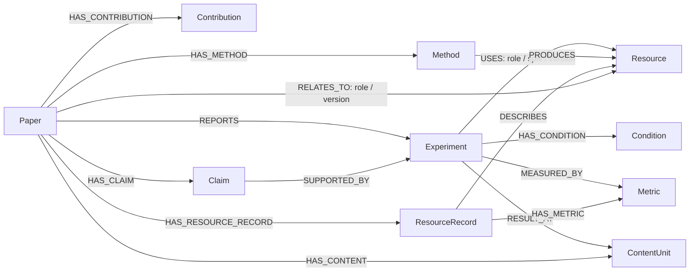

# 论文知识图谱 schema

日期：2026-09-22。状态：**设计草案，未实施**。

依据 [Layer4 v3 抽取提议稿](../discussions/2026-09-13-layer4-schema-proposal.yml)，
将其中的对象、引用和嵌套字段映射到 Neo4j。实验部分沿用后续的
[实验抽取设计](experiments.md)，整体边界见 [总体设计](main.md)。
v3 本身仍是提议；本文提出的节点标签、关系名称和入图规则也需要讨论确认。
v3 中新增的示例取值与定位数字没有经过重新抽取，本文只借用其结构。

> 重点还是得简化一点，不能搞太复杂了。

本稿以已有抽取内容为起点：保留论文、自述贡献、方法、主张、实验和资源之间的联系；
条件保留自由名值对；实验结果先指向表图；来源、条件和版本跟随具体记录。
建图不会补出抽取结果中没有的语义关系，也不会把作者报告升级为已验证事实。

## 1. Node、Edge 与 Attribute 的划分

Neo4j 使用属性图：节点带标签，关系有方向和类型，二者都可以带属性。
本文分别使用 Node、Edge、Attribute 三个名称；Attribute 对应 Neo4j 的 Property。
参见 [Neo4j 图模型](https://neo4j.com/docs/getting-started/appendix/graphdb-concepts/)。

| 类别 | 划分原则 | 例子 |
| --- | --- | --- |
| Node | 需要独立指名、连接或维护的对象与记录 | 论文、方法、主张、实验、资源、表图 |
| Edge | 两个节点之间有明确依据的联系 | 论文报告实验、实验使用资源、主张关联支持实验 |
| Attribute | 描述某个节点或某次联系的值 | 标题、主张原文、资源使用角色、切分与版本 |

属性的归属按含义决定。例如资源名称描述资源，`split`、`subset`、`version`
描述某次使用；同一资源在两篇论文中的使用方式分别留在两条边上。
需要按某个值筛选，不意味着该值必须成为一个共享实体。

## 2. Node：对象与记录

### 2.1 核心节点

| 标签 | 表达什么 | 来自 v3 | 主要属性 |
| --- | --- | --- | --- |
| `Paper` | 一次抽取形成的论文记录 | `paper_record` | `paper_id`、`title`、`authors`、`year`、`venue`、`abstract`、`arxiv_id`、`acl_id`、`doi`、`url`；可选 `ss_id` |
| `Contribution` | 作者在论文中自己声明的一项贡献 | `atomic_extracts.contributions[]` | `text`、`position`、来源定位与原文片段 |
| `Method` | 本文描述的一项具名方法 | `atomic_extracts.methods[]` | `method_id`、`name`、`aliases` |
| `Claim` | 本文的一条主张 | `atomic_extracts.claims[]` | `claim_id`、`text`、`support_strength` |
| `Experiment` | 一项实验及其报告范围 | `atomic_extracts.experiments[]` | `experiment_id`、`task` |
| `Resource` | 可供跨论文连接的资源身份 | `resource_id` 及实体对齐结果 | `resource_id`、可选显示名 `name` |
| `ResourceRecord` | 某次抽取或观察对资源的具体描述 | 一条完整 `resource_record`，其中 `paper_relation` 转为边 | `name`、`name_normalized`、`aliases`、`kind`、`description`，以及展开后的画像、获取方式与检查字段 |
| `Metric` | 实验或资源画像引用的指标身份 | `experiments[].metrics[]`、`profile.evaluation_metrics[]` | `name`、可选 `aliases`；明确身份后才共享 |

**Contribution 的抽取范围。** 逐条保存作者明确声明的贡献，例如提出方法、发布数据集、
建立理论结果或报告新的实证发现。表述可以来自摘要、引言、结论等位置，不要求有专门的
“Contributions”小节。每条保留 `text` 与 v3 的 `evidence`，并记录原列表中的 `position`。
`text` 可以忠实整理作者表述，`evidence_quote` 保留原文；作者声称的“首次”“更好”等限定
仍按 `paper_claim` 理解，不表示系统已经确认新颖性或有效性。

没有找到作者明确的贡献表述时，保留查找范围和缺失状态，不由抽取器代替作者编写贡献。
Contribution 的定位证明“作者如此声明”；其贡献是否成立需要另外的依据，
因此不要求每条 Contribution 都连接 Experiment，也不添加 `support_strength`。

Contribution 与 Claim 承担不同的读取用途：前者回答“作者列出的贡献是什么”，
后者承接需要进一步关联支持依据的主张。两者在语义上可以重叠，不作互斥文本分类。
基础映射分别保留 v3 的两组条目和各自定位，不因文字相似就自动合并，
也不从贡献文本自动补出到 Method 或 Resource 的语义边。

v3 的 `resource_record.kind` 保存在 `ResourceRecord.kind`，沿用
`dataset / benchmark / code / model / tool`。这几类共用 `Resource` 身份层，
kind 不编码进资源 ID。名称、画像或 kind 的不同描述可以并存。

保留 `ResourceRecord` 的用途是承接 v3 的原始记录粒度。例如两篇论文对同一 benchmark
报告了不同规模，或者今天与昨天观察到不同可获得性，都新增记录并指向同一资源身份。
共享的 `Resource` 节点不直接承载一个会覆盖旧记录的“最新规模”或“当前 available”。

**Resource 与 ResourceRecord 的区别是对象身份与来源描述。** 以下为假设示例：

| 节点 | 表达的内容 |
| --- | --- |
| `Resource(resource_id: res.D)` | 各篇论文关联的是资源 D |
| 第一条 `ResourceRecord` | 论文 A 声称 D 已公开；依据是论文中的一句话 |
| 第二条 `ResourceRecord` | 某次仓库检查观察到了 D 的数据文件；依据是当时的仓库快照 |

两条描述都经 `DESCRIBES` 指向资源 D，但声明、观察与来源分别保留。
ResourceRecord 不等同于资源版本：同一版本可以有多份描述或观察；
论文使用 D 的哪个 split、subset、version，仍由 `RELATES_TO` 或 `USES` 承载。

这层拆分是本稿为“同一资源的多来源描述与追加观察”提出的选择，v3 并未要求两个节点。
代价是多一个记录节点和一次关联。若初版只维护每个资源的一份描述，可以先采用一个
Resource 节点承载描述与来源；出现不同来源、不同时间的取值时，则需要明确的并存或历史保存
办法，不能让后来的值无声覆盖前者。是否现在采用双节点仍列为待确认项，
其必要性由实际复用任务决定。

`Method` 初版保持篇内粒度。即使名称相同，也不自动合并不同论文的方法记录；
`derived_from` 表达沿用关系，不能替代同一实体的判定。

### 2.2 附属记录节点

| 标签 | 用途 | 属性与边界 |
| --- | --- | --- |
| `Condition` | 保存一项实验条件及其独立定位 | `dimension`、`values`、证据字段；值保持原文字符串 |
| `ContentUnit` | 让实验结果可以连接到表或图 | `unit_id`、`kind: table / figure`、`label`、`caption`、`section_id`、`paragraph_index`、`parsed`；表保留 `body_kind`、`md_span`，图保留 `image_path` |

`Condition` 是属于具体实验的记录，不是全局维度实体。不同实验的同名条件分别保存；
不建立 `Hardware`、`ContextLength` 等受控维度节点，也不把 `8 × A100` 拆成硬件实体。
这里将条件条目节点化，是为了同时保留名值配对、定位和查询能力；沿用已有的自由名值对语义。

初版不预建数值 `Result` 节点。`result_refs` 先连接 `ContentUnit`；
`parsed: true` 只表示表体已解析，不表示数值已经抽取或核查。
后续按需抽出的结果如何回写，另行定义。

### 2.3 保留为属性的内容

| v3 内容 | 存放位置 | 处理方式 |
| --- | --- | --- |
| `metadata.*`、`content_units.abstract` | `Paper` | 标量或字符串列表 |
| `atomic_extracts.intent.*` | `Paper` | 展开为 `paper_type`、`research_problem`、`target_domain` |
| `limitations`、`future_work` | `Paper` | 以 `*_json` 字符串保留条目与原有证据 |
| `section_outline`、附录与补充材料标记 | `Paper` | 大纲保存为 `section_outline_json`，两个标记保持布尔值 |
| `experiments[].subjects`、`baselines` | `Experiment` | 暂存 `subjects_json`、`baselines_json`；具名对象完成对齐后才增加连接 |
| `profile.splits` | `ResourceRecord` | `profile_splits_json`，保留每个 split 的名称与规模配对 |
| `citation_context`、未解析引文与引文统计 | `Paper` | 上下文及未解析引用保存为 JSON 字符串；统计展开为 `cites_*` 属性 |
| `source_artifacts` | `Paper` | `source_artifacts_json` 保留下载与元数据记录，常用来源路径单独展开 |

因此 `20 prominent LLMs` 继续是被测对象的原文描述，不凭此生成 20 个模型节点。
作者、领域标签、任务描述也暂保留为属性；以后出现明确的连接需求再讨论实体化。

`source_type: paper` 保留 v3 的记录类别含义。初稿中的 PDF、LaTeX、HTML 输入区别
单列为 `input_format`，避免把论文对象类型与材料格式混为一项；路径沿用
`pdf_path`、`markdown_path`、`content_list_path`。`ss_id` 是初稿保留的可选外部标识，
v3 没有提供它，有实际来源时再填。

## 3. Edge：关系及其属性

以下是初版关系词汇。关系允许多条同类型边，不能只按“起点、类型、终点”覆盖写入；
同一实验可以以不同角色、切分或版本多次使用同一资源。

| 起点 → 关系 → 终点 | v3 来源 | 关系属性或解释 |
| --- | --- | --- |
| `Paper → HAS_CONTRIBUTION → Contribution` | `contributions[]` 的归属 | 记录论文自述贡献，原顺序由 Contribution 的 `position` 保存 |
| `Paper → HAS_METHOD → Method` | `methods[]` 的归属 | `role: proposed / reused / extended / compared` |
| `Method → DERIVED_FROM → Method / Resource` | `derived_from[]` | 仅解析显式给出的目标；保留来源 |
| `Method → PRODUCES → Resource` | `produces_resource_id` | 方法与其公开产物的联系；不等于产物可用 |
| `Paper → HAS_CLAIM → Claim` | `claims[]` 的归属 | 结构性归属 |
| `Paper → REPORTS → Experiment` | `experiments[]` 的归属 | 论文报告了这项实验 |
| `Claim → SUPPORTED_BY → Experiment` | `claims[].supported_by[]` | 抽取记录所列的支持联系；保留判断来源 |
| `Experiment → USES → Resource` | `experiments[].resources_used[]` | `role`、`split`、`subset`、`version` |
| `Experiment → HAS_CONDITION → Condition` | `conditions[]` | 保留条目顺序 `position` |
| `Experiment → MEASURED_BY → Metric` | `metrics[]` | `name_raw`、`scoring`；打分方式属于本次实验 |
| `Experiment → RESULT_AT → ContentUnit` | `result_refs[]` | 结果所在位置，不携带预抽数值 |
| `Paper → HAS_CONTENT → ContentUnit` | `tables[]`、`figures[]` | 表图归属 |
| `Paper → HAS_RESOURCE_RECORD → ResourceRecord` | 按论文组织的资源记录 | 从论文找到本次登记的资源描述 |
| `ResourceRecord → DESCRIBES → Resource` | `resource_id` | 描述对应哪个资源身份 |
| `Paper → RELATES_TO → Resource` | `resource_record.paper_relation` | `role`、`split`、`subset`、`version`、`modification`、`citation_context_ids` |
| `ResourceRecord → HAS_METRIC → Metric` | `profile.evaluation_metrics[]` | `name_raw`，只表达该画像所列的指标 |
| `Paper → CITES → Paper` | `links.cites[]` 中已解析的目标 | `reference_index`、`anchor_type`、`anchor`、`context_ids`、`roles` |

资源的两个角色词表保持分开：`RELATES_TO.role` 沿用
`introduced / used / evaluated / cited_only / unknown`；`USES.role` 沿用
`training_data / evaluation_target / analysis_input / tooling / unknown`。
引入资源不自动产生 `USES`；论文级角色也不直接转换成实验级角色。

### 3.1 容易误放到边上的信息

- **`support_strength` 暂留在 Claim。** v3 只给出整条主张的总体支持强度，
  没有为每个支持实验分别打分。不能把 `partial` 复制到每条边并解释为逐实验判断。
  该值的来源沿用 `field_status`，模型判断保留为 `inferred`。
- **论文级使用条件保持在 `RELATES_TO`。** `used_in_experiments` 只提供实验与资源
  的关联线索。由它补出的 `USES` 标记 `mapping_origin: paper_relation`，实验角色缺失时
  保留 `unknown`；不把论文级 split、subset、version 自动套用到每个实验。
- **图中反向访问不要求存反向边。** `SUPPORTED_BY`、`USES`、`CITES` 均可逆向遍历；
  不额外存 `SUPPORTS`、`USED_BY`、`CITED_BY` 镜像。

### 3.2 引文与开放关系

`CITES` 初版只连接目标身份已解析、且已选定目标记录的库内论文。
库外锚点和未解析引用保留在 `Paper.unresolved_references_json`，不丢弃，也不凭标题猜目标。
同一引用上下文可能提及多篇论文，必须按 `links.cites[].reference_index` 与 `context_ids`
的对应关系建边，不能将一个上下文的单个 anchor 广播给所有参考文献。
`roles` 是多个上下文角色的汇总；原始逐上下文标注继续保留，空角色不表示没有引用。

本稿先使用表中的关系类型。新关系需要说明端点、方向、语义和来源；开放关系的注册与
兼容机制待定。`contradicts`、`similar_to` 等判断不在基础入图时自动生成。

## 4. Attribute：Neo4j 中的存放方式

Neo4j 属性可保存标量以及同类型简单值列表，不能直接保存嵌套 map 或对象列表。
本文用三种方式映射 v3 的嵌套结构：

1. 固定字段展开：`access.url → access_url`、`availability.status → availability_status`。
2. 需要关联或逐项筛选的条目转节点或边：`conditions[]`、`resources_used[]`。
3. 主要供读取、核查的复杂条目保存为明确命名的 `*_json` 字符串。

ID、原文和版本号用字符串；`aliases`、`authors`、`roles` 用字符串列表；
`position`、段落序号用整数，范围用整数列表，`parsed` 等标记用布尔值。
初版沿用 v3 的 ISO 8601 时间字符串，写入端校验格式，比较时解析时间；不按原始字符串排序。
每个节点和边都有非空 `id`；知识记录还要能定位到记录集和原始字段路径。
字段缺失时省略值并保留状态，属性键本身缺失不表达“已确认不存在”。

JSON 字符串不承担普通属性谓词或图遍历。初版条件筛选走 `Condition.values`，
资源关联走 `USES`；若以后要在全库筛选 split 规模或某类 citation context，
再为相应字段增加结构化映射。类型依据见
[Neo4j 属性类型](https://neo4j.com/docs/cypher-manual/current/values-and-types/property-structural-constructed/)。

### 4.1 ResourceRecord 的展开

| v3 字段组 | 入图属性 |
| --- | --- |
| `anchors` | `anchor_github`、`anchor_huggingface`、`anchor_doi`、`anchor_url` |
| `profile` | `profile_task`、`profile_domain`、`profile_languages`、`profile_scale`、`profile_scoring`、`profile_prerequisites`、`profile_splits_json` |
| `profile.evaluation_metrics` | `HAS_METRIC`，同时保留原始名称列表供核对 |
| `access` | `access_type`、`access_url`、`access_license` |
| `material_completeness` | `material_repo_exists`、`material_repo_non_empty`、`material_has_readme`、`material_has_dependency_manifest`、`material_has_entrypoint`、`material_declared_license`、`material_last_commit_at`、`material_observed_by`、`material_observed_at`、`material_notes` |
| `availability` | `availability_status`、`availability_source`、`availability_observed_by`、`availability_observed_at`、`availability_notes` |
| `provenance` | `extracted_from`、`registry_entry`、`registry_status`、`last_checked` |

`access_license` 与 `material_declared_license` 分别保留；论文所称许可与仓库声明可以不同。
`material_*` 与 `availability_*` 的观察时间分别保存，不用一个记录级时间替代。
仓库存在、存在入口、成功运行与实验复现是不同观察；v3 的材料检查只覆盖前两类中的部分信息。

### 4.2 来源、证据和缺失状态

证据定位默认作为所属节点或边的属性，暂不建立通用 Evidence 节点：

| 逻辑内容 | 属性 |
| --- | --- |
| 证据来源 | `evidence_origin`、`evidence_source_uri`、`evidence_source_version`、`evidence_source_digest` |
| 论文内定位 | `evidence_section_id`、`evidence_paragraph_index`、`evidence_char_span`、`evidence_quote` |
| 外部材料定位 | `evidence_locator`、`evidence_quote`，同时保留所指材料的 URI 与版本 |
| 记录归属 | `record_set_id`、`schema_version`、`pipeline_run_id`、`model`、`prompt_version`、`record_written_at` |
| 时间与输入快照 | `observed_at`、`source_version_at`、`inputs_digest`；分组观察按下面说明保留各自时间 |
| 字段级来源及缺失状态 | `field_status_json`，沿用原始字段路径、`source`、`absence`、观察者与观察时间 |

`evidence_origin` 沿用 v3 的材料类型；`field_status.source` 沿用
`paper_claim / external_observation / inferred`，二者不能混用。
`ResourceRecord.profile` 的定位加 `profile_evidence_*` 前缀，
`paper_relation.evidence` 随 `RELATES_TO` 保存，避免 README 和论文正文的证据互相覆盖。
`model`、`prompt_version` 表达抽取归属，不充当材料的观察者。
单个 evidence 的 `source_version_at` 对应其来源；多证据时该时间随各个证据项分别保存。

一个对象有多条证据时保留 `evidence_refs_json`，每项带其适用字段；不能拼成一个不分来源的 quote。
这里只提供保存方式，多证据的统一查询接口待定。
原始 `field_status` 在所属 Paper 或 ResourceRecord 上完整保留；拆出的子节点和边
记录 `extraction_path`，使用它回溯原字段路径，避免移动字段后状态失联。

缺值沿用 v3 的 `not_checked / not_found / not_applicable`。
`not_found` 表示在声明的查找范围内未找到，不升级为全局不存在；原来未给状态的空值保持待补，
不能由导入器猜测。v3 中用 `false + not_applicable` 表示的材料项，入图时省略该布尔值并保留
状态，避免下游将“不适用”计为“检查失败”；原始输入仍可回查。

节点与边的结构性归属可以由容器和 ID 引用确定；语义联系必须保留相应来源。
v3 有些字段没有独立 evidence，例如示例 claim 没有正文定位，支持边也没有单独的定位。
这些缺口需要在抽取时补足或明确标记待补；`extraction_path` 只能定位抽取产物，不能代替原文证据。
通过端点、字段和 quote 存在性检查，也不能证明一条主张或支持关系在语义上正确。

## 5. 身份、版本与入图规则

### 5.1 对象身份与记录身份

- `paper_id`、`method_id`、`claim_id`、`experiment_id` 保留 v3 标识；它们是业务标识，
  不使用 Neo4j 内部 ID 作为外部引用。
- 每次抽取产物有不可变的 `record_set_id`；它需要区分材料快照、运行及修订，
  不能只用 `inputs_digest`，因为同一输入可以有不同抽取结果。
- `Paper`、`Contribution`、`Method`、`Claim`、`Experiment`、`ResourceRecord`、`Condition`、`ContentUnit`
  都属于具体记录集；图中 `id` 由 `record_set_id` 与篇内 ID／条目路径共同确定。
  同一论文重抽后形成新记录集，不用原有业务 ID 覆盖旧节点。
- `Resource` 与已确认的 `Metric` 身份可跨记录集共享；未对齐时先分配局部 ID。
  Method 和 Claim 不因文本相同而跨论文合并。未具名条目的序号只在本记录集内有效。

v3 的 contribution 条目没有独立业务 ID；其图中 `id` 使用 `record_set_id` 与
`atomic_extracts.contributions[i]` 路径生成。不同论文声明相似贡献时分别保存，
条目序号也不承担跨修订的身份对应。

资源归一检查规范名、外部锚及实际指向的对象。共享仓库 URL 只是身份线索：
同一仓库可能同时承载数据集、代码和评测工具，不能仅据 URL 相同就归并。
`name_normalized`、`registry_status: matched` 也不能单独证明身份相同。
`res.*` 若没有可靠的全局身份依据，入图时必须补论文／记录集作用域，并保留原始 ID。
Metric 同名也先保留原文及局部身份，待定义和口径确认后再共享。

资源身份表示资源本身；某次使用的 `version` 留在使用边上。
未知版本保持未知，不连接到“最新版”，也不据相同资源身份断言实验可比。
观察到的仓库 commit 属于来源版本，不能自动当作论文实验使用的版本。

### 5.2 确定性映射与未解决引用

下述确定性映射以已经给定的实体对齐结果为输入；尚未确认的对应保留局部身份，
不会通过入图过程顺带做语义消歧。一次入图依次处理节点、显式引用、附属记录和检查结果：

1. 按原始 ID 或条目路径建立本次记录集的节点，并保存 `extraction_path`。
2. 根据 `supported_by`、`resource_id`、`derived_from`、`result_refs` 建边。
   `derived_from` 可以指向 Method 或 Resource，目标类型要由引用解析确认。
3. 连接 Metric，建立 Condition，展开来源和状态。每条边保存 `id`、`record_set_id`
   及产生它的原始路径；重复导入同一产物应幂等。
4. 对合并键、端点类型、悬空引用、重复记录和缺失定位作结构检查，并保留待处理项。

`resources_introduced`、篇级 `resources_used` 与 `paper_relation` 是同一联系的不同入口。
内容一致时合并为一条关系并保留 `extraction_paths`；有冲突时保留差异，不静默择一。
同理，`used_in_experiments` 只在没有对应显式实验使用条目时补关联，不能重复计数。
一条边涉及 ResourceRecord 的描述或使用信息时，保存 `resource_record_id` 以便追踪。

缺少目标的引用进入所属记录的 `unresolved_refs_json`，保留字段路径和原值，
不凭空创建“已读论文”“已完成实验”或猜测的资源节点。
v3 的 GSM8K 第二条资源记录本来就是构造示例，其中的 `exp::3`、`cite::17`
在该文件的 paper_record 中不存在，不能直接当作完整入图测试数据。
v3 中 `field_status` 的列表下标解释也需统一后才能按路径解析，不能忽略越界状态项。

### 5.3 时间与维护边界

观察时间、来源版本时间、写入时间分别保存。来源时间来自实际材料；未知时保留缺失状态，
不从 `record_written_at` 或 `last_checked` 推定。`inputs_digest` 对应抽取输入快照；
外部 profile、仓库检查还需要各自的快照、版本或响应指纹。

刷新追加新记录，原记录及其来源保留。论文记录集也按修订追加；跨记录集查询要明确选择范围，
统计论文数量时按 `paper_id` 去重，不能把多次抽取计作多篇论文。
`CITES` 指向所选目标记录，语义仍是引用目标论文；目标修订后旧边不静默改指。

这些字段为历史查询保留必要信息。完整的 as-of 选择规则、身份对齐历史、
旧记录失效状态与新旧记录的替代关系仍待设计，不能仅凭“有时间戳”宣称已支持历史查询。

## 6. 结构示意



不同论文的 Experiment 可以经各自的 `USES` 连到同一 Resource，边上分别保留版本、用途和条件。
共享资源提供关联入口；可比性与适用性仍由消费方结合具体记录判断。

一个实验使用条目的映射示例（只示意结构，省略公共来源字段）：

```yaml
# 抽取输入，来自 v3 的第一项实验。
resources_used:
  - resource_id: res.lifbench
    role: evaluation_target
    split: ''
    subset: 11 tasks across 3 scenarios
    version: ''

# 入图映射：split、version 缺失时不虚构属性值。
edge:
  type: USES
  source: '<record_set_id>::2025.acl-long.803::exp::1'
  target: '<resolved_resource_id>'
  properties:
    role: evaluation_target
    subset: 11 tasks across 3 scenarios
    extraction_path: paper_record.atomic_extracts.experiments[0].resources_used[0]
```

## 7. 本稿新增的选择与待确认项

相对 v3，本稿新增的是入图表示：贡献条目的节点化、公共记录身份、Resource 与 ResourceRecord 的分离、
Condition 和 ContentUnit 的节点化、Metric 的连接，以及嵌套字段的展开／JSON 保存规则。
这些均为本稿提议，不改变现有抽取代码。

后续需要确认：

- 这组节点粒度是否足够简洁，尤其是 ResourceRecord 与条件节点的保留范围。
- 资源与指标对齐由谁执行、依据什么、如何保留未确认对应；跨论文 Method 身份暂不合并。
- v3 缺失的逐字段定位、支持关系依据和来源版本如何补足；claim 数量限制不作为图的容量约束。
- v3 三态命名与总体设计的对应，以及复现观察如何补充现有三类 `field_status.source`。
- 按需数值 Result、多证据关系、库外引文节点及开放关系类型何时进入 schema。
- 记录修订与 as-of 选择规则；具体 Neo4j 版本下的约束、索引和导入实现另行确定。
