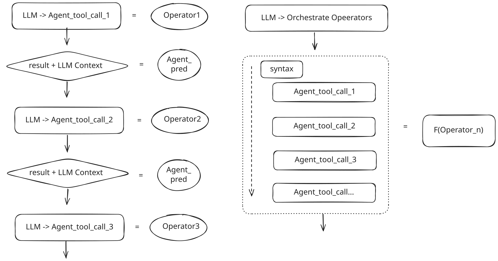
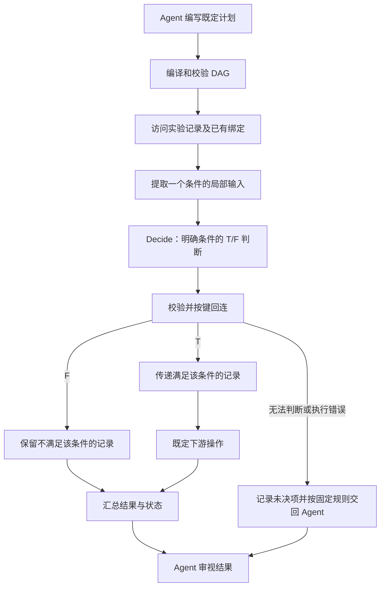

# Decide：连接既定 DAG 的局部 LLM 判断算子

> **状态（2026-10-02）：** 按本轮讨论收窄 `Decide`：只处理上下文极其有限、判据已明确的简单 T/F 判断，用来连接已经规划好的数据算子。它不承担动作选择、开放策略、生成或修改 DAG，也不判断是否应提前结束 DAG。接口和效果尚未实现验证。
>
> **核心目标：** 在少量仍需理解局部文本的连接点，用受限判断替代外层 Agent 携带完整上下文的一次介入，使既定算子组合能连续执行。收益以减少介入和上下文传递为主，同时必须评价失去外层综合判断能力的代价。
>
> 对应：[Intent 拆解](intents_decompose.md) §4.3、§5.1 和 I1–I6；[研究顶层设计](research_design_v2.md) §5.3。本文件细化其中适合局部化的子判断，不将已有 `A_pred` 全部替换为 `Decide`。

## 1. 先明确外层 Agent 与局部算子的能力差异



图左侧的 Agent 拿到 tool result 后，结合已有任务上下文重新阅读。它能够完成当前判断，也有机会发现结果异常、质疑原计划、补充条件、寻找新材料，或者决定提前结束。这种介入具有更宽的判断范围和更大的行动空间，不能全部记作无价值的编排开销。

图右侧由 Agent 先组织算子组合，执行环境按既定依赖推进。`Decide` 只补上其中少量简单判断，使上下游不必因这些判断而返回外层 Agent。它不复制外层 Agent 的完整能力，也不负责维护整项任务的策略。

因此，这是一项有条件的取舍：**当一个连接点只需要很小的上下文回答明确的 T/F 问题时，才尝试用局部 LLM 判断换取连续执行；需要综合理解和策略调整时，继续由外层 Agent 承担。** 外层能力更宽，不意味着每次局部判断都必然更准确，但它是评价中必须保留的强对照。

```text
外层 Agent：理解任务 → 编写 DAG → 接收结果或异常 → 必要时修改计划/结束任务
                                ↓
既定 DAG：数据算子 → 局部 Decide → 普通筛选或连接 → 数据算子
```

`Decide` 的结果只改变既定计划中哪些数据通过条件，不生成新的调用结构，也不选择下一项研究策略。

## 2. 哪些判断适合纳入

### 2.1 纳入条件

适合的判断应同时具有以下特征：

1. **问题已经确定。** 比较对象、比较维度和 T/F 含义由计划给定，模型无需决定应该判断什么。
2. **上下文很小且自足。** 判断只依赖指定字段、两段短描述或一个局部材料片段，不需要完整会话或跨多处材料建立解释。
3. **结果只用于必要衔接。** 后续筛选、连接与参数传递已确定，不需要模型选择操作、工具或停止策略。
4. **不能直接由现成字段和规则完成。** 若所需值已经规范化，普通比较、等值连接和集合操作优先。

“输出只有两个值”不足以满足这些条件。实验是否公平可比、证据是否足以支持科学结论，也可以写成 T/F，但往往需要综合理解，不能因此交给局部算子。

### 2.2 简单比较的边界

| 情形 | 执行方式 | 原因 |
| --- | --- | --- |
| 两个已解析数值比大小，单位和方向已明确 | 普通比较 | 已有确定算法，无需 LLM |
| 已规范化 ID、版本、切分或枚举值是否相等 | 普通比较/连接 | 直接消费已有结构 |
| 两种短表述是否在已给定维度上同义，例如均明确表达未重排序 | 可尝试 `Decide` | 只需有限的局部文本理解 |
| 一个原始称呼与一个候选短定义是否表达同一对象，且作用域已明确 | 满足局部条件时可尝试 `Decide` | 判断固定的一对输入，不从开放候选空间选最优对象 |
| 两个结果是否可以公平比较 | 外层 Agent；其中足够简单的子条件可局部化 | 整体结论可能依赖协议、脚注及未显式列出的条件 |
| 选择下一工具、生成新查询、改写 DAG、提前结束 DAG | 外层 Agent | 属于策略与规划，即使可列出少数选项也不纳入 |

比大小、相等、不等是局部谓词的典型形态；是否使用 LLM 取决于输入是否仍需少量语义解释。不能为了形成 LLM 算子而将已经可计算的比较交给模型。

## 3. 最小接口：一个明确谓词，一份局部输入

```text
Decide(predicate_spec, operands, local_context, executor) -> LocalDecision

predicate_spec = {
  id, revision,
  criterion,              # 固定的判断维度与 T/F 含义
  input_contract,         # 所需字段、作用域及允许的局部材料
  context_limit           # 针对该谓词约定的上下文上限
}

LocalDecision = {
  unit_key, condition_id,
  status: decided | needs_agent | error,
  value: T | F | null,
  basis_refs,
  reason?                 # 简短说明，供追踪或交回 Agent
}
```

`operands` 是被比较的值或对象对，带稳定键。`local_context` 由上游按固定绑定取得，不包含完整会话，不由模型自行检索或扩充。模型配置、实际输入、材料版本和成本复用原文的调用 trace 记录；具体上下文长度通过实例确定，本稿不预先编造阈值。

完成判断时返回 `decided` 和 T/F。若局部材料不足、含义有歧义或问题超出规定范围，返回 `needs_agent`，不强迫模型给出布尔值。格式错误、超时等返回 `error`。这些是不能正常交付局部判断的状态，不是供模型选择策略的动作菜单。

与原文 `PredRow` 连接时，`decided` 映射到 `origin=agent` 的 T/F 记录；`needs_agent` 保留 U 及原因并交回外层；错误保持执行错误。这个适配不将原文所有 U 自动路由到 `Decide`。规则无法决定的事项，可能恰恰需要外层 Agent 的完整理解。

`Decide` 不选择候选 ID、动作键或工具，不修改引用、写入 alias 或建立关系。候选配对、结果回连与唯一性检查由普通程序完成。

## 4. 必要连接如何工作

一个典型连接是：上游返回带局部描述的记录，下游需要符合某个明确条件的记录。计划预先规定比较什么、用哪些字段、T/F 各怎样处理。

```text
records = 上游访问算子(已确定参数)
inputs = 按计划中的字段和绑定提取局部输入(records)

若可由已有规范值直接判断：
    decisions = 普通规则(inputs)
否则，仅对计划已指定的局部谓词：
    decisions = Decide(predicate_spec, operands, local_context, executor)

checked = 校验结果键、引用与状态(decisions)
passed = 按 unit_key 回连 records 中判断为 T 的项
rejected = 保留 F 项及其判断记录
unresolved = 保留 needs_agent、error 及未处理项
下游算子(passed 的已声明字段)
输出结果及 rejected/unresolved
```

上例是设计表达，处理集合时仍按单元记录；批量接口不自动改变单个谓词的上下文范围。未知项如何交回外层由预先声明的执行规则处理，不让 `Decide` 决定补查还是停止。

这里的“连接”是通过已有键、T/F 条件和类型将上游结果传给下游。它不包含开放的语义 join，也不让模型决定怎样重组结果。

## 5. 与 intent 拆解中的判断点对应

下表筛选可能适合局部化的子判断。其余工作仍沿用原 intent 的外层 Agent 职责，不因为原文写作 `A_pred` 就纳入本算子。

| 原文位置 | 可讨论的局部连接 | 仍由外层 Agent 处理的内容 |
| --- | --- | --- |
| I1 `J`、`delta_J` 适用性判断 | 给定资源要求与一项明确记录，判断一个简单条件是否满足；结构化条件优先规则 | 总体方法适用性、隐藏前提识别、需求改写和补查 |
| I2 细节问答 | 暂无必须加入的 `Decide` | 理解机制、抽取细节、发现材料不足 |
| I3.5 规范化 | 作用域已确定时，核对一对短表述是否等义 | 新作用域判断、多候选综合消歧、缺失信息恢复；精确命中仍用规则 |
| I3.6 比较条件 | 对固定行对的一个明确维度作局部等同/不同判断，例如两条显式设置是否均表示未重排序 | 整体可比性、脚注与协议的综合解释、发现遗漏的比较维度 |
| I3.7 数值比较 | 数值、单位与方向已确定后使用普通程序，无需 `Decide` | 数值口径未明确时的解释与核查 |
| I4 `J`、`K` | 只有在具体实例中能约束为自足短文本等同判断时才考虑 | 问题范围分析、路线分组、跨论文共同点与冲突的综合判断 |
| I5 `J`、`K` | 暂不将证据支持判断整体纳入；局部谓词需另按实例证明范围足够小 | 命题成立范围、证据支持/反驳/限定的综合判断 |
| I6.2–I6.3 | 局部称呼或明确设置的同等核对；规范化版本等直接用规则 | 实现身份确认、版本差异重要性及运行环境整体适用性 |
| I6.5 日志解释 | 已有明确状态字段直接读取，通常不需 LLM | 综合日志确定核验级别、判断是否需要新执行 |
| 共同控制片段 `A_policy` | 不映射为 `Decide` | 编写新 DAG、修改现有计划、选择补查路径和提前结束 |

尤其不能把“有限动作集合”当作纳入依据。是否结束任务即使只有继续/停止两个选项，也涉及整体任务状态与策略，超出这里的局部连接职责。

## 6. I3 局部示例与 DAG 表达

下面是说明接口的假设实例，不是已观察到的论文事实。外层 Agent 已确定比较条件，其中一项是两行实验均未使用重排序；对应记录分别明确写作 `without a reranking stage` 与 `no reranker is used`。该项可表述为一个局部 T/F 问题，其他实验条件仍单独处理。

```text
J = Decide(
    predicate_spec=这两条设置是否都明确表示未使用重排序,
    operands={left: setting_a, right: setting_b},
    local_context={两条设置的固定作用域和来源},
    executor=已声明的模型适配器)

# J 只回答这一项，不能推出两个实验整体可比。
```

若其中一条设置包含需要进一步理解的条件引用，局部输入不足，应交回 Agent。若未重排序已经存为规范布尔字段，则直接比较字段，不调用 `Decide`。



图中 T/F 只控制预定的数据流；`Decide` 不决定后继操作是什么。交回 Agent 是执行环境按事先约定处理异常或未决项，不能表述成 LLM 算子选择提前结束 DAG。Agent 收到结果后，才决定是否继续、重写计划或停止。预算耗尽等执行限制也由运行时处理，不交给局部 LLM 裁决。

编译输入是显式计划，不是尚未解释的自然语言 intent。节点与依赖已知，T/F 运行时才产生，并不妨碍建立 DAG。完整 intent 中的开放补查循环仍属于外层规划；本轮不试图通过 `Decide` 将其包进一个 DAG。

## 7. 收益及其代价

### 7.1 首要收益：跨过简单判断点连续执行

一些访问链的数据依赖已经明确，只因一个小范围语义谓词尚不能由普通程序计算，就需要外层 Agent 重新读取 tool result。将该谓词作为 `Decide` 节点，可以把判断前后的访问纳入同一执行段。

`Decide` 提供这一连接所需的接口；计划编译和运行机制负责实现连续执行。新增一个函数本身不会自动生成 DAG，也不证明全部 intent 都适合预编排。

### 7.2 减少为简单连接支付的完整介入成本

外层 Agent 无需仅为一个小判断而重新消费任务历史、工具结果及接口说明；局部调用只取得所需输入，结果由程序回连并传递。预期减少上下文传递、下一调用组织和外层等待。

收益不要求每次都减少模型调用数量：一次完整 Agent 介入可能被一次局部模型调用替代。应比较全部模型 token、时延及实际任务质量。模型规格也不预设必须更小；小上下文与受限职责已经构成区别。

### 7.3 必须计入失去综合审视的代价

完整 Agent 读一遍 tool result，可能发现局部谓词之外的问题。DAG 连续执行会减少这种中途审视机会。即使局部 T/F 全部答对，也可能错过计划的错误前提或数据中的异常。

因此，需要验证的不只是局部准确率，还包括：哪些节点适合省去完整介入、会漏掉哪些异常、这些遗漏是否影响最终任务。不能默认外层判断只是冗余，更不能用“绑定合法”代替整体理解质量。

| 方面 | 预期收益 | 需要同时检查 |
| --- | --- | --- |
| 连续执行 | 简单谓词前后不再返回外层组织调用 | 被省去的介入是否承担必要的综合判断 |
| 上下文与成本 | 局部输入替代完整会话介入 | 总模型成本、上下文组装及回退成本 |
| 衔接正确性 | 程序按键回连，减少引用与参数传递错误 | 局部谓词本身是否正确 |
| 计划覆盖 | 更多已知依赖可留在一个 DAG 段 | 不把开放策略或整体可比性隐藏进小节点 |
| 任务质量 | 简单连接保持质量且使用成本降低 | 错误前提、异常遗漏和最终结果退化 |

判断记录的持久化、复用与失效不是本轮新增贡献重点；本轮先检验必要连接能否以更低成本完成。

## 8. 验证方案

以下是待讨论的验证设计，不据此新增实验代码或启动运行。

先选 I3 中经人工核对确实属于“小上下文、固定谓词”的连接点，保留独立参考判断及最终任务要求。需要包含正常局部判断，也包含短片段不足以判断、看似简单但需要更宽语境的反例。

| 对照 | 目的 |
| --- | --- |
| 固定输入和判断输出，检查 DAG 的绑定与后继执行 | 隔离程序组合是否正确 |
| 外层 Agent 带完整任务上下文读取同一 tool result，与局部 Decide + DAG 比较 | 直接测量成本收益及失去综合审视的质量代价；基线不能被人为限制为同样狭窄的谓词调用 |
| 同模型配置的完整介入与局部调用 | 先隔离上下文和职责收窄的影响，不把模型更换当作算子收益 |
| 有确定规则的项目使用普通程序 | 检查 LLM 是否被不必要地用于已可计算的判断 |

双方具有相同的材料访问权限，记录实际提供的上下文差异；局部输入准备、外层计划生成、未决项回退和修正全部计入成本。先检查手写计划，再评价 Agent 编写计划的可用性。

指标至少包括局部 T/F 准确率、无法判断与回退比例、误将复杂判断纳入局部算子的情况、绑定正确性、最终任务质量、异常发现情况、外层介入次数、全部模型 token 与总时延。仅报告重新规划减少，无法说明取舍合理。

## 9. 当前设计结论

`Decide` 是一个受限的局部谓词节点：**外层 Agent 已经决定做什么、比较什么以及怎样接续，局部 LLM 只完成极少上下文下必要的 T/F 判断。** 它使这些简单连接能够留在既定 DAG 内连续执行。

开放策略、新 DAG 的编写、计划修改和提前结束仍由外层 Agent 负责。收益主张应当写成：在适合局部化的连接点，以较小的判断调用减少完整 Agent 介入成本，并通过实验检查这一收窄是否保持任务质量；不主张局部算子比外层 Agent 更强，也不将有限输出本身作为简单性的证明。
