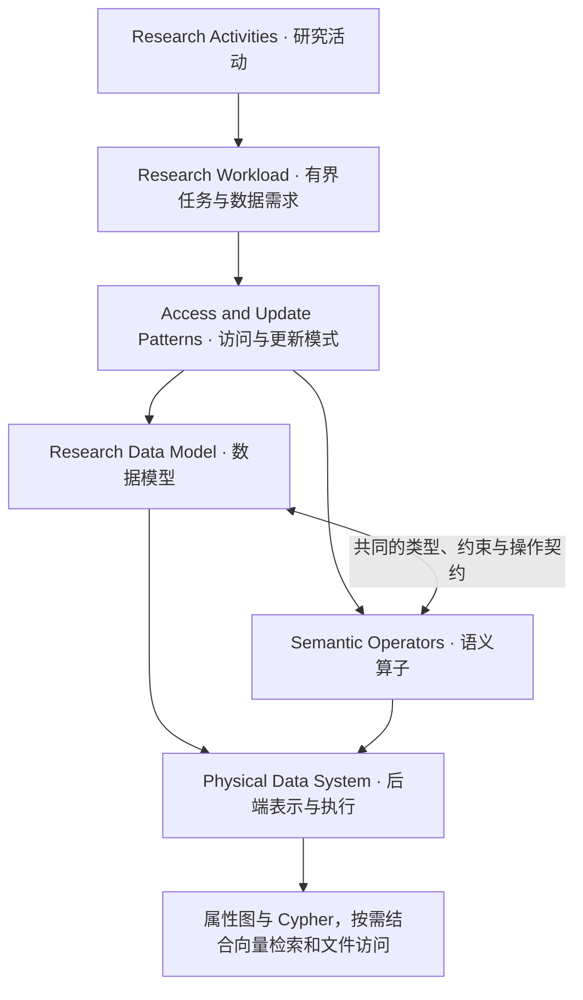

# 学术文献数据网络：研究顶层设计 v2

> **研究定位：** 面向学术知识利用 workload，共同设计数据模型与语义算子，优化 Agent 与持续积累的研究知识之间的数据交互。
>
> **核心问题：** 如何通过具有明确语义、能够组合并映射到底层执行的数据抽象，支持外部 Agent 对论文衍生知识的表示、查询、组合与维护？

## 1. 研究出发点：支持 Agent 利用学术知识开展研究

我们的出发点包含两个选择：**面向 Agent 利用学术论文及相关材料支持研究者的需求，并从数据库视角优化对这些需求的支持。**

研究者阅读论文，是为了理解问题、寻找方法、比较结果，或者判断一项资源能否用于自己的工作。一次阅读形成的理解，可能在之后的任务中继续使用；新论文、新版本和新的验证结果，也会补充或修正已有认识。因此，我们希望管理的对象包括：

- **知识与解释**：方法描述、论断、实验条件、结果等；
- **关系与判断**：知识之间的语义关系，以及外部 Agent 或研究者作出的判断；
- **依据与历史**：来源、证据和版本信息。

论文、附录、代码与数据集等材料是这些对象的来源。将对象持续积累，并让后续任务能够查询、组合和更新它们，是“学术文献数据网络”的基本用途。

**这一选择确定了优化对象：Agent 与研究数据交互的抽象层。** 外部 Agent 负责理解和判断，系统负责数据的组织与操作。我们希望这套能力能够被不同 Agent 使用，而不依赖某个 Agent 的内部实现。

> **研究选择：** 我们选择研究数据管理机制，无需先证明这一方向优于所有可能的 Agent 优化方向。
>
> **论证责任：** 所选场景存在值得支持的数据需求，且提出的数据抽象能够改善对这些需求的支持。

## 2. 限定 workload：从研究意图走向可评价的任务

“支持学术研究”仍然过于宽泛。要据此设计系统，需要将范围收敛到**有边界的 CS 研究任务**。我们暂以 *Knowledge Utilization Workload*（知识利用工作负载）概括这一范围，从以下活动寻找代表性任务：

| 活动入口 | 希望支持的知识利用需求 |
| --- | --- |
| 方法发现 | 寻找与研究问题、适用条件相关的方法 |
| 实验比较 | 组织方法的实验结果及其条件，支持后续比较 |
| 证据追踪 | 从记录或判断追溯到支持它的材料与位置 |
| 资源复用 | 查找相关代码、数据、模型及已有的可用性记录 |
| 研究问题关联 | 组织问题与方法、论断、证据之间的已有关系 |

这些是**候选任务类别**，具体任务与 benchmark 仍需确定。它们帮助我们选择研究范围，不意味着已经覆盖所有研究行为。

### Intent → Task → Workload

用户说“找适合我当前条件的方法”，表达的是一个 **intent**。进一步明确当前条件、可访问材料、所需输出和质量要求，才能得到可执行、可评价的任务。

```text
Intent：使用者希望达成什么目的
   ↓ 补充输入、约束、证据环境和预期输出
Task：一个具体、可评价的任务
   ↓ 选择代表性任务，明确数据状态与查询、更新需求
Workload：用于设计和评价系统的一组任务及其数据操作需求
```

Agent 的执行轨迹可以帮助发现需求，但某次执行的偶然步骤不能直接成为 workload 的定义。我们需要识别的是**任务的数据需求，以及合理执行方式中可复用的操作结构**。

### Workload 为模型范围提供依据

选定 workload 后，模型优先表达其中需要的方法、论断、实验条件、结果、资源及其证据和关系。作者、机构等信息可以作为来源元数据；是否需要将它们建成具有独立身份和丰富关系的核心对象，由任务是否需要相应操作决定。

**设计原则：以选定任务的知识利用需求约束模型范围。** 这允许我们深入处理相关数据语义，无需先构建完整的学术世界模型。

## 3. 确定优化对象：数据模型 + 数据操作方式

一种可行方案是：构建图谱，提供 schema 和使用说明，让 Agent 编写 Cypher 完成任务。这为我们的研究提供了直接的比较起点。

我们的切入点是，既然已经限定 workload，能否进一步提供与这些任务相匹配的**领域数据模型和操作方式**，让 Agent 通过明确的领域操作访问积累的知识？

```text
有边界的知识利用 workload
            ＋
外部 Agent 负责理解、判断，并可替换
            ↓
研究可优化的对象：
知识如何表示 + 数据如何操作 + 操作结果如何继续使用
```

Agent 可替换性指接口和数据语义不依赖特定 Agent 的内部实现。不同 Agent 的实际使用效果仍需评价；在隔离中间件效果的对照中，则应固定 Agent 条件。

我们希望减少反复理解底层结构、构造领域查询和修正操作的负担，同时保留任务所需的条件、来源与版本信息。**这些是待验证的收益，不能由“提供了工具接口”直接推出。**

## 4. 推导方法：从任务展开中共同设计模型与算子

### 4.1 从具体任务识别共同需求

首先，将具体任务展开为三个相互关联的部分：

```text
用户意图 → 具体任务
                ↓
       数据需求 + 数据操作 + Agent 判断
                ↓
             任务结果
```

例如，“比较两个方法的实验结果”可以作如下展开。这里用于说明分析方式，尚未规定最终算子集合。

| 分析维度 | 这个任务需要什么 |
| --- | --- |
| 数据需求 | 方法、实验记录、数据集与版本、指标、实验设置、结果和证据 |
| 数据操作 | 查找相关实验、按明确条件筛选、组织结果、关联来源 |
| Agent 判断 | 不同设置是否足以支持比较，结果能够支持怎样的研究结论 |
| 结果要求 | 保留条件与证据，使后续判断有据可查 |

接着，在多个任务之间寻找共同结构：哪些数据反复被需要？哪些查询或更新反复出现？哪些中间结果会被后续操作继续使用？

> **研究假设：** 有边界的知识利用任务中，存在一组可复用、可组合的数据访问与更新模式，可以据此设计领域数据模型和语义算子。

这些模式可能表现为相同查询中的参数差异，也可能表现为不同任务共享的一段操作组合。哪些模式成立、能够覆盖哪些任务、还需要哪些外部判断，应由任务分析与后续验证确定。

**同一组模式同时约束模型与算子。** 模型需要表达操作依赖的区别，算子需要利用这些区别并保留后续任务所需的信息。二者围绕任务共同迭代。



这个过程不要求先穷尽“元 intent”，也不要求证明所有复杂研究活动都能分解为同一套操作。首先需要证明的是：**选定任务中的重要数据需求能够被表达，其操作能够被支持和组合。**

### 4.2 用临时数据约定启动分析

具体查询需要数据表示，而数据模型又需要由任务需求约束。这是设计过程中的相互依赖，不能只靠把章节排列为“workload → schema → operator”解决。我们的起点是**一份可修订的临时数据约定**：先说明本例的数据对象、字段、关联及已知条件，使任务能够被具体展开，再根据展开中发现的缺口修订表示。

| 临时数据约定 | 最终研究模型 |
| --- | --- |
| 用于表达和检查具体任务 | 用于统一支持选定 workload |
| 可以局部、重复，随实例修订 | 需要明确身份、类型、来源与约束 |
| 是分析起点，不承担贡献主张 | 与语义算子共同构成待验证的方法 |

当前采用属性图作为共同表示基础，使用参数化 Cypher 描述图上的操作。各任务只需声明实际涉及的临时标签、属性与关系，以及尚未记录的信息。[v1 数据模型](../v1/graph_model.md) 可以提供草稿，但既有结构不自动成为 v2 的要求。

分析顺序因此是“具体任务 → 临时表示与操作展开 → 检查缺口 → 比较多个实例 → 共同修订模型和算子”。一个任务可以存在多种合理实现；我们需要区分任务必需的信息与某种表示、执行策略额外引入的结构。不能仅因为某种查询形状反复出现，就认定它是领域固有模式。

### 4.3 用统一表达约定保留数据与判断的边界

任务展开统一使用**数据变量、显式 Agent 判断、参数化 Cypher**，通过赋值、分支和循环连接。Agent 判断抽象需要结合用户需求和证据的解释、比较与决策；Cypher 描述在明确条件下执行的数据操作。内部推理可以抽象，判断的输入、输出和后续用途必须可见。已存储的判断可以被查询，新判断则由外部产生。

这一约定让不同任务的过程可以对照，同时避免在分析开始前就引入待设计的领域算子。先写出实际读取和组织数据的过程，再讨论其中哪些部分值得封装、怎样组合，以及模型需要保留什么语义区别。

Cypher 已有关系图代数的形式化工作，可作为后续分析的参考；目前先用具体查询表达需求。是否引入代数层，取决于后续是否需要证明转换、组合或语义保持性质，不能把某个核心片段的形式化直接视为完整语言及所有更新行为的保证。参见 [Formalising openCypher Graph Queries in Relational Algebra](https://arxiv.org/abs/1705.02844) 与 [Formal Semantics of the Language Cypher](https://arxiv.org/abs/1802.09984)。

具体的表达约定、实例格式与模式记录方式见 [代表性 Intent 的分解](intents_decompose.md)。顶层设计负责上述设计理由与研究边界，任务分文档负责可检查的展开过程。

## 5. 定义方法的语义：表示、操作、组合与更新

数据模型与算子“一体设计”，需要落实为可检查的约定。

| 设计对象 | 需要明确的内容 |
| --- | --- |
| 数据模型 | 对象和关系的类型、身份、来源、版本及约束 |
| 单个算子 | 输入、输出、适用条件、执行效果及失败条件 |
| 算子组合 | 输出如何成为后续输入，哪些上下文和来源必须保留 |
| 更新行为 | 新增、修订和版本变化如何影响已有记录及其关系 |

以实验比较为例，返回两组数值不足以说明任务得到支持。还需要明确：**哪些实验条件、指标定义、版本和证据随数值一起返回，以及哪些条件用于筛选。** 返回“满足指定条件的候选实验”，不能被解释为“已经证明可以公平比较的实验”。

若后续操作继续聚合或关联这些结果，就需要检查必要条件与证据是否仍被保留。新增论文版本或修正已有判断时，也需要规则来避免静默混合不同版本、不同条件或相互不兼容的对象。

由此可以进一步细化候选技术目标：**表示是否保真、组合是否保留语义、更新是否维持约束。** 具体要保证哪些性质，仍应由 workload 和实际机制决定。

### Agent 与中间件的责任边界

| 外部 Agent / 研究者 | 数据管理中间件 |
| --- | --- |
| 理解任务与原始材料 | 保存知识、解释、关系及其证据 |
| 判断实体对应、论断关系和研究结论 | 管理显式提交的判断及其来源 |
| 选择并提交操作或计划 | 检查操作契约，执行查询与更新 |
| 解释结果，决定后续行动 | 返回带必要条件和来源的结果 |

**检索到一个已存储的判断，不等于重新产生或验证了这个判断。** Schema 有效、证据链接存在、内容得到证据支持，是三个不同层次的性质；前两者的管理机制不能替代对第三者的独立评价。嵌入计算的具体放置位置仍是实现边界中的开放问题。

## 6. 实现路径：领域操作映射到后端执行

属性图与 Cypher 是当前实现基础。数据模型映射为后端表示，语义算子映射为查询或更新计划，必要时结合向量检索与文件访问。例如：

```text
FindMethodOperator（示意）
    → 图匹配 / 候选检索
    → 按显式条件过滤
    → 排序
    → 返回符合输出契约的方法记录与相关信息
```

Agent 通过工具接口提交操作，通过使用说明理解操作含义及组合方式。接口可以适配不同 Agent 环境，但研究机制要落在其背后的**数据语义、操作契约与正确实现**上。

这里需要建立的是从领域抽象到后端执行的可靠映射。当前不以超越 Cypher 的表达能力为前提，也不预设完整的新代数或编译器是必要贡献。

## 7. 证明责任：与直接查询比较，分层评价

研究起点决定我们研究什么，**相同任务上的比较决定方法是否有效**。因此，“图谱 + schema 说明 + Agent 编写 Cypher”仍然是必须认真面对的基线；合适的查询模板和其他可比抽象也应进入比较范围。

对照应具有相同的信息访问条件和声明预算，并区分两层评价：

| 评价层次 | 控制条件与主要问题 |
| --- | --- |
| **中间件支持** | 固定已存储知识与 Agent 条件，比较查询和更新正确性、组合行为、执行与交互成本、扩展性和维护行为 |
| **构建与使用全过程** | 从材料构建知识并用于任务，评价提取、关系、证据支持和下游结果，并计入构建与维护成本 |

在中间件评价中，还需要分别判断：

- **意图符合性**：Agent 提交的操作计划是否符合任务意图；
- **计划有效性**：计划是否满足类型、输入输出及组合约束；
- **执行正确性**：后端是否按照操作语义执行并返回结果。

这三层不能互相替代。一个有效且正确执行的计划，仍可能偏离用户意图；一个流畅的最终答案，也不足以证明知识库中的关系与证据可靠。

最终需要验证的主张是：这套领域抽象是否在选定任务中，更可靠地保留和维护必要语义、更有效地支持操作组合，或者减少数据交互成本。**收益及其适用范围必须由实验确定。**

## 8. 当前落点与下一步

> **v2 主线：** 有界的知识利用 workload → 数据需求、操作需求与外部判断 → 可复用的访问和更新模式 → 数据模型与语义算子的共同设计 → 后端实现与受控评价。

目前确定的是研究出发点、设计路径与责任边界。具体任务集合、模式划分、模型结构、算子集合及评价协议仍需讨论。

**下一步：展开一个代表性任务。** 写清它的输入、初始数据状态、预期结果、数据操作序列及外部判断，再检查数据模型与算子需要共同承担什么语义责任。

# 原始表达

# 学术文献数据网络

理念：尝试从 workload、operator、Agent 需求几个角度综合来完成我们的学术文献数据网络的模型设计，本研究不优化 Agent 推理能力，而优化 Agent 与研究数据交互的抽象层。

现在的数据 Agent 不同于 coding agent，他们通常的优化方向是，给 Agent 提供更多地数据模型（例如关系数据库的schema的探知方式），当Agent操作一个新的数据库时，它通过规范的数据库建模流程、受控的查询表达式编写、详细的数据库介绍文档、skill，来实现面向数据库管理的 Agent 优化。他们的努力至少证明了，SQL或者任何数据库查询语言这种通用的算子系统（找个名词，我想表达的是，算子组培方式=语法，语法+算子等于的那个东西）当要应用于任意不确定的下游 workload 时，会给 Agent 带来负担，也就有了提升空间。他们的优化采用的逻辑是，workload 多样复杂，他们采用的优化是面向不同的workload，让 Agent 能够更好的理解、受控、规范的操作，实现效果的优化。

我们无需论证的前提（这由我们研究意图决定），在于我要瞄准 Agent 利用学术文献及相关材料支持研究者开展研究的需求，并且打算从数据库视角来优化这个方案。这两个是我出发点决定，我无需论证的问题是，我为啥要从这个出发，而不是去优化通用 Agent 能力。我需要论证的是，最初的意图有理由，且在这个理由之上，我枚举的那些 workload，例如各种 intent，已经大致描述清楚，或者具备典型性，能够覆盖这个意图出发的workload。这样 workload 固定了，也就是垂域，同时我们追求服务于学术文献日常利用场景，不追求垂域 Agent，而是追求Agent通用可替换。那么我们的优化场景自然而然到了，学术文献数据管理系统上，这就包括了数据模型和在这个存储模型上的工作方式

前文提到，既然 workload 固定，我们的数据模型也就无需追求通用性、或者某种统一通用模式的理念。而是要瞄准这些 workload 所需要的数据模型。这里仍旧以 “workload 明确” 为前提，不过这个前提也存在一种表达方式，包含了我们明确要处理的数据，就是限定在学术论文与其他相关的材料，尤其发生在学术论证、使用中那些高度相关的，我们无需将作者、机构、或者现实世界某个地点这种东西纳入我们的数据模型（这里需要一种排除这些内容的论证或表达，支持研究活动中的知识利用，而不是构建完整学术社交网络。我想的是正确限定我的workload：Knowledge utilization workload
包含：
- 方法发现（method discovery）
- 实验比较（experiment comparison）
- 证据追踪（evidence tracing）
- 资源复用（resource reuse）
- 研究问题关联（research question exploration））。

那么在学术文献数据网络，这种受控的workload + 不改变 Agent下，继续提升性能，自然而然就来到了，优化这个学术文献数据管理系统 + 暴露给 Agent 的操作方式上了。我们从合理的 intent 枚举出发，说明我们的解决方法能够有效解决。我们的解决方案，算子和datamodel是一体的，至于是怎么来的呢，有两点要求，一个是给 Agent 提供简易、通用的使用方式，一个是出于完成 workload 的需要的数据资源。

为 Agent 提供即插即用的协议目前有两种 mcp 和 skill（从LLM协议的角度来说呢，也只有 tool 与 普通消息格式两种）。将图谱构建好，然后将图谱说明讲给 Agent，本质上是我们前面说的“通用数据管理Agent”的思路，从一开始我们就和他们走了另外一条路，所以别人应该没有理由问我，为啥不去优化通用数据管理Agent，这是出发点的分歧，而不是方法上的优劣。那种思路下，接入 Agent 的工具本质上，只为了完成一个工具而服务，如何编写出正确的查询表达式，也就是正确的 sql 或者 cypher 语法，带来正确的结果。同样也是和我们走在一条不同出发点上，我们出发点是，提供一种更加接近 Agent Native 的数据增删改查方式，那就是将这些增删改查包装成 tool，提供给 Agent，或者另一种更直接的算子，operator，我们这个算子满足到到查询的转化（每个 operator 都可以被实现为底层查询计划，例如FindMethodOperator -> MATCH + vector search + filter + ranking），覆盖了workload的的解决（那些有意义的CRUD操作，因为cypher能够组成的表达式无限，却并不总是有意义）。

我们的解决方案中，数据模型与数据模型上的工作方式，是互相关联的，（就像我们正在提出一套新的 sql一样，这是个比喻绝对不会进入论证嗷）。不是说对着数据模型改算子，也不是为了算子改数据模型，而是都是从workload出发。

理想的演进方式，我们枚举出那些符合只觉得检索 元 intent，或者说更加复杂的intent，也会拆解、退化成这些元 intent。服务于这些元 intent，需要 Agent 智能 + 数据管理系统，这样我们的算子才有意义。瞄准这个，我们直接提出一套！（而不是前面说的，1推导2，2推导1，就像关系模式和关系代数一样，双方都是必要的）。我们的提出方式是，我们将这些 元 intent 的解决方式所需要的 数据+数据查询式+agent判断，枚举出来，例如写出这样的过程，

用户 intent => 一套（Agent智能 + cypher + 数据需求）的组合方式 => 解决

因为我们的理念中 Agent 智能可替换，因此我们观察 cypher和数据需求，发现，cypher 中表现出来，表达式是有固定的模式的，数据需求是有限的，固定模式下，不同的cypher 仅仅是某些参数有区别，数据需求不是无限扩张的，于是抽出了一套数据模型与他匹配的算子

```text
Research Activities
        |
        v
Research Workload
        |
        v
Access Patterns
        |
        +----------------+
        |                |
        v                v
Research Data Model   Semantic Operators
        |                |
        +----------------+
                 |
                 v
        Physical Data System

Neo4j + Vector DB + Files
```

前文没有太区分intent和 workload。 intent 是从用户出发的，而 workload 是从 agent 要完成任务出发点吗，用户意图经过 Agent 执行过程被具体化为可观察的数据访问需求（workload）。workload 转化为查询式，再损耗一部分，我们减去了 Agent 智能 和一些完全没有意义的的组合，那些 pattern 最后转化为了 data model 和 operator 互相耦合度的东西，耦合起来的东西是我们的完整方法
