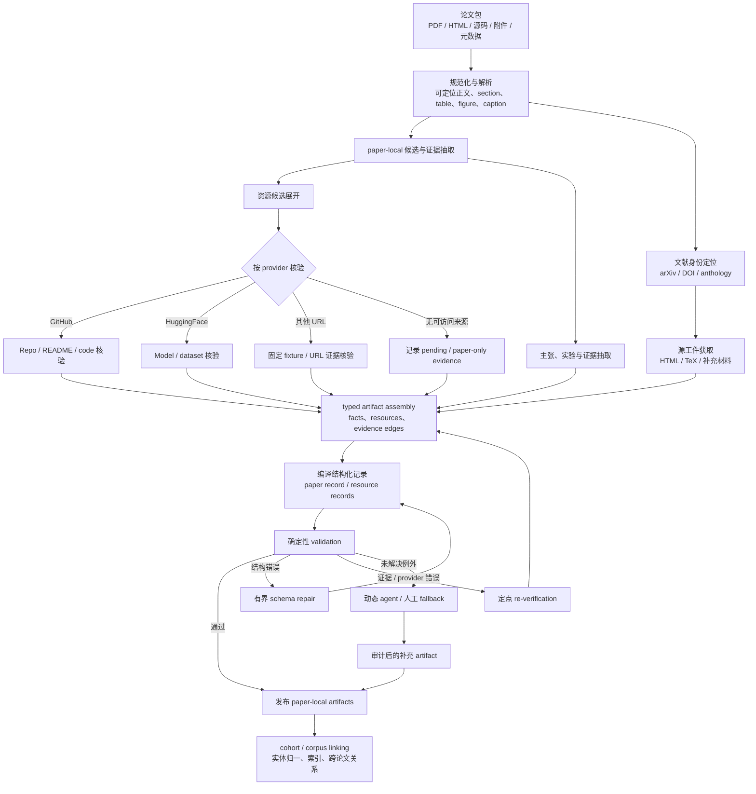

# 从 P4A v1 到 Paper-for-Agents：workload 与 batch 的讨论

> **状态：探索记录，不是决定、实验设计或结果。**
>
> 本文保留 2026-09-04 的讨论，以免当前研究问题尚未收敛时，把临时的术语选择、业务原型或系统设想误写成既定方向。它不改变 [`docs/PROGRESS.md`](../PROGRESS.md) 的主线状态，也不替代其中已记录的实验边界。

## 1. 讨论起点：P4A v1 的视野过窄

而且 P4A V1 目前没有评测体系，无法客观衡量 Agent 执行效果，如果以此为 benchmark 导向，天然就压低了 cache-aware planning 的收益上限

现有 P4A 历史项目的 v1 执行形态是：一个 agent session 处理一篇论文，从读 Skill、读论文、查 arXiv / GitHub / HuggingFace、写 `agent_judgment.json` 到运行校验脚本。它是本项目观察到长 ReAct 上下文重复计费问题的起点，但不应被误当作 *Paper for Agents* 的完整业务模型。

P4A 的完整目标可以重新表述为：

> 将论文及其关联材料加工成可被后续 agent 检索、引用、比较、调用与验证的版本化工件。

在这个定义下，v1 的 resource extraction 只是一个窄切片：`paper → resource_records`。更完整的单篇论文产物可包括：

- 规范化、可定位的正文与内部结构（section / table / figure / caption / page）；
- 带原文证据锚点的事实、主张、实验结果与局限；
- code、dataset、benchmark、model 等资源及其访问、许可、核验状态；
- 可追溯的关系记录（事实 → 证据，资源 → 核验来源）；
- 与语料库中既有实体、任务、方法、数据集和论文的规范化链接。

因此业务单位不应只是一条 `paper → agent session`，还应区分：

1. **paper-local**：解析、抽取、证据定位、资源核验；
2. **cohort-level**：同 venue、格式、领域、任务族、数据集族或规则版本的一批论文；
3. **corpus-level**：实体归一、索引/图谱更新、跨论文关系构建。

历史 P4A 数据与管线保持不可变；这里讨论的是未来 workload 的重构方向，不是重写或重跑历史项目。

## 2. “agentic workflow”不是任务语义标签

Helium 所谓 *agentic workflow* 不是“数据分析”或“学术论文”这样的业务垂类，而是由相互依赖的 LLM 调用、工具调用和中间工件组成的执行结构。其关键条件是：批量任务的 workflow template、算子依赖与 prompt 结构可在执行前编译为 DAG / query plan，进而做 CSE、主动 KV 预热和 cache-aware scheduling。

因此 P4A 是广义的 data-intensive agent workflow：它有固定 procedural knowledge、输入并行重复、长程工具调用和结构化输出；但 P4A v1 的 call-level 控制流由模型在运行时决定，不能直接视作 Helium 已知的 operator-level DAG。

这里曾需澄清一个技术点：Paper-for-Agents 的主路径**应当归约为 DAG**。问题不是“它能否 DAG 化”，而是不同解析层级的 DAG 在何时可见：

| 层级 | 可见结构 | 是否 DAG |
|---|---|---:|
| workflow template | 算子类型、依赖、prompt skeleton | 是 |
| batch instance | 候选资源数、实体匹配、被激活的 repair 节点 | 数据驱动地展开后仍是 DAG |
| fallback agent 内部 | 模型决定的读、搜、验证、重试序列 | 粗粒度可当黑盒节点；call-level 不能预先完整编译 |

有限次数的 repair 可以展开为 DAG 节点；只有无界的“继续调查直到满意”的 ReAct loop 才含真实循环。将 fallback 当作一个粗粒度节点并不使主路径非 DAG，只是隐藏了无法在运行前调度的内部调用。

## 3. 从一条 session 到显式 ingestion workflow

从 P4A v1 的真实轨迹中，可以保守地提炼出如下混合 workflow：

```text
固定任务 / Skill / 已有输入
  → 文献定位（命中 | 重试 | 未匹配）
  → 候选资源按 provider 核验（GitHub | arXiv | HF | 其他 URL）
  → 生成 agent_judgment
  → apply：生成结构化输出
  → validate
      ├─ pass → 发布 paper-local artifacts
      ├─ 结构或证据错误 → 定点 repair / re-verification → apply → validate
      └─ 执行能力不足或异常 → agent / 人工 fallback
```

这里的潜在算子不是凭空设计的。已在固定工具配置、固定时间戳的 961 份 E01 观测集上新增轨迹探测（[`02_trajectory.ipynb`](../../experiments/e01-p4a-trajectory/notebooks/02_trajectory.ipynb) 第 5 节）：

- 952 份为主任务，9 份为独立 repair prompt；
- 949/952 主任务调用过 arXiv MCP，786/952 调用过 GitHub MCP；
- 940/952 调用过 `apply_agent_judgment.py`，934/952 调用过 `validate_layer4_outputs.py`；
- 160/952 在首次 validator 调用后仍发生 `Edit`，可作为 validator 驱动 repair 的保守调用信号；
- 79/952 使用 `Agent` 或 `AgentSwarm`，应视为执行/环境异常信号，而非业务主路径的证据。

该 notebook 的统计仅表示工具调用被尝试，**不**裁定外部查询是否成功，也**不**构成 CachePlan 方法有效性的实验结果。

### 3.1 候选 Paper-for-Agents ingestion workflow

下图只是讨论用的候选业务/执行结构，不是已决定的系统设计。它将 P4A v1 中混在一条长 ReAct session 内的解析、核验、编译、校验与异常处理显式分开；主路径可归约为 DAG，候选数量、实体匹配和 repair 分支则在运行中展开。



从 cache-aware execution 的视角，批处理单位不再是“整篇论文的一条 session”，而是图中 ready 的 operator instance，例如 `ResolveBibliography(paper_i)`、`VerifyGitHubResource(resource_ij)`、`ExtractExperimentEvidence(section_ik)` 与 `RepairJudgment(diagnostic_il)`。这使得同一 workflow 同时暴露 stage、content root、KV 长度与依赖/到达状态，而不是只暴露一个长而私有的 session。

## 4. 多 root 的正确含义

一个因果 LLM prompt 只能沿一条唯一的 token 前缀路径计算 KV；不能把两个任意独立 root 的 KV 随意拼接后当作其串接 prompt 的 KV。

因此“不同 run 有不同 root 可用”应理解为：一个 batch / workflow 含有多个调用，每个调用落在 prefix forest 的不同路径；调度器决定哪些 prefix 物化、pin、相邻执行或驱逐。例如：

```text
全局编译协议 + schema version
├─ 文献定位角色 + arXiv provider contract
├─ GitHub 资源核验角色 + repository evidence contract
├─ HF 资源核验角色 + model/dataset evidence contract
├─ judgment synthesis 角色 + paper-local candidate/evidence
└─ validator repair 角色 + diagnostic class
```

完整 prompt 的合理顺序是：

$$
\text{global procedure}
\rightarrow
\text{stage/role}
\rightarrow
\text{cohort or provider state}
\rightarrow
\text{paper-private artifact}.
$$

只有某一层被足够多 ready calls 经过、其 KV 存活时间足够长且占用预算可承受时，额外 root 才带来节省。一次性 root 只会增加 cache fragmentation。

## 5. AgenticScholar 是业务原型，不是应当照抄的系统

[AgenticScholar](../literature/2026-AgenticScholar.md) 的目标不是简单地将论文放进检索库，而是将 scholarly corpus 组织为：论文内部结构 + taxonomy-anchored knowledge graph + 混合 query planning + 算子化 DAG execution。它说明单篇论文加工可天然包含 corpus-level normalization 和关系构建，也说明“预定义计划 + 动态生成兜底 + 验证自纠错”是可行的混合形态。

但它不应成为直接复制目标：

- 它的主产品是 scholarly DBMS，覆盖从检索到趋势分析/想法生成的 query 面；
- 它的缓存是计划/结果层，而非 prompt/KV 层；
- 完整 taxonomy 和知识图谱构建会把 CachePlan 的焦点移到数据建模。

Paper-for-Agents 的最小业务承诺应先由下游 agent 的真实读取、调用与证据需求界定，再决定是否需要 taxonomy / graph，而不是先建一个大而全的学术 DBMS。

## 6. batch 不只有“共享前缀”

[AlignedServe](../literature/2026-AlignedServe.md) 进一步要求将 batch 拆成两条正交路线：

1. **内容共享**：多个调用共享相同 prefix，避免重复 prefill；这是 Helium / KVFlow / CachePlan 的路线。
2. **长度形态对齐**：同一 decode iteration 内，KV 长度悬殊的请求会形成 straggler bubble；这是 AlignedServe 的路线。

AlignedServe 中的 “prefix” 指输入加已生成 token 的全部 KV 长度，而不指多个请求共享相同文本。它不是 CachePlan baseline，不能拿来证明内容复用；但它提醒我们，按 content root 聚类的调用仍可能因 paper-private context 长度不同而在 decode 中互相拖慢。

一个将两者写清楚的 batch 单位是：

$$
B = (\text{stage},\ \text{content root},\ \text{current-KV-length bucket}).
$$

潜在策略是先按 stage / content root 保住前缀复用，再在 cluster 内按当前 KV 长度分桶，最后交给 continuous batching。相应的调度目标至少同时权衡：

$$
\operatorname{PrefillSaved}
- \lambda\operatorname{DecodeBubble}
- \mu\operatorname{QueueWait}
- \nu\operatorname{KVPressure}.
$$

这只是问题结构，不是已提出的方法。P4A v1 的整 session 长度很可能异质；未来按 operator stage 拆开后是否仍有显著 length skew，必须先测量，不能假定 AlignedServe 的收益会直接出现。

## 7. 研究问题的转向：从单根 session 优化到分阶段、部分显露的 workflow

本讨论的核心转向不是已经决定“做一个复杂的 Paper-for-Agents 系统”，而是改变我们寻找问题的视角：

| 旧的直觉出发点 | 正在探索的出发点 |
|---|---|
| 一篇论文由一个长 agent session 处理；跨 run 主要只有一个固定 Skill root | 一批论文被编译为多阶段、带 typed artifacts 的 ingestion workflow；多个 stage / provider / cohort / corpus-state prefix 可复用 |
| 优化 focus 是 session 内 history 重发与首步静态前缀 | 优化 focus 还包括 ready operator 的形成、cohort batch、prefix forest、KV 预算和 decode shape |
| P4A 是要优化的单一工作负载 | P4A v1 是真实轨迹来源和动态边界案例；未来 Paper-for-Agents 是候选 workload family |
| DAG 与 agentic execution 二选一 | 主路径可编译为 DAG；动态 agent 保留在受限 repair 或异常 fallback |
| batch 主要帮助获得更多 prefix reuse | batch 同时决定内容复用、decode bubble、排队等待和 KV 驱逐 |

据此，尚未收敛但值得继续讨论的候选问题包括：

1. 对结构只随中间 typed artifact 逐步显露的 repeated agent workflow，怎样在线形成 cohort、选择可物化的 reusable context，并调度 ready operators？
2. 静态 `system prompt` 布局、root-aware batching、length-aware batching 各自能贡献多少；它们在何种 workload shape 下互补或冲突？
3. 哪些 paper-local artifacts 与 corpus-level links 是下游 agent 真正需要的，从而为 workflow 的节点与质量指标提供业务约束？
4. 固定 workflow 主干保效率、动态 fallback 保能力时，fallback 率、质量与缓存收益之间的边界在哪里？

这些是讨论问题，不应在未形成可复现协议前升级为实验 claim。后续若要建立新实验目录、脚本或全量运行，先单独讨论并获得确认。

## 8. 当前未作出的决定

本文明确不作出以下决定：

- 不宣布 P4A 已被新业务模型替代；
- 不宣布 Paper-for-Agents 的最终 artifact schema、用户、query interface 或 corpus representation；
- 不宣布多 root / joint batching 一定优于 A2 static-first baseline；
- 不将 Helium、AgenticScholar 或 AlignedServe 作为本项目方法有效性的直接证据；
- 不创建新的实验、数据产物或实现计划。
