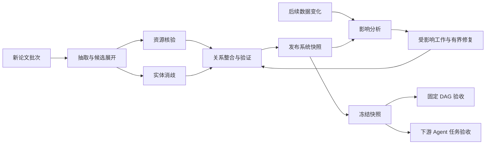

# Mini-bench 任务设计的研究依据：数据管理流程、生命周期与工作流契约

> **日期：2026-09-07。状态：文献调研与候选设计，尚未冻结为任务规范。**
>
> 本文承接[文献资源系统构建与维护 mini-bench 计划](2026-09-06-literature-maintenance-mini-bench.md)，回答：哪些已有系统和管理模式，能够帮助我们设计有业务依据、可验证、适合 Agent 参与的 workflow？文中区分原研究的机制与迁移到本项目的建议；不表示已验证 Agent 必要性、工作负载代表性或 CachePlan 效果。

## 1. 问题与初步判断

Mini-bench 的基本评测对象是一段系统构建与维护过程及其成果快照。任务应由真实的数据管理需求产生，并具有明确的输入、输出、依赖和完成条件；不能仅因需要多 Agent 或缓存命中机会，就人为安排重复角色和步骤。

本轮发现可以分为三层：

| 层次 | 回答的问题 | 优先参考 |
|---|---|---|
| 数据生产与维护流程 | 系统实际需要完成哪些工作？ | D-NET／OpenAIRE、DeepDive、NADEEF、ProVe |
| 数据对象生命周期 | 何时启动工作，何时算完成，变化后哪些工作需要重新打开？ | Guard–Stage–Milestone（GSM） |
| 工作流模板与语义契约 | 哪些数据与能力足以支持一个下游流程？ | WINGS、AgenticScholar |

**D-NET／OpenAIRE 最接近“文献系统中有明确的工作流管理方案”；GSM 适合组织逐步显露的工作；WINGS 适合支撑最终快照对固定 DAG 的能力验收。** 这是针对本项目需求的判断，不是对这些系统的普遍排名。

需要区分三个对象：

- **管理模型**：规定状态、条件、事件、阶段和合法变化，可以包含分支、循环和重新验证。
- **具体执行依赖图**：由某次输入和运行结果逐步展开，约束可执行工作及其先后关系。
- **下游验收 DAG**：预先定义，用来检查冻结快照是否提供足够的数据与能力。

固定下游验收 DAG 不要求所有参评方法使用相同的构建 DAG；执行 DAG 也不要求管理生命周期本身无环。

## 2. 可借鉴的研究与系统模式

### 2.1 D-NET／OpenAIRE：聚合、整合并提供数据服务

**原研究与系统依据。** D-NET 的 *The D-NET Software Toolkit: A Framework for the Realization, Maintenance, and Operation of Aggregative Infrastructures*（2014）研究如何组合数据管理服务，构建和运行异构数据聚合基础设施。其 EAGLE 应用明确描述了带有 fork/join 的工作流，以及由多个工作流组成的 meta-workflow，并给出采集、转换、清理、索引和对外提供数据的处理序列。[D-NET 在 EAGLE 中的工作流实例](https://ircdl2015.unibz.it/papers/paper-13.pdf)

OpenAIRE 的去重处理进一步分成五个阶段：导入记录、候选聚类、成对判断、重复记录分组、关系重新挂接。合并后的代表记录保留来源信息，相关关系也需要迁移。[OpenAIRE 去重流程，文档版本 5.1.1](https://graph.openaire.eu/docs/5.1.1/graph-production-workflow/deduplication/)

**迁移建议。** 文献入库的产物应包括共享实体及关联关系，而不只是单篇论文的独立 JSON。可考虑：

`资源候选抽取 → 与已有实体生成匹配候选 → 消歧 → 新建／关联实体 → 更新论文—资源关系`

这类任务自然引入多输入处理、候选集合展开、跨论文整合和共享状态写入。候选生成可以用普通检索或程序；需要语义判断的消歧才是 Agent／LLM 的候选执行位置。

**迁移边界。** OpenAIRE 的工作级去重服务于其统计需求。我们的 work、paper version、resource、resource version 应先约定身份语义；同一工作的不同版本可以关联，但不能因此丢弃各版本的独立内容与证据。也不能直接对不确定的 Agent 成对判断取传递闭包，就认为所得实体合并一定正确。

### 2.2 DeepDive：增量知识库构建

**原研究依据。** *Incremental Knowledge Base Construction Using DeepDive*（PVLDB 2015）将知识库构建定义为从异构输入中通过抽取、清理和集成产生结构化事实，并处理数据与规则的变化。其技术重点是 grounding 和统计推断的增量计算；论文中的一组系统快照实验涉及 KBC 系统的迭代开发。[原论文，§1–3](https://www.vldb.org/pvldb/vol8/p1310-shin.pdf)

**迁移建议。** 首次入库之外，可以加入版本化变化事件：

`变化到达 → 确定受影响记录及派生关系 → 重新核验／计算 → 验证 → 发布新快照`

例如资源说明出现新版本，可能牵动论文—资源关系的核验状态，以及依赖该状态的汇总。任务必须说明变化对象、旧版本、新版本和预期受影响范围。

**迁移边界。** “资源更新事件 benchmark”是我们的设计建议，不能把 DeepDive 的开发快照实验直接说成这种协议的验证。增量结果维护与 KV-cache 复用也属于不同层次：若主实验研究 CachePlan 的执行优化，不同策略应面对一致的结果复用规则和维护语义；由跳过有效结果重算得到的收益应单独归因。

### 2.3 Guard–Stage–Milestone：数据对象驱动的生命周期

**原研究依据。** GSM 将业务实体的信息模型与生命周期结合起来，用条件与事件推进工作，支持层次结构、并行以及不同实体实例之间的交互。[Hull 等，DEBS 2011](https://research.ibm.com/publications/business-artifacts-with-guard-stage-milestone-lifecycles-managing-artifact-interactions-with-conditions-and-events)

三个核心概念是：Guard 控制阶段何时启动；Stage 组织为某个目标执行的活动；Milestone 表示已达成的业务目标，也可以因后续条件或事件而失效。[GSM 模型说明](https://kodu.ut.ee/~dumas/pubs/bpmws2012gsm.pdf)

**迁移建议。** 以下是我们自己的文献管理实例，不是原论文案例：

| 数据对象 | Guard：启动条件 | Stage：工作阶段 | Milestone：可检查的完成状态 |
|---|---|---|---|
| 论文版本 | 新 PDF 到达 | 解析与抽取 | 必需字段及证据已产生 |
| 资源候选 | 抽取发现候选链接 | 获取材料、核验归属 | 已核验，或明确记录无法确定的原因 |
| 实体匹配案例 | 存在多个可能对应对象 | 消歧与关系处理 | 建立可追溯的新建／关联决定 |
| 待发布记录 | 必需检查完成 | 一致性验证与发布 | 满足发布契约 |
| 已发布记录 | 支撑材料发生相关变化 | 影响分析与重新验证 | 产生新版本及更新后的状态 |

抽取前不知道有多少资源候选；消歧前不知道涉及哪些已有实体；验证前不知道是否需要修复。这使后续任务由实际数据状态触发，符合“逐步显露依赖”的需求。

**迁移边界。** 不必实现完整 GSM 引擎。可以先借用条件、阶段、完成状态和失效条件来写任务契约。若运行时采用 DAG，需要把不同版本和修复尝试表示为不同执行节点，并保留数据依赖和共享写入冲突；不能用“生命周期已完成”取代独立正确性评价。

### 2.4 NADEEF：规则驱动的质量检测与修复

**原研究依据。** NADEEF（SIGMOD 2013）通过统一接口表达多种数据质量规则，由规则说明哪里存在问题以及可能如何修复，再由系统执行错误检测与清理。[原论文介绍](https://docs.lib.purdue.edu/ccpubs/529/)

**迁移建议。** 把验证输出定义成有类型的诊断，使后续工作具有具体对象：

`约束检测 → 生成诊断与候选修复 → 处理修复冲突 → 应用修改 → 重新验证`

例如论文记录引用了不存在的资源版本，或同一个版本的证据归属不一致。修复需要说明修改哪些字段、引用哪个输入版本、满足哪些前置条件，以及怎样避免破坏其他有效关系。

**迁移边界。** 上述完整循环是我们的候选流程，不是对 NADEEF 算法的逐步复述。结构约束检查可以由确定性程序执行；需要重新阅读原文、判断实体或解释冲突时，再考虑 Agent。schema 合法、规则不再报错，都不足以证明语义正确。

### 2.5 ProVe：声明与其来源之间的证据核验

**原研究依据。** ProVe 核验知识图谱三元组是否得到其记录的文本来源支持。其模块包括文本提取、三元组转述、证据句选择与声明核验，输出判断和证据。判断涉及支持、反驳和信息不足；输入已经给定声明及其来源。[ProVe，§3](https://journals.sagepub.com/doi/10.3233/SW-233467)

**迁移建议。** 例如检查“论文 P 使用了数据集 D”这一关系是否得到引用段落支持：

`读取声明及来源 → 定位证据 → 判断支持程度 → 生成诊断 → 必要时触发有界修复`

诊断可以触发更正关系、重新定位证据或保留不确定状态。它既可作为构建阶段的核验子流程，也可启发快照验收的证据支持指标。

**迁移边界。** 来源支持与事实真伪应分别表达；未找到支持不等于事实为假。开放式寻找新来源和修复是我们的扩展，不能归为 ProVe 已验证的原始任务。构建阶段的核验输出也不能直接充当评测 gold，应另有独立标注或审查。

### 2.6 WINGS：语义工作流模板与能力契约

**原研究与系统依据。** WINGS 提供可复用的科学工作流模板，通过传播数据和组件的语义约束来检查适用性、选择具体组件，并展开集合上的并行处理。[WINGS 研究说明](https://wings-workflows.org/research.html)

官方教程还描述了 interleaving：先执行部分工作，获得真实输出元数据，再继续规划后续流程。[WINGS 教程，§3.1](https://wings-workflows.org/tutorial/tutorial.html#3.1)

**迁移建议。** 用契约定义“系统快照支持一个固定 DAG”：

- 所需记录和资源可以找到；
- 输入类型、版本、证据状态满足算子要求；
- 节点之间的数据组合满足兼容条件；
- 完整流程产生正确且完整的输出；
- 对不具备条件的实例，准确报告缺失或不兼容的原因。

例如比较实验结果时，流程可能要求同一数据集版本、兼容的评测设置和可追溯数值。仅存有论文摘要，不代表快照已具备这种能力。具体约束必须针对任务定义，不能假定所有比较都要求完全相同的配置。

**迁移边界。** 数据契约满足只是完成任务的必要条件之一，仍要检查最终输出质量。工作流模板、集合展开和边执行边规划已有先例，不能单独作为 CachePlan 的新颖性主张。我们借此定义验收，不预设必须使用 WINGS、OWL 或特定执行引擎。

### 2.7 AgenticScholar：学术算子与集合展开

**本地论文依据。** AgenticScholar 的 Table 2 包含 `Search`、`Extract`、`Verify`、`Check`、`GroupBy`、`Aggregate`、`Rank` 等算子；Algorithm 2 区分逐条展开的 `instance` 算子与处理集合的 `group` 算子，并按依赖就绪情况执行。[本地论文，Table 2、Algorithm 2](../../references/papers/2026-AgenticScholar/source.pdf)；[已有评议](../literature/2026-AgenticScholar.md)。

**迁移建议。** 可据此设计集合工作流：

`检索论文集合 → 逐篇抽取 → 分组 → 跨论文检查 → 聚合输出`

这个模式可以帮助确定单输入算子与集合算子的边界，也适合下游固定 DAG 的设计。

**迁移边界。** 上述算子编排主要面向查询与分析执行；持续入库、版本变化和发布条件需要额外定义。论文中的计划／结果缓存也不能视为 KV-cache 管理机制。

## 3. 首版候选任务家族

建议先考虑同一系统内的三个任务家族，具体是否采用仍待讨论：

| 任务家族 | 主要依据 | 候选流程 | 主要验收对象 |
|---|---|---|---|
| 批量入库与实体整合 | D-NET、OpenAIRE、ProVe | 抽取 → 候选展开 → 核验／消歧 → 关系整合 → 发布 | 实体与关系正确完整，来源和版本可追溯 |
| 变化驱动的维护 | DeepDive、GSM、NADEEF | 变化到达 → 影响分析 → 重验证／修复 → 发布新版本 | 预期变更完成，未遗漏受影响数据，未误改其他内容 |
| 冻结快照上的能力验收 | WINGS、AgenticScholar、ProVe | 选择记录 → 检查契约 → 关联／核验证据 → 聚合成果 | 固定 DAG 和下游 Agent 能否完成任务及其产物质量 |

以下图是这些模式启发的候选管理骨架，不是任何论文的原图，也不是冻结的执行 DAG：

图中的反馈表示生命周期上的后续维护；具体执行应区分快照版本和尝试实例。核验与消歧是否能并行、何时可以发布、哪些写入存在冲突，需要由契约确定，不能仅依据图上的并行分支判断。

### 3.1 固定 DAG 的候选实例

可以从已有计划中的服务需求出发，定义一个“评测资源与证据表”流程：

`选出目标主题论文 → 关联实验记录与数据集版本 → 检查评测设置兼容性 → 关联代码入口及文件证据 → 聚合成表`

输出至少区分已确认、材料缺失、信息不足和不兼容的情况；不能强行给每篇论文补出肯定结论。此例用于说明如何从下游需求反推构建产物，并不确定首版字段、题目或阈值。

### 3.2 构建与验收的边界

验收从冻结快照开始，在统一条件下运行。允许读取哪些原始材料、是否允许下游推理以及其预算，应在协议中明确；不能在验收阶段静默补建缺失实体或关系，再将其算作构建成果。

下游 Agent 支持度主要评价完成情况、产物质量与证据充分性，不严格以该 Agent 的执行效率评分。构建阶段的总成本、吞吐、延迟、排队和缓存压力另行记录。固定 DAG 支持度、Agent 支持度和 QA 的具体权重尚未确定。

## 4. 与 CachePlan 的关系及归因边界

这些管理模式为工作负载提供了业务理由：

- 多篇论文应用同一版本的处理规范，产生跨输入重复的程序性知识；
- 候选资源和匹配对象在运行中展开，形成可观测的调度边界；
- 不同任务触及共享实体、证据和版本，需要合法的跨任务组织；
- 外部材料获取、核验和有界修复形成长短不同、包含工具等待的工作。

它们支持“为什么研究系统级批量 Agent 工作流”的设计动机，但尚不能证明前缀共享规模、缓存竞争强度或调度收益。共同算子、相似文档和相同 Skill 都只产生潜在复用；实际 KV 复用仍要求相同有序 token 前缀、兼容配置以及可用推理状态。

主实验应区分结果／artifact 复用、计划复用与 prompt／KV 复用，并分离算子调度、后端请求调度、缓存驻留策略和 prompt 重构。静态规范基线应保留完整的同信息处理程序；普通程序足以完成的节点无需强行改成 Agent。

已有研究也说明，持续系统构建、增量维护、工作流展开和生命周期管理各自都有先例。本文用于建立任务依据，不能据此宣称“首次把这些概念用于系统”或确认相对所有 Agent benchmark 的新颖性。论文主线仍是：CachePlan 能否在这些实际约束下，以相当质量和一致资源条件，相对强基线改善有用工作的执行效率。

## 5. 下一轮需要确定的任务契约

比立即选定一张完整 DAG 更先需要确定的是：

| 契约项 | 需要回答的问题 |
|---|---|
| 业务目标与来源 | 此任务服务哪个系统能力？依据哪个研究模式或实际需求？ |
| 触发事件 | 新论文、资源变化、候选发现还是验证诊断触发工作？ |
| 输入与版本 | 读取哪些记录、材料、规范和已有系统快照？ |
| 输出与证据 | 产生哪些字段、实体、关系、诊断和来源定位？ |
| 共享状态 | 读写哪些对象？何时需要等待、重新检查版本或处理冲突？ |
| 完成与失败条件 | 什么算完成？缺失、未知、失败如何表示？修复如何有界终止？ |
| 执行方式 | 哪些工作适合确定性程序、单次 LLM 或工具增强 Agent？ |
| 独立验收 | gold 如何产生？怎样区分结构合法、证据支持和语义正确？ |
| 优化边界 | 哪些顺序可调整？各策略获得哪些相同信息和复用能力？ |

建议先为“批量入库与实体整合”中的少量核心算子写出这些契约，再判断是否需要在首版加入维护事件，以及哪些下游 DAG 足以检验所构建系统。本文不决定任务规模、算子接口、实现框架或实验配置。
