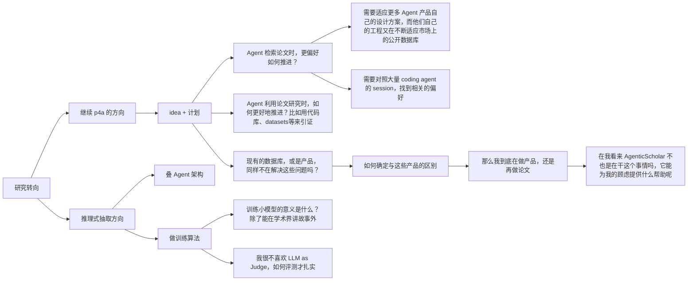

## 主题

对原本 papers for agents 的 idea 的 callback 与延申；

### 讨论

p4a 的初衷是服务于如何让 agent 更好地使用论文成果，帮助其完成检索、查询、阅读和使用。为此，我们设计了一组 schema，这些 schema 能够更好地表述一篇论文的关键信息，例如元数据、引文、以及代码仓库 github\huggingface\datasets\benchmark 的使用。从最底层的 schema 开始，能够构建更加深度的网络，支持更加复杂的应用，[p4a协议](docs/discussions/p4a-v1-protocol.md) 正是在这个设想下提出的

目前我想要产出学术论文，因此想要从这个出发继续推进。推理式抽取，是老师提到的方向，与我的 p4a 的交叉点是，我同样在 p4a 的工程中进行过抽取。我的核心出发点是

> 信息抽取和知识组织能够更好的支持 Agent 运行、使用

但是在 p4a 的抽取与构建过程中，也是我的思考中，我并没有把诸如 claim、discussion 等这种相对自然语言化、需要语义理解和加工的内容，作为重点。出于几点原因：

+ 这些知识的抽取高度依赖 prompt 工程的引导，如何设计这些提示词和抽取方案，本身就是值得研究的题目；
+ 抽取方案往往不代表某种公正的正确性，而是符合应用需求或是某些指标的叙事，很大程度上需要对着 benchmark 或者指标优化。

因此我个人觉得确定性的元数据，例如标题、作者、引文等，以及确定性的资源，例如代码、数据集、benchmark等才是值得关注的。聚合这些数据，同样能帮助 Agents 更好的利用论文。就像以往 papers with code 的工作。

### 困惑

现在研究的方向摆在眼前，我应该更加关注如何去推理式抽取，构建一套自己的叙事，如何抽取更好，还是继续这个“为 agent 提供支持” 的方案呢？

这是一个树状图

我对 [AgenticScholar](references/papers/2026-AgenticScholar-reread/source.pdf) 那篇论文其实个人评价不高，但是他那样都能发论文，能在某种程度上给我参考和支持吗？我能不能继续在 p4a 的基础上推进系统化的构建，来完成论文呢