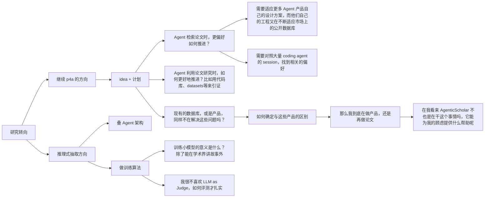

## 当前讨论结论（2026-09-10，Introduction 修订）

**当前主线：方便 Agent 发现和使用研究资源。** 以 Agent 面对研究问题时的发现、判断、选择和使用准备为叙事中心，将已发表论文及关联材料加工为可复用的研究知识。

- Introduction 先用渐进式研究案例呈现行动和需求，再引出分散材料与可复用理解之间的 gap，总论式介绍 P4A。
- Community 保留为系统内部的候选组织方式，不在当前 Introduction 中引入。其检测设计及与 GraphRAG 的具体比较仍待研究。
- 第 1–9 节保留早期定位，第 10–11 节记录 community 讨论；其中以 community 为 Introduction 中心的安排已由本次讨论调整。
- “意见跟进”保留用户原始意见与所附 storytelling 骨架；第 12 节整理当前叙事、案例、贡献位置及证据边界。
- 已授权修改讨论稿和 Introduction 草稿，尚未确定方法、benchmark 或实施计划。

---

## 主题

对原本 papers for agents 的 idea 的 callback 与延申；

### 讨论

p4a 的初衷是服务于如何让 agent 更好地使用论文成果，帮助其完成检索、查询、阅读和使用。为此，我们设计了一组 schema，这些 schema 能够更好地表述一篇论文的关键信息，例如元数据、引文、以及代码仓库 github\huggingface\datasets\benchmark 的使用。从最底层的 schema 开始，能够构建更加深度的网络，支持更加复杂的应用，[p4a协议](p4a-v1-protocol.md) 正是在这个设想下提出的

目前我想要产出学术论文，因此想要从这个出发继续推进。推理式抽取，是老师提到的方向，与我的 p4a 的交叉点是，我同样在 p4a 的工程中进行过抽取。我的核心出发点是

> 信息抽取和知识组织能够更好的支持 Agent 运行、使用

但是在 p4a 的抽取与构建过程中，也是我的思考中，我并没有把诸如 claim、discussion 等这种相对自然语言化、需要语义理解和加工的内容，作为重点。出于几点原因：

+ 这些知识的抽取高度依赖 prompt 工程的引导，如何设计这些提示词和抽取方案，本身就是值得研究的题目；
+ 抽取方案往往不代表某种公正的正确性，而是符合应用需求或是某些指标的叙事，很大程度上需要对着 benchmark 或者指标优化。

因此我个人觉得确定性的元数据，例如标题、作者、引文等，以及确定性的资源，例如代码、数据集、benchmark等才是值得关注的。聚合这些数据，同样能帮助 Agents 更好的利用论文。就像以往 papers with code 的工作。

### 困惑

现在研究的方向摆在眼前，我应该更加关注如何去推理式抽取，构建一套自己的叙事，如何抽取更好，还是继续这个“为 agent 提供支持” 的方案呢？

这是一个树状图



我对 [AgenticScholar](../../references/papers/2026-AgenticScholar-reread/source.pdf) 那篇论文其实个人评价不高，但是他那样都能发论文，能在某种程度上给我参考和支持吗？我能不能继续在 p4a 的基础上推进系统化的构建，来完成论文呢

---

## 讨论汇总（2026-09-09）

本节整理上述问题的后续讨论。原始想法保留在上方；以下区分用户明确表达的倾向、讨论提出的建议，以及尚未成立的研究假设。本文没有确定 benchmark、系统架构或实施计划。

### 1. 当前倾向：继续 P4A，探索系统论文的组织方式

用户希望研究的是：**已发表论文如何被 Agent 接收和使用**。输入来自现有论文、代码仓库、数据集、模型和补充材料，不以作者采用新的出版协议、在研究过程中主动记录完整轨迹为前提。

建设重点是将计算机领域论文中相对具体、容易核查的内容联系起来，包括元数据、引文、代码、数据集、模型、benchmark 等。期望这些关联能够：

- 帮助 Agent 检索与筛选论文；
- 为“值不值得读、值不值得参考”提供依据；
- 帮助 Agent 找到并进一步使用研究成果。

用户倾向于以 **系统构建** 为论文叙事重点，参考 AgenticScholar 将知识表示、处理流程、查询与下游评测组织为系统工作的方式。无需预先将论文限定为某一种抽取算法，也不要求为了贴近“推理式抽取”而重点处理 claim、discussion 或贡献谱系。

当前可用的系统定位草案是：

> 面向已发表的计算机领域论文，整合论文及其代码、数据集、模型、benchmark 等资源，构建可查询、有来源依据的关联记录，帮助 Agent 检索论文、判断其与当前需求的关系，并进一步使用研究成果。

这段话描述建设目标，**尚不是已经证实的新颖性或论文贡献**。暂定投稿目标仍为 SIGMOD，但本次讨论没有形成可发表性的判断。

### 2. P4A 与推理式抽取的关系

“帮助 Agent 使用论文”可以决定系统解决什么问题；推理式抽取可以承担从分散材料中恢复信息和对应关系的工作。抽取对象和组织方式应由使用任务决定，不必将两者当成互斥方向。

“相对确定性”描述的是对象具体、判定较容易约束，不意味着抽取和关联无需语义理解。例如：

- 仓库是作者实现、第三方复现，还是论文依赖的基础工具？
- 数据集用于训练、评测，还是仅在相关工作中被提到？
- 某项结果对应哪个数据版本、划分和预处理？
- 仓库提供完整评测流程，还是只有推理示例？

这些都是候选问题，不能仅凭它们需要推理就认定存在新研究空间。

应用需求可以决定抽取哪些信息，但事实判定仍必须受证据约束。应避免先设计 schema 和系统，再生成只适合该系统的问题，最后用这些问题证明系统有用。

推理式抽取不预设多 Agent 架构，也不预设训练小模型。流程设计、模型训练和工具调用都需要对应实际困难与可测收益；目前没有确定采用其中任何一种。

### 3. 已有工作对研究定位的约束

讨论中曾提出将“论文资源实体及其使用关系的可靠构建”作为切入点。用户指出该表述过于基础、宽泛，已有大量相邻工作。后续核查支持这一质疑：不能把已有工作概括为简单的资源目录，也不能通过增加“面向 Agent”“可验证”等描述直接获得新颖性。

| 工作 | 已覆盖的相关内容 | 对 P4A 定位的约束 |
| --- | --- | --- |
| [SciREX](https://aclanthology.org/2020.acl-main.670/) | 文档级实体、显著实体与 Method、Task、Dataset、Metric 多元关系抽取 | 论文中的实验相关实体与关系已有明确任务定义 |
| [Softcite](https://github.com/softcite/softcite_dataset_v2) 及[后续抽取资源](https://github.com/softcite/softcite-extractions-oa) | 软件名称、版本、发布者、URL，以及 used、created、shared 等用途判断 | 区分资源提及与使用、识别软件角色并非空白 |
| [SoMeSci](https://github.com/dave-s477/SoMeSci) | 软件提及、版本、开发者、许可证、引用、别名等标注与实体链接 | 关系、文本定位、身份关联及人工金标准已有基础 |
| [SoftwareKG](https://arxiv.org/abs/2003.10715) | 从超过 5.1 万篇社会科学论文构建软件知识图谱，分析软件使用与可获得性 | 聚合资源后支持跨论文查询与分析已有先例 |
| [ORKG](https://academy.orkg.org/courses/template-course.html) | 研究贡献结构化、模板及跨论文比较；另有 [LLM 结构化科学摘要研究](https://arxiv.org/abs/2405.02105) | 结构化论文知识和自动构建都需对照既有研究 |
| [Workflow Run RO-Crate](https://www.researchobject.org/workflow-run-crate/profiles/) | 工具及工作流执行的输入、输出与逐步骤 provenance | 资源、执行和可追溯记录已有表示体系 |
| [OpenAIRE](https://graph.openaire.eu/docs/data-model/relationships/) | 研究产物的依赖、派生、版本等关系，以及 provenance、trust 和验证状态 | 有来源、版本及验证记录的关系层不能直接宣称为新设计 |

这些工作包括任务与数据集、知识库、表示规范和基础设施，不能只按功能勾选比较。上表是初步定位，不是完整相关工作综述，也未证明任何剩余问题无人研究。

后续需要分别回答：

1. **表示：** 现有模型能否表达所需信息？能够表达时，优先考虑复用。
2. **构建：** 现有方法能否以足够的质量和成本获得这些信息？表示存在不代表自动构建已解决，但使用推理模型也不自动构成贡献。
3. **使用：** 这些信息是否改善具体任务？下游收益不能单独证明表示新颖或构建方法先进。

“面向 Agent”可以改变设计取舍、信息生产成本与使用方式，即使底层复用已有标准，仍可能产生研究问题。但需要说明具体变化，不能仅把消费者名称换成 Agent。

### 4. ARA 提供的叙事启发与边界

用户特别认同 [The Last Human-Written Paper: Agent-Native Research Artifacts，v3](<../../tmps/2026, The Last Human-Written Paper, Agent-Native Research Artifacts, Jiachen Liu et al., v3.pdf>) 的叙事：越来越多的论文被 Agent 阅读和参与撰写，由此重新思考学术资源的交换格式。

ARA 的论证将生产与消费两端联系起来：

- **消费端：** Agent 理解、执行和扩展研究时，需要论文叙事中没有充分表达的细节。
- **生产端：** 人机协作留下了会话、工具调用和实验记录，为保存过程知识提供机会。
- **信息损失：** 作者用 Storytelling Tax 描述失败尝试和研究分支的丢失，用 Engineering Tax 描述论文说明与执行要求之间的缺口。
- **载体设计：** 以研究知识对象为主要产物，论文成为其编译视图；通过 `/logic`、`/src`、`/trace`、`/evidence` 及跨层联系组织内容。（原文 §1–4、图 4–5）

这套叙事对 P4A 的启发是：从研究成果消费者的变化出发，讨论成果如何被接收和使用，而不只讨论字段抽取准确率。

用户明确选择了**已发表成果的后续加工**，没有选择研究过程中的原生记录与出版流程改造。但 ARA Compiler 同样处理历史论文和仓库，因此该选择尚不足以构成与 ARA 的区别。

需要保留的证据边界：

- 会话记录丰富，不代表完整研究过程都被记录；历史材料未留下的信息不能靠格式转换恢复。
- ARA 的构建使用了专家 rubric 或历史运行轨迹，而常规基线没有这些额外材料。作者报告的问答得分提升可以支持更充分交付研究材料的价值，不能全部归因于格式本身。（§7.1–7.2、Table 3）
- 问答和复现评测使用模型裁判；扩展任务中，失败历史既可能帮助探索，也可能限制后续 Agent。（§7.2–7.4）
- ARA 对已有标准的概括需要独立核查，尤其应考虑 Workflow Run RO-Crate 等扩展。

### 5. AgenticScholar 作为系统论文参照

用户将 [AgenticScholar](../../references/papers/2026-AgenticScholar-reread/source.pdf) 看作帮助 Agent 检索和使用论文的一项实践，并希望借鉴其系统构建与评测方式。

它的范围不止检索，还包括抽取、跨论文综合和知识发现。可借鉴的是：围绕具体学术查询组织知识表示、查询规划和执行，并用系统实验进行比较；这为 P4A 提供了一种论文组织方式，不要求每个组件都是新的训练算法。

其评测应分开理解：本地版本 §6.2 使用 197 条人工标注的排序查询和 NDCG，§6.3 的趋势分析、研究想法等开放任务使用 GPT-5 打分。因此，不能说它全部依赖模型裁判，也不能用开放任务分数直接证明事实抽取和研究判断可靠。

已有系统论文的发表提供形式上的参照，不能替 P4A 证明新颖性、有效性或可发表性。P4A 不必复制其完整功能范围。

### 6. 系统建设工作量如何形成论文内容

用户提出通过系统化构建、关联资源和充分评测积累工作量。讨论支持以系统为中心，但需要将建设工作转化为可解释、可比较的能力：

- 建立语料、接通不同来源、处理真实数据问题、实现完整流程和开展实验，都可以成为系统工作的重要基础。
- 功能数量、数据规模和实验表格数量不能单独承担贡献。
- 需要说明系统支持了什么困难任务、哪些设计对完成任务必要、相对已有工具的合理组合改善了什么。
- 底层可以复用已有服务、方法和标准；整体设计是否有贡献，需要通过比较与组件分析判断。

基线不能仅限于普通文档 RAG。**现有资源服务或知识库与通用 Agent 的合理组合**也应成为比较候选。具体系统、接入方式和信息条件尚未确定。

### 7. “论文价值”与使用任务

用户希望关联资源帮助判断论文是否值得读、值得参考。讨论建议将可评测目标表述为：**为论文对当前任务的适用性、阅读与参考优先级提供依据**。

代码发布状态和资源完整性不等于学术价值，不应直接转化为通用的论文价值分。以下是候选使用需求，不是已确定的 benchmark：

| 需求 | 系统可能提供的依据 |
| --- | --- |
| 找可采用的实现 | 作者实现是否存在、覆盖什么功能、有哪些使用条件 |
| 找实验参照 | 数据集、benchmark 和评测设置 |
| 找可利用的数据 | 获取位置、版本、划分及相关说明 |
| 决定阅读优先级 | 与当前问题的匹配程度、配套材料能否支持后续工作 |

不必先适配所有 Agent 产品或收集大量 coding agent session。是否需要 session，应由任务代表性和实际研究问题决定。

### 8. 候选评测结构

讨论提出三个层次，借鉴系统论文从基础能力到下游任务的组织方式，但尚未确定任务、规模、标注流程或指标口径。

| 层次 | 核心问题 | 候选评测内容 |
| --- | --- | --- |
| 关联记录质量 | 数据产品是否正确、充分且有依据？ | 资源身份、角色、版本、证据支持；错误关联和遗漏 |
| 检索与筛选 | 关联信息是否帮助找到符合需求的论文？ | 带资源条件的查询、条件满足情况、检索与排序质量 |
| Agent 使用 | 是否更容易完成具体后续任务？ | 找到正确实现、选定符合要求的数据版本、交付有依据的资源清单或完成明确使用步骤；成功率、成本与失败类型 |

评测建议与边界：

- 核心事实与关系可依靠独立人工标注、判定指南和争议处理评价，不必主要依赖 LLM-as-Judge。
- 查询应独立于系统输出构造，避免只考系统拥有的字段。
- 证据链接存在、schema 合规、语义正确、执行成功与实验复现是不同结论，必须分别判断。
- 保留“未找到”“明确没有”“材料矛盾”等区别，避免把未知转成否定或肯定。
- 控制基线的信息访问条件与预算；区分额外材料、知识组织、抽取方法和模型能力的影响。
- 计入建库成本，区分一次性使用与多次复用；下游收益不能代替关联记录的质量检查。

### 9. 尚待讨论的问题

1. 第一版系统具体支持哪些检索、筛选与使用任务？核心输出是什么？
2. P4A 既有字段、关系与预期查询，有多少可以映射到现成标准、知识库和数据集？
3. 现有服务与通用 Agent 的组合在哪些任务上持续失败？原因是覆盖不足、信息缺失、关联错误、组织方式，还是执行能力？
4. 哪些关键系统设计能够对应这些困难？哪些只是必要集成工作？
5. 如何与 AgenticScholar、ARA Compiler 及相关资源基础设施形成具体比较？
6. 如何固定语料、外部材料版本、独立质量标注、信息访问权限和成本口径？

下一步可先讨论一份系统论文提纲，明确目标任务、输入输出、关键设计问题、比较对象与评测层次，再决定实施范围。本次仅汇总讨论，未启动系统实现或实验。


### 10. Community 检测备忘（2026-09-10）

用户当前偏好按 community 组织论文、dataset、benchmark、代码库等资源，由 Agent 为每个 community 生成用于检索的摘要，不以复杂知识图谱关系作为主要组织方式。

**Community 的检测与形成机制需要专门设计。** 后续应明确资源为何被组织在一起，以及这种组织如何帮助摘要检索，并与 GraphRAG 的 community 构建、摘要及检索机制进行具体比较。不能仅凭采用 community 和 Agent 生成摘要就宣称区别或新颖性；GraphRAG 的具体机制与差异仍需核查，当前尚未确定检测算法或验证方案。


### 11. Community 组织与 Introduction 推进（2026-09-10）

#### 用户明确的设计偏好

用户不倾向于用知识图谱组织复杂关系，更偏好围绕论文、dataset、benchmark、代码库等资源形成 community，由 Agent 为每个 community 生成摘要，以摘要支持检索。Community 检测需要专门设计，并具体研究与 GraphRAG 的区别（见第 10 节）。本次用户同意先写 introduction 初稿，并将讨论记录于本文；这不等于确定检测算法、系统架构或 benchmark。

#### 原始 P4A schema 的作用

原协议可继续提供资源身份、描述、入口与来源等基础记录，以及从单篇抽取到跨资源组织的加工思路。Community 成员记录和有来源依据的摘要可以成为新的组织中心；多视角分类为不同组织视角提供参考。复杂关系图、贡献谱系、动态本体与完整复现目前不必承担核心故事。资源关系可在需要时保留，但不要求构建完整知识图谱。

讨论提出允许同一资源参与多个 community，作为候选设计，而非已确定要求。Schema 应服务于成员组织、摘要追溯和资源定位；增加字段本身不足以建立研究贡献。

#### 候选核心立意

研究如何通过集合层面的知识组织，支持 Agent 发现异构研究资源：将相关资源组织为 community，生成有来源依据的集合摘要作为检索入口，并进一步定位具体资源。

讨论提出，除了主题相似性，还可考察资源在研究任务中的互补性。例如，方法论文、评测数据和实现代码的描述可能差异较大，却共同服务一个研究需求。互补性是否应参与 community 检测、如何定义与验证，仍待设计；它尚不是与 GraphRAG 的已证实区别。

核心假设是：集合摘要能够表达单个资源描述难以完整呈现的主题和使用背景，从而改善资源发现。风险包括摘要泛化、重要成员遗漏，以及把个别成员的能力误写成整个集合的能力。摘要流畅不能代替检索收益与事实质量验证。

#### 三个候选设计问题

1. Community 形成：如何确定成员归属，兼顾主题关联和使用上的互补，避免集合过宽。
2. 摘要生成：如何概括共同特点并保留成员差异，将描述对应到具体来源与资源。
3. 检索与定位：如何把摘要命中转化为正确的资源发现，避免具体需求被集合主旨掩盖。

“先检索 community 摘要，再定位成员，同时保留直接资源检索”是一种讨论候选，尚未选定。层级、重叠、更新方式和查询执行机制也未确定。

#### Agent 的角色与系统边界

Agent 可承担材料理解、community 组织、摘要生成与检查；下游 Agent 消费检索结果并继续研究任务。AgenticScholar 可作为表示与操作相互配合的系统参照，但不要求 P4A 复制通用规划器、DAG 或执行算子库。是否引入查询时补充检查，应由具体任务决定。原协议中将研究资源包装为 AgentCallable，与系统内部执行检索算子是不同任务，当前未确定资源包装与执行验证范围。

#### Introduction 的组织与待补证据

初稿按以下论证推进：Agent 的异构资源需求 → 单个资源描述与集合背景之间的缺口 → community 与摘要的候选思路 → 形成、摘要和定位三个挑战 → 系统设计回应 → 评测与贡献。

先用一个具体研究需求贯穿论文、数据、benchmark 与代码，说明它们为何值得共同发现、摘要增加了什么信息。后续需独立核查现有方法的能力，不能预写其失败或宣称新颖性。比较候选包括逐资源检索、简单聚类后摘要，以及经核查后选定的 GraphRAG 等相关方法。

评测讨论包括组织与摘要质量、具体资源检索效果，以及构建和使用成本；应区分组织机制、摘要、信息访问和模型投入的作用。查询与质量标准需要独立于系统输出制定。具体任务、指标、基线和实验规模仍待讨论。

本次先产出 `paper/introduction.zh.md` 作为中文讨论初稿。尚未确定的方法与结果明确留待补充，不启动系统实现或实验。

## 意见跟进

当前的 introduction 不太满足一个合适的 introduction 该有的形式，我们应该着重思考这些问题

现状与我们设定的某种理想情况存在什么 gap

单篇论文，零散的数据和信息，并不能很好的支持 Agent 进行学术研究和阅读，（ARA）提出了论文 PDF 压缩了大量论文相关信息。

论文越来越多，什么论文更加值得读（被引量高，与我论文相关），什么论文更加值得跟进（后续工作推进，比如代码库维护），哪些资源可以服务于我的idea验证（benchmark、datasets），论文间的关系（例如 DSPY 与后期的 textgrad 论文有很密切的关系）等问题。

从上下文角度来说， Agent 如果需要了解一篇论文的工作，需要从 pdf 或者其他格式获取原文，提取其中文本，大量重复工作被进行。论文、benchmark 等资源需要检索和阅读，如果我们将这些工作汇总在一个资源库中，将极大加速这一流程，节省时间和上下文。还能提升准确性

datasets benchmark 等资源越来越被频繁提出，如果能够让其与论文关联起来，系统还能够为“我的论文适合在哪些benchmark上评测”提供支撑，此外，一些benchmark的使用方法也值得摘要，例如 SWE 这一 bench 经过并发式的使用，就能为 cache 优化、负载提供支撑

例如本仓库以前加入了两篇论文来支撑question，但其实那两篇论文与我当时的兴趣方向并不相关:

````
Challenge: Research Intent Is Not Fully Captured by Conventional Paper Metadata

A fundamental challenge in scholarly retrieval is that the conceptual intent of a research work is often not explicitly represented in its conventional metadata. Paper titles, abstracts, and author-provided keywords typically describe the high-level contribution from the perspective of the authors, but may omit the broader system context, practical implications, and reusable artifacts that define the actual scope and impact of the work.

For example, when searching for research on agent execution traces, many retrieved papers focus on trace visualization, debugging, or context compression. Although these works share similar terminology, they do not necessarily address the intended research question: how execution histories can be represented, organized, and reused as system-level knowledge. The mismatch occurs because the underlying intent of a research contribution may be reflected not only in its textual description, but also in associated resources, such as datasets, benchmarks, code repositories, experimental pipelines, and the relationships among them.

Existing scholarly search systems primarily index and rank papers based on document-level signals. However, research contributions increasingly extend beyond papers themselves into a broader ecosystem of artifacts. A dataset may reveal the actual task formulation, a code repository may expose the implemented system abstraction, and experimental resources may clarify the intended application scenarios. Without modeling these artifacts and their relationships, retrieval systems may identify papers with similar terminology while missing works that share the same underlying research intent.
````

````
结合原文（54 页版 §1、§2、§7、§8）看，AgenticScholar 的叙事是一条非常典型的、而且执行得很工
   整的 SIGMOD 系统论文故事线，可以拆成七幕：                                                 
                                                                                              
   1. 开篇升华：把领域问题改写成"数据管理问题"                                                
   引言第一句就定调："The exponential growth of scholarly corpora represents one of today's   
   most complex data management challenges"（p. 2）。注意它不说"检索难"或"LLM 应用"，而是强调 
   语料是多模态、半结构化的"ecosystem"，并挂上"democratizing knowledge and promoting          
   evidence-based research"的价值。这一步的作用是把论文的身份从 NLP/应用论文锚定成数据库论文。
                                                                                              
   2. 用一个具体例子当叙事主线                                                                
   Fig. 1 的"vector search 渐进式会话"是全文的叙事脊柱：一个研究者从开放问题 "How has research
   on vector search been evolving…" 出发，沿 Q1（趋势）→Q2（检索）→Q3（里程碑）→Q4（性能比较与
   局限）→Q5（研究想法）逐步深入，并分叉出 Intent 1/2/3 三条路径。这个例子不是装饰——后面所有东
   西都从它推导出来。                                                                         
                                                                                              
   3. 从例子归纳"查询特征"，再推出"现有系统做不到"                                            
   引言从 Fig. 1 直接观察到学术查询的四条性质：start open-ended and evolve diverse intents /  
   require multi-step semantic reasoning / depend on multi-modal evidence / require           
   context-aware knowledge generation。然后一句话完成转折："they cannot autonomously          
   orchestrate a complete analytical pipeline – from trend analysis (Q1) through … research   
   idea exploration (Q5)"（p. 2）。§2.2 的 Table 1（8 个系统 × 三层查询的能力矩阵）把这个 gap 
   物化成一张表——它是全文动机的"反派"。                                                       
                                                                                              
   4. 四个 Challenge，与架构一一对应                                                          
   这是全文最工整的叙事装置：Challenge 1（语义表示）→ 知识表示层（§3）；Challenge 2（复杂流水 
   线规划）→ LLM 混合规划层（§4）；Challenge 3（通用性与可扩展性）→ 统一执行层                
   （§5）；Challenge 4（可解释可追溯）→ 由执行层物化计划和 lineage 顺带解决。贡献列表里每一条 
   都写着 "To address Challenge X"——读者几乎不需要自己建立问题和方案的映射。                  
                                                                                              
   5. DBMS 类比作为解释框架                                                                   
   全文反复把系统部件对应到数据库概念：传统优化器"built for fixed relational schemas"不够用   
   （Challenge 2）；可解释性要 "materialized and inspectable, akin to query execution plans in
   DBMSs"（Challenge 4）；算子集 + DAG 执行 + result cache 就是执行引擎。这个类比让 SIGMOD 读 
   者用熟悉的心智模型接收一个 LLM 系统。                                                      
                                                                                              
   6. 三层查询分类法做设计与评测的共同骨架                                                    
   Fig. 3 的 Tier-1 检索 / Tier-2 抽取与综合（单篇/多篇）/ Tier-3 发现与生成，在 §2.1 定义后  
   ，§5 的算子设计从它出发，§6 的实验也按它分三套评测，最后 case study 再重演一遍 Fig. 1 的渐 
   进会话。故事的结构和评测的结构是同一个结构。                                               
                                                                                              
   7. 收尾：Lessons 示人以诚 + "first system" 优先权声明                                      
   §7 罕见地承认构建质量是软肋（"prone to occasional errors in entity extraction, relation    
   detection… that can propagate through downstream components"，p. 23）、多模态数值抽取不可靠
   、成本权衡；§8 结论则以 "To the best of our knowledge and evaluation, AgenticScholar is the
   first system to execute agentic reasoning over multi-modal scholarly data through DAG-based
   plans"（p. 24）收束，并自限评测只覆盖 CS 部分领域。                                        
                                                                                              
   一句话概括它的 storytelling：用一个研究者的渐进式探索会话作为叙事脊柱，把"学术查询"重述为" 
   查询处理问题"，用四 Challenge ↔ 三层架构的一一映射制造工整感，再用三层查询分类法把动机、设 
   计和评测缝成同一副骨架——叙事完成度很高。需要留意的是（重读笔记也指出），这个故事的说服力大 
   量依赖 Table 1 这类作者自标的能力矩阵和"first system"这类自我声明，叙事上的闭环不等于证据上
   的闭环。
````


### 12. 以研究行动为主线的叙事修订（2026-09-10）

#### 调整原因与当前立意

上一版过早以 community 和摘要检索为中心，将 P4A 收窄成一种集合检索方案。用户希望继续强调方便 Agent 发现和使用研究资源，以研究过程中的行动组织故事，并在 Introduction 中总论式介绍贡献。

当前候选主旨：将已发表论文及其关联材料中的分散信息，加工和组织为可复用的研究知识，支持 Agent 从研究需求出发发现材料、判断适用性、选择资源并准备后续使用。

Gap 不应仅表述为 PDF 解析或文本获取的重复。需要研究的是理解资源背景、用途、设置和使用条件等加工结果如何保存并跨任务复用。节省时间、上下文及提高准确性是待验证收益；已公开材料的加工不能恢复未公开的研究过程。

#### 借鉴 storytelling 的方式

借鉴所附 AgenticScholar 骨架中“渐进案例 → 需求特征 → 问题 → 系统回应 → 评测”的对应关系。案例负责展示需求，相关工作比较与实际观察负责证明缺口，实验负责验证设计。不能通过案例直接推断现有系统普遍失败，也不复制能力矩阵中的自我声明、first-system 主张或固定架构。

数据管理定位来自对资源知识的构建、持久化、组织、访问与复用，不依靠额外引入规划器或执行引擎来建立。

#### 贯穿案例（说明性，待真实材料核查）

研究者开发一种提升长上下文指令遵循能力的方法，请 Agent 调研相关工作并准备实验。

| 请求 | Agent 行动 | 希望得到的结果 |
| --- | --- | --- |
| Q1：哪些工作相关，哪些值得优先读？ | 发现、筛选 | 有相关性依据的阅读候选 |
| Q2：这些工作的研究问题和实验条件与我的设想有何区别？ | 理解、判断 | 支持选择的差异说明 |
| Q3：哪些 benchmark 和数据适合检验我的方法，已有研究如何使用它们？ | 寻找资源、判断用途 | 有适用性依据的评测候选 |
| Q4：有哪些实现与评测工具可以采用，使用前需要检查什么？ | 选择、准备使用 | 入口、使用说明与待核查事项 |

案例终点是有依据的选择与使用准备，不承诺自动实验或完整复现。行动可反复发生：Q2 可改变检索方向，Q4 的检查可促使重新选择 Q3 的资源。这些行动不是强制流水线，也不是预设难度递增的 benchmark 层级。

#### 从案例到挑战与系统责任

案例提出三个需求特征：相关性依赖使用者的研究需求；判断依据跨越论文与外部材料；部分理解具有跨问题、跨任务复用的机会。应区分作者原始用途、后续研究实际用法和针对新需求的适用性判断；后者不能作为无条件事实提前写入资源记录。

| 挑战 | 系统责任 |
| --- | --- |
| 获得支撑研究选择的信息 | 从论文及关联材料构建有来源的资源知识 |
| 支持不同研究需求 | 组织、检索和呈现背景、用途及差异 |
| 支持已有理解的后续使用 | 保留来源、适用条件与材料状态，支持返回原材料检查 |

这些责任可以跨模块实现。Community 在设计章节中作为组织方式讨论，不在 Introduction 中先行定义。具体检测、摘要及访问机制仍待设计。

#### Introduction 与贡献的安排

当前顺序：研究 Agent 的需求 → Q1–Q4 案例 → 需求特征及 gap → 三项系统责任 → P4A 总体定位 → 贡献方向与评测。

贡献暂以三个位置组织：面向研究行动的资源知识组织、资源库构建与访问机制、面向发现与使用的系统评价。初稿采用研究议程和拟开展工作的表述；后续必须用具体设计及实证结果补实，不能当作已成立的新颖性或已完成的贡献。

评测可覆盖发现筛选、适用性判断与资源选择、使用准备及整体成本。任务与质量标准应独立于系统输出，并比较同等材料访问条件下的合理工具组合。贯穿案例展示能力如何连接，不能代替独立评测。Community 检测及摘要等机制的分析可在这一总体框架下开展。

本次同步修订 `paper/introduction.zh.md` 与 `paper/main.tex`，编译预览；不启动实现或实验。下一步需要选定并核查真实案例，明确相邻方法留下的具体缺口，再完善机制与贡献。
