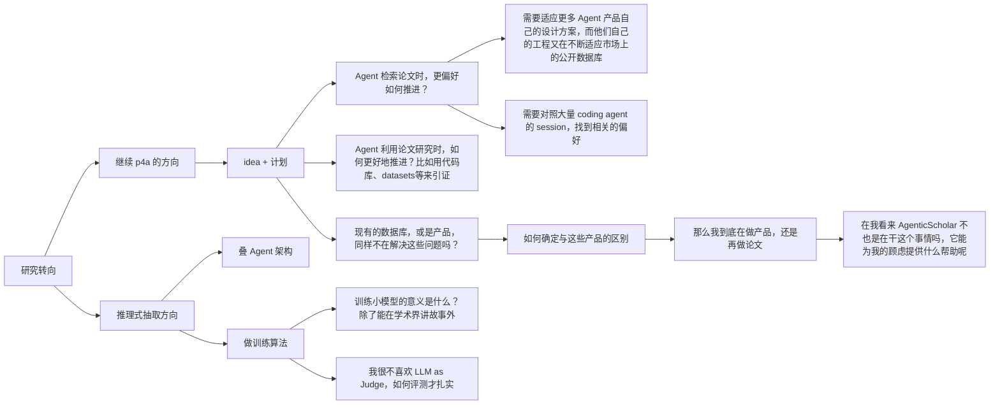

## 主题

对原本 papers for agents 的 idea 的 callback 与延申；

### 讨论

p4a 的初衷是服务于如何让 agent 更好地使用论文成果，帮助其完成检索、查询、阅读和使用。为此，我们设计了一组 schema，这些 schema 能够更好地表述一篇论文的关键信息，例如元数据、引文、以及代码仓库 github\huggingface\datasets\benchmark 的使用。从最底层的 schema 开始，能够构建更加深度的网络，支持更加复杂的应用，[p4a协议](p4a-v1-protocol.md) 正是在这个设想下提出的

目前我想要产出学术论文，因此想要从这个出发继续推进。推理式抽取，是老师提到的方向，与我的 p4a 的交叉点是，我同样在 p4a 的工程中进行过抽取。我的核心出发点是

> 信息抽取和知识组织能够更好的支持 Agent 运行、使用

但是在 p4a 的抽取与构建过程中，也是我的思考中，我并没有把诸如 claim、discussion 等这种相对自然语言化、需要语义理解和加工的内容，作为重点。出于几点原因：

+ 这些知识的抽取高度依赖 prompt 工程的引导，如何设计这些提示词和抽取方案，本身就是值得研究的题目；
+ 抽取方案往往不代表某种公正的正确性，而是符合应用需求或是某些指标的叙事，很大程度上需要对着 benchmark 或者指标优化。

因此我个人觉得确定性的元数据，例如标题、作者、引文等，以及确定性的资源，例如代码、数据集、benchmark等才是值得关注的。聚合这些数据，同样能帮助 Agents 更好的利用论文。就像以往 papers with code 的工作。

### 困惑

现在研究的方向摆在眼前，我应该更加关注如何去推理式抽取，构建一套自己的叙事，如何抽取更好，还是继续这个“为 agent 提供支持” 的方案呢？

这是一个树状图

我对 [AgenticScholar](../../references/papers/2026-AgenticScholar-reread/source.pdf) 那篇论文其实个人评价不高，但是他那样都能发论文，能在某种程度上给我参考和支持吗？我能不能继续在 p4a 的基础上推进系统化的构建，来完成论文呢

---

## 讨论汇总（2026-09-09）

本节整理上述问题的后续讨论。原始想法保留在上方；以下区分用户明确表达的倾向、讨论提出的建议，以及尚未成立的研究假设。本文没有确定 benchmark、系统架构或实施计划。

### 1. 当前倾向：继续 P4A，探索系统论文的组织方式

用户希望研究的是：**已发表论文如何被 Agent 接收和使用**。输入来自现有论文、代码仓库、数据集、模型和补充材料，不以作者采用新的出版协议、在研究过程中主动记录完整轨迹为前提。

建设重点是将计算机领域论文中相对具体、容易核查的内容联系起来，包括元数据、引文、代码、数据集、模型、benchmark 等。期望这些关联能够：

- 帮助 Agent 检索与筛选论文；
- 为“值不值得读、值不值得参考”提供依据；
- 帮助 Agent 找到并进一步使用研究成果。

用户倾向于以 **系统构建** 为论文叙事重点，参考 AgenticScholar 将知识表示、处理流程、查询与下游评测组织为系统工作的方式。无需预先将论文限定为某一种抽取算法，也不要求为了贴近“推理式抽取”而重点处理 claim、discussion 或贡献谱系。

当前可用的系统定位草案是：

> 面向已发表的计算机领域论文，整合论文及其代码、数据集、模型、benchmark 等资源，构建可查询、有来源依据的关联记录，帮助 Agent 检索论文、判断其与当前需求的关系，并进一步使用研究成果。

这段话描述建设目标，**尚不是已经证实的新颖性或论文贡献**。暂定投稿目标仍为 SIGMOD，但本次讨论没有形成可发表性的判断。

### 2. P4A 与推理式抽取的关系

“帮助 Agent 使用论文”可以决定系统解决什么问题；推理式抽取可以承担从分散材料中恢复信息和对应关系的工作。抽取对象和组织方式应由使用任务决定，不必将两者当成互斥方向。

“相对确定性”描述的是对象具体、判定较容易约束，不意味着抽取和关联无需语义理解。例如：

- 仓库是作者实现、第三方复现，还是论文依赖的基础工具？
- 数据集用于训练、评测，还是仅在相关工作中被提到？
- 某项结果对应哪个数据版本、划分和预处理？
- 仓库提供完整评测流程，还是只有推理示例？

这些都是候选问题，不能仅凭它们需要推理就认定存在新研究空间。

应用需求可以决定抽取哪些信息，但事实判定仍必须受证据约束。应避免先设计 schema 和系统，再生成只适合该系统的问题，最后用这些问题证明系统有用。

推理式抽取不预设多 Agent 架构，也不预设训练小模型。流程设计、模型训练和工具调用都需要对应实际困难与可测收益；目前没有确定采用其中任何一种。

### 3. 已有工作对研究定位的约束

讨论中曾提出将“论文资源实体及其使用关系的可靠构建”作为切入点。用户指出该表述过于基础、宽泛，已有大量相邻工作。后续核查支持这一质疑：不能把已有工作概括为简单的资源目录，也不能通过增加“面向 Agent”“可验证”等描述直接获得新颖性。

| 工作 | 已覆盖的相关内容 | 对 P4A 定位的约束 |
| --- | --- | --- |
| [SciREX](https://aclanthology.org/2020.acl-main.670/) | 文档级实体、显著实体与 Method、Task、Dataset、Metric 多元关系抽取 | 论文中的实验相关实体与关系已有明确任务定义 |
| [Softcite](https://github.com/softcite/softcite_dataset_v2) 及[后续抽取资源](https://github.com/softcite/softcite-extractions-oa) | 软件名称、版本、发布者、URL，以及 used、created、shared 等用途判断 | 区分资源提及与使用、识别软件角色并非空白 |
| [SoMeSci](https://github.com/dave-s477/SoMeSci) | 软件提及、版本、开发者、许可证、引用、别名等标注与实体链接 | 关系、文本定位、身份关联及人工金标准已有基础 |
| [SoftwareKG](https://arxiv.org/abs/2003.10715) | 从超过 5.1 万篇社会科学论文构建软件知识图谱，分析软件使用与可获得性 | 聚合资源后支持跨论文查询与分析已有先例 |
| [ORKG](https://academy.orkg.org/courses/template-course.html) | 研究贡献结构化、模板及跨论文比较；另有 [LLM 结构化科学摘要研究](https://arxiv.org/abs/2405.02105) | 结构化论文知识和自动构建都需对照既有研究 |
| [Workflow Run RO-Crate](https://www.researchobject.org/workflow-run-crate/profiles/) | 工具及工作流执行的输入、输出与逐步骤 provenance | 资源、执行和可追溯记录已有表示体系 |
| [OpenAIRE](https://graph.openaire.eu/docs/data-model/relationships/) | 研究产物的依赖、派生、版本等关系，以及 provenance、trust 和验证状态 | 有来源、版本及验证记录的关系层不能直接宣称为新设计 |

这些工作包括任务与数据集、知识库、表示规范和基础设施，不能只按功能勾选比较。上表是初步定位，不是完整相关工作综述，也未证明任何剩余问题无人研究。

后续需要分别回答：

1. **表示：** 现有模型能否表达所需信息？能够表达时，优先考虑复用。
2. **构建：** 现有方法能否以足够的质量和成本获得这些信息？表示存在不代表自动构建已解决，但使用推理模型也不自动构成贡献。
3. **使用：** 这些信息是否改善具体任务？下游收益不能单独证明表示新颖或构建方法先进。

“面向 Agent”可以改变设计取舍、信息生产成本与使用方式，即使底层复用已有标准，仍可能产生研究问题。但需要说明具体变化，不能仅把消费者名称换成 Agent。

### 4. ARA 提供的叙事启发与边界

用户特别认同 [The Last Human-Written Paper: Agent-Native Research Artifacts，v3](<../../tmps/2026, The Last Human-Written Paper, Agent-Native Research Artifacts, Jiachen Liu et al., v3.pdf>) 的叙事：越来越多的论文被 Agent 阅读和参与撰写，由此重新思考学术资源的交换格式。

ARA 的论证将生产与消费两端联系起来：

- **消费端：** Agent 理解、执行和扩展研究时，需要论文叙事中没有充分表达的细节。
- **生产端：** 人机协作留下了会话、工具调用和实验记录，为保存过程知识提供机会。
- **信息损失：** 作者用 Storytelling Tax 描述失败尝试和研究分支的丢失，用 Engineering Tax 描述论文说明与执行要求之间的缺口。
- **载体设计：** 以研究知识对象为主要产物，论文成为其编译视图；通过 `/logic`、`/src`、`/trace`、`/evidence` 及跨层联系组织内容。（原文 §1–4、图 4–5）

这套叙事对 P4A 的启发是：从研究成果消费者的变化出发，讨论成果如何被接收和使用，而不只讨论字段抽取准确率。

用户明确选择了**已发表成果的后续加工**，没有选择研究过程中的原生记录与出版流程改造。但 ARA Compiler 同样处理历史论文和仓库，因此该选择尚不足以构成与 ARA 的区别。

需要保留的证据边界：

- 会话记录丰富，不代表完整研究过程都被记录；历史材料未留下的信息不能靠格式转换恢复。
- ARA 的构建使用了专家 rubric 或历史运行轨迹，而常规基线没有这些额外材料。作者报告的问答得分提升可以支持更充分交付研究材料的价值，不能全部归因于格式本身。（§7.1–7.2、Table 3）
- 问答和复现评测使用模型裁判；扩展任务中，失败历史既可能帮助探索，也可能限制后续 Agent。（§7.2–7.4）
- ARA 对已有标准的概括需要独立核查，尤其应考虑 Workflow Run RO-Crate 等扩展。

### 5. AgenticScholar 作为系统论文参照

用户将 [AgenticScholar](../../references/papers/2026-AgenticScholar-reread/source.pdf) 看作帮助 Agent 检索和使用论文的一项实践，并希望借鉴其系统构建与评测方式。

它的范围不止检索，还包括抽取、跨论文综合和知识发现。可借鉴的是：围绕具体学术查询组织知识表示、查询规划和执行，并用系统实验进行比较；这为 P4A 提供了一种论文组织方式，不要求每个组件都是新的训练算法。

其评测应分开理解：本地版本 §6.2 使用 197 条人工标注的排序查询和 NDCG，§6.3 的趋势分析、研究想法等开放任务使用 GPT-5 打分。因此，不能说它全部依赖模型裁判，也不能用开放任务分数直接证明事实抽取和研究判断可靠。

已有系统论文的发表提供形式上的参照，不能替 P4A 证明新颖性、有效性或可发表性。P4A 不必复制其完整功能范围。

### 6. 系统建设工作量如何形成论文内容

用户提出通过系统化构建、关联资源和充分评测积累工作量。讨论支持以系统为中心，但需要将建设工作转化为可解释、可比较的能力：

- 建立语料、接通不同来源、处理真实数据问题、实现完整流程和开展实验，都可以成为系统工作的重要基础。
- 功能数量、数据规模和实验表格数量不能单独承担贡献。
- 需要说明系统支持了什么困难任务、哪些设计对完成任务必要、相对已有工具的合理组合改善了什么。
- 底层可以复用已有服务、方法和标准；整体设计是否有贡献，需要通过比较与组件分析判断。

基线不能仅限于普通文档 RAG。**现有资源服务或知识库与通用 Agent 的合理组合**也应成为比较候选。具体系统、接入方式和信息条件尚未确定。

### 7. “论文价值”与使用任务

用户希望关联资源帮助判断论文是否值得读、值得参考。讨论建议将可评测目标表述为：**为论文对当前任务的适用性、阅读与参考优先级提供依据**。

代码发布状态和资源完整性不等于学术价值，不应直接转化为通用的论文价值分。以下是候选使用需求，不是已确定的 benchmark：

| 需求 | 系统可能提供的依据 |
| --- | --- |
| 找可采用的实现 | 作者实现是否存在、覆盖什么功能、有哪些使用条件 |
| 找实验参照 | 数据集、benchmark 和评测设置 |
| 找可利用的数据 | 获取位置、版本、划分及相关说明 |
| 决定阅读优先级 | 与当前问题的匹配程度、配套材料能否支持后续工作 |

不必先适配所有 Agent 产品或收集大量 coding agent session。是否需要 session，应由任务代表性和实际研究问题决定。

### 8. 候选评测结构

讨论提出三个层次，借鉴系统论文从基础能力到下游任务的组织方式，但尚未确定任务、规模、标注流程或指标口径。

| 层次 | 核心问题 | 候选评测内容 |
| --- | --- | --- |
| 关联记录质量 | 数据产品是否正确、充分且有依据？ | 资源身份、角色、版本、证据支持；错误关联和遗漏 |
| 检索与筛选 | 关联信息是否帮助找到符合需求的论文？ | 带资源条件的查询、条件满足情况、检索与排序质量 |
| Agent 使用 | 是否更容易完成具体后续任务？ | 找到正确实现、选定符合要求的数据版本、交付有依据的资源清单或完成明确使用步骤；成功率、成本与失败类型 |

评测建议与边界：

- 核心事实与关系可依靠独立人工标注、判定指南和争议处理评价，不必主要依赖 LLM-as-Judge。
- 查询应独立于系统输出构造，避免只考系统拥有的字段。
- 证据链接存在、schema 合规、语义正确、执行成功与实验复现是不同结论，必须分别判断。
- 保留“未找到”“明确没有”“材料矛盾”等区别，避免把未知转成否定或肯定。
- 控制基线的信息访问条件与预算；区分额外材料、知识组织、抽取方法和模型能力的影响。
- 计入建库成本，区分一次性使用与多次复用；下游收益不能代替关联记录的质量检查。

### 9. 尚待讨论的问题

1. 第一版系统具体支持哪些检索、筛选与使用任务？核心输出是什么？
2. P4A 既有字段、关系与预期查询，有多少可以映射到现成标准、知识库和数据集？
3. 现有服务与通用 Agent 的组合在哪些任务上持续失败？原因是覆盖不足、信息缺失、关联错误、组织方式，还是执行能力？
4. 哪些关键系统设计能够对应这些困难？哪些只是必要集成工作？
5. 如何与 AgenticScholar、ARA Compiler 及相关资源基础设施形成具体比较？
6. 如何固定语料、外部材料版本、独立质量标注、信息访问权限和成本口径？

下一步可先讨论一份系统论文提纲，明确目标任务、输入输出、关键设计问题、比较对象与评测层次，再决定实施范围。本次仅汇总讨论，未启动系统实现或实验。
