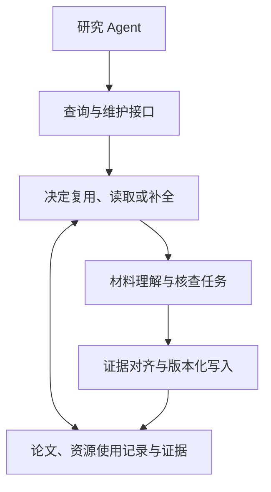

# P4A：相近工作、贡献风险与方法特色讨论

日期：2026-09-11；KATS 相关内容于 2026-09-12 根据精读更新。

本记录承接 [Papers for Agents 讨论](2026-09-09-paper-for-agents.md)与 [Introduction 中文草稿](../../paper/introduction.zh.md)，整理本轮关于相近工作和方法特色的讨论。文献比较来自定向检索、论文相关章节及作者项目材料，尚未逐项复现。风险等级是研究判断，不是录用概率；下文设计均为候选，尚未确定技术路线、benchmark 或实现计划。

本轮两次回复中明确列出的相近工作共 14 篇，论文包位于 [tmps/p4a-related-work-2026-09-11](../../tmps/p4a-related-work-2026-09-11/README.md)。该目录保存 PDF 和下载清单，文献元数据统一登记于 [refs.bib](../../references/refs.bib)。原先已讨论的 ARA 作为背景保留在既有材料中，不重复计入这 14 篇。

## 1. 讨论起点与当前判断

当前 P4A 的设想是：以已发表论文为组织起点，关联代码、数据集、benchmark 和引文，通过推理式抽取形成有依据的资源知识，支持研究 Agent 发现论文、判断适用性、选择资源和准备使用，并减少重复阅读与核查。

用户首先提出：这一 idea 是否与已有工作高度相似，是否影响投稿空间？随后提出，需要在方法构建上体现特色，例如：

- 从数据库视角设计论文库的更新与访问架构；
- 让 Agent 调用通用 operator，查询论文与资源、解释论文、请求资源库更新；
- 在资源库内部包含 multi-agent 运行系统。

本轮判断：**上述宽泛目标的新颖性风险偏高，尤其需要正面对照 KATS 和 AgenticScholar。** 目前的检索不能证明 P4A 的具体任务已被完整覆盖，也不能证明仍存在独占空白。下一步需要把系统愿景收窄成可独立验证的问题，说明已有方法做到哪里，以及 P4A 的机制为何必要。

叙事与工程可以继续同步推进。贯穿案例负责展示研究需求和选择过程；相关工作与对照实验负责证明缺口；方法及独立评价负责证明增量。不能用某次检索失败替代对现有方法的比较。

## 2. 相近工作及其对贡献表述的约束

### 2.1 论文与资源知识的构建、组织和查询

| 工作 / citekey | 已覆盖的能力 | 对 P4A 的约束与待比较边界 |
| --- | --- | --- |
| [KATS](../literature/2026-KATS.md)，`2026-KATS`，PVLDB 2026 | 从论文抽取数据集用途，建立论文—数据集—任务图；结合任务链接、实体消歧、向量检索、PPR 和 LLM 重排，支持新增知识入库。 | 直接对照。已包含具体用途、论文关联和版本身份区分；CS-TDS 主要评价候选发现。需比较跨材料使用条件的构建与核验，以及产物在不同研究任务中的正确复用。 |
| [AgenticScholar](https://arxiv.org/html/2603.13774v1)，`2026-AgenticScholar`，SIGMOD 2026 | 组织论文内容、数据集、指标、baseline 和引文，构建问题／方法分类体系，以计划和算子支持研究查询。 | 高重叠。Paper 本身就是内容及实验信息的中心；以论文为起点、结构化表示、可组合算子均不能单独区分 P4A。重点比较外部材料理解与条件判断。 |
| [Linked Papers With Code](https://arxiv.org/abs/2310.20475v1)，`2023-LPWC` | 将论文、任务、方法、数据集、评测结果与仓库组织成可查询的 RDF 图谱。 | 对资源组织主张的重叠高。建立多类实体之间的连接已有基础，需比较关联的语义粒度与证据支持。 |
| [MLSea](https://dtai-kg.github.io/MLSea-KGC/)，`2024-MLSea`，ESWC 2024 | 整合来自 OpenML、Kaggle、Papers with Code 的数据、实验、配置、实现和论文等知识。 | 已超出论文—链接目录。不能把包含实验配置、支持资源发现与复用统称为新能力。 |
| [SemRepo](https://arxiv.org/html/2605.13310v1)，`2026-SemRepo`，2026 年预印本 | 关联仓库依赖、贡献者、issues 等信息与论文及其他资源图谱，支持溯源和软件维护分析。 | 中高重叠。外部代码库信息并非空白；需比较仓库生态信息与支撑具体研究条件的实现证据。 |
| [SciNoBo / RAA](https://aclanthology.org/2023.nlposs-1.5/)，`2023-RAA`，NLP-OSS 2023 | 从论文片段抽取数据／软件及名称、版本、许可、URL、使用和来源信息，采用指令式 QA 训练。 | 资源角色、版本与使用关系已有抽取任务。采用更强推理模型需要体现具体机制，并评价语义质量。 |
| [SciER](https://aclanthology.org/2024.emnlp-main.726/)，`2024-SciER`，EMNLP 2024 | 提供全文中数据集、方法、任务及细粒度关系的人工标注和基线。 | 对抽取评价直接相关；全文和细粒度关系抽取本身已有工作，不能只检查 schema 或链接是否存在。 |

AgenticScholar 应同时被当作叙事参照和直接相关工作。借鉴它的案例—挑战—方法—评测结构，并不能证明 P4A 在系统能力上不同。其 §3 与附录 B 已明确以 Paper 节点关联内容及实验上下文。

#### KATS：精读后的比较边界

2026-09-12 已完成[文献记录](../literature/2026-KATS.md)和[图文精读](../../references/papers/2026-KATS/analysis.md)。[本地官方仓库](../../references/repos/KATS)的提交为 d66382ad677f16bb98800c3c869a1125021706ea，与精读时核查的代码快照一致。本次证据包括论文及选定代码、CSV 的静态核查，尚未运行 KATS 或复现实验，也未确认该提交就是论文主结果对应的实验版本。

**任务与方法。** KATS 明确面向“自然语言任务 → 相关数据集排名”。它先从论文文本中筛选、抽取数据集及具体用途，再补充任务关键词；通过相似任务连边和数据集实体消歧整合跨论文信息。在线阶段先检索任务、用 PPR 扩展，再按关联任务的最大分数聚合到数据集，最后由 LLM 重排（§3–6）。其三类 Agent 主要承担固定阶段的 LLM 调用；论文没有独立证明这种分解优于同预算的单次专用抽取。

**CS-TDS 的评价边界。** 两个语料分别有 628/2,101 篇论文和 47/204 条查询。问题由 LLM 从真实论文的使用情境生成并经人工核验，初始答案取该论文实际使用的数据集，来源论文从搜索语料中留出。人工相关性判定还接受别名、变体及功能上合理的替代数据集（§3.2、§7.1.1）。因此，命中相关资源不等于证明它满足精确的版本、划分、预算或评测协议。公开测试 CSV 只有任务、初始答案和链接，未提供完整替代答案集合与人工裁决记录，不能直接重建全部人工判分。

**可以采信的结果。** Table 4 中，KATS 在 M/L 的 Hit@5 为 72.3%/73.0%，比各自最强基线 GraphRAG/HippoRAG 2 高 12.7/12.2 个百分点。Fig.7 支持重排和消歧的条件化贡献，但未单独隔离 PPR 的收益。Table 5 报告 M 上建库 5.2 小时、21M LLM tokens，查询 8.4 秒、1,041 tokens；相较 VanillaRAG，建库投入更高，因而还需按实际查询量比较累计成本。§8.2 与 Gemini Deep Research 的两个案例只说明报告设置下的在线时延差异，不能泛化为知识库在研究任务上普遍更好、更便宜。

精读修正了几种容易夸大的差异：

- **KATS 已有用途上下文和来源关联。** 任务描述表达资源被用于什么，导入记录保留 document_id；不能将其概括为名称与 URL 目录。
- **已考虑版本身份。** 公开消歧提示词要求区分年份、版本和 train/test split。检索允许多个版本都相关，与实体消歧将它们视为同一对象，是两个标准；“我们识别版本”本身不能构成增量。
- **已支持新增知识和部分外部简介接入。** §5.5 的增量机制不是静态库；但删除、纠错、撤销误合并、历史实验与当前资源状态的维护，尚未得到同样的机制与评价支持。
- **事实语义仍缺少独立核验。** 作者在 §9.2.2 明确承认缺少依据源文核验并纠正抽取事实的专门模块。Hit Rate、名称 EM/F1 不能证明使用关系或实验条件正确；Table 9 的前两项任务描述还与正文对应不一致，不能作为准确抽取的可靠实例。该问题可能来自排版或转录，不能据此推断实际系统必然出错。

**对 P4A 的约束与候选特色。** 保留“将论文及关联材料转化为 agent-ready artifacts”的整体目标，但将可验证增量落实到产物支持的研究行动。KATS 已覆盖预加工、结构化、实体整合和反复查询；更广的资源类型、更多接口或更多 Agent 不足以单独区分。

与 §4.1–4.2 对应，值得继续研究的是：将论文、表格、配置、数据说明和评分代码对齐到同一使用实例；核验资源、版本、实验条件与证据之间的关系；区分作者主张、材料观察、实际执行和推导判断；让同一份事实在新任务中被有条件地复用，必要时补充核查。这一差异可以发生在资源已经正确检索出来之后，评价也应覆盖产物语义质量和固定消费 Agent 的下游表现。资源使用记录可以作为首个可验证切面，方法说明、实验协议、结论证据等仍可属于整体产物范围。

**对 CS 实证范围的启示。** 论证应从 Agent 利用研究的需求出发，再说明选择具有公开配套材料的 CS 论文，可以观察和核查论文与实现、数据及评测之间的联系。代码库、数据集、benchmark 因而是理解研究的证据来源，具体选择由研究动作决定。材料可获取、关系可追踪提供实证条件，但公开并不意味着已适合 Agent 直接使用；“发表快”等特征还需与持续更新等具体问题建立联系。

上述内容是精读后的候选定位，尚未确定 schema、方法主线或 benchmark。KATS 自身也提出未来增加事实核验，因此“加一个 fact checker”仍需具体机制、强基线和独立评价来证明增量；与 KATS 的差异也不能替代对其他直接相关工作的比较。

### 2.2 论文检索与评价

| 工作 / citekey | 与本项目相关的内容 | 评价设计上的启示 |
| --- | --- | --- |
| [PaSa](https://aclanthology.org/2025.acl-long.572/)，`2025-PaSa`，ACL 2025 | 多轮搜索、读取论文、扩展引文并选择候选。 | 不能只把关键词搜索作为对照；合理的查询改写、阅读和引文扩展需要纳入比较。 |
| [SciNet](https://arxiv.org/abs/2601.03260v2)，`2026-SciNet`，ICML 2026，采用 arXiv v2 | 评价论文网络中的单点、成对和路径级关系检索。 | “关系有助于研究发现”已有专门任务设计；P4A 应具体区分资源使用关系与引文关系。 |
| [MAPLE](https://arxiv.org/abs/2608.15624v1)，`2026-MAPLE`，2026 年预印本 | 从动机、方法、实验结果等多个方面检索论文，包含全文与多模态依据。 | 仅说明摘要不充分仍不够，需要检查全文读取后是否仍存在必须访问外部资源的缺口。 |

SciNet 的会议归属可在 [ICML 2026 论文列表](https://icml.cc/Downloads/2026)核查；下载采用固定的 arXiv v2，不将其混写为正式会议排版版本。

### 2.3 算子、查询反馈与知识维护

| 工作 / citekey | 已覆盖的能力 | 对候选方法的约束 |
| --- | --- | --- |
| [LOTUS](https://www.vldb.org/pvldb/vol18/p4171-patel.pdf)，`2025-LOTUS`，PVLDB 2025 | 语义过滤、连接、排序、聚合等可组合算子及其优化。 | 通用 operator 接口已有明确研究基础；需要说明 P4A 特有的语义、执行决策或质量问题。其优化保证相对于参考算法，不等于现实事实的正确性保证。 |
| [DocETL](https://www.vldb.org/pvldb/vol18/p3035-shankar.pdf)，`2025-DocETL`，PVLDB 2025 | 声明式文档处理，通过 Agent 引导的计划改写、分解和评价改进处理流程。 | 内部由 Agent 规划或优化抽取过程也已有工作，需比较具体规则与收益来源。 |
| [TCR-QF](https://www.ijcai.org/proceedings/2025/0901.pdf)，`2025-TCR-QF`，IJCAI 2025 | 恢复三元组上下文，通过查询反馈补充缺失知识。 | 查询驱动补全不是独占新意；需进一步限定跨材料使用条件、核查任务选择与持久复用。 |
| [Zep / Graphiti](https://arxiv.org/html/2501.13956v1)，`2025-Zep`，2025 年预印本 | 时序知识整合、事实有效期、关系失效及历史保留，论文实验主要围绕 Agent 记忆。 | 版本和失效管理已有基础。论文历史实验与资源当前状态的对应关系仍需具体比较，不能笼统声称现有系统只能维护静态知识。 |

## 3. 值得继续核查的任务缺口

本轮建议保留的核心现象是：**关联资源中的具体证据，可能改变一篇论文是否满足研究需求的判断，并改变发现路径。** 此处的关联资源包括代码实现、配置、任务样例、评分脚本、数据说明及其版本。

以下是待寻找真实材料的案例形态，不是已经验证的结果：

- benchmark 名称看起来合适，但任务样例或评分代码显示，其测量能力不符合 query；
- 两篇论文使用同一数据集，但子集、处理流程和评测协议不同，对当前需求的适用性不同；
- 某篇论文的标题摘要不显眼，但它对资源的具体使用方式满足研究者寻找的任务或执行模式。

筛选时应依次核查：

1. 合理改写 query、阅读论文全文并追踪引文后，缺口是否仍然存在？
2. 获取关键外部材料后，普通 Agent 或完整材料上的 RAG 能解决到什么程度？
3. P4A 的具体机制是否进一步提高正确性，或在独立问题上减少重复核查？

第 2 步可以证明外部材料的价值，但不能单独证明结构化资源库的价值。需要区分材料访问、抽取质量、知识组织、查询策略及模型选择的作用。

真实的 Agent trace 检索需求继续作为候选。现有复盘主要表明“执行经验复用”被偏读成“历史上下文压缩”，尚需定位改变选择的外部资源证据；不能未经复核就把 DeepPrep / LongDA 的分类作为 ground truth。长上下文指令遵循案例也继续保留，待检查任务样例、评分脚本与配置能否提供有区分力的材料。

## 4. 候选方法特色

### 4.1 构建带使用条件的资源知识

以“某篇论文如何使用某个资源”为关键知识对象。供讨论的记录包含：论文、实验或使用场景、资源及版本、角色、任务与评测条件、来源证据、观察时间和核查范围。记录的具体 schema 尚未确定。

例如，“论文 P 使用 benchmark B”可以进一步落实为“P 在实验 E 中，使用 B 的版本 V、子集 S 和评分协议 M，检验能力 C”。这需要对齐论文描述、配置、数据样例与实现，确认材料指向同一次使用。

候选方法问题包括：

- 如何避免把某个子实验的条件推广到整篇论文；
- 如何区分同一资源的不同版本、使用方式与来源角色；
- 如何保留证据不足或材料不一致的状态；
- 如何将可复用事实与当前 query 下的适用性判断分开。

评价可检查错误关联、条件遗漏、版本混淆、过度概括及下游判断变化。证据链接存在仍须核查其是否支持记录。

### 4.2 查询驱动的按需补全与复用

本轮助手建议优先探索此方向，用户尚未确认采用。

资源库难以预先理解每份材料的全部细节，新 query 又会引入新条件。候选处理过程为：发现候选 → 对照查询条件检查已有证据 → 标识缺失知识 → 选择材料进行核查 → 保存有依据的事实 → 重新判断。

以长上下文指令遵循为说明性例子：库中已有任务类型，却缺少指令位置和评分是否检查指令约束的信息；系统可以据此检查任务生成与评分材料，将核查结果保存供后续问题使用。这里尚不预设案例一定成功。

候选研究问题是：**在给定预算下，应优先补全哪些知识，哪些结果值得保存，何时已有证据足够支持判断？** 可以考虑候选区分能力、预期复用机会与核查成本，但评分方式和策略尚未设计。预算耗尽、未找到材料或字段缺失，不应直接转化为“不满足条件”。

比较需要覆盖预先全面抽取、每次在线核查、朴素按需补全，以及使用相同材料的检索方案。应在留出问题或独立查询序列上测量收益，避免根据评测答案决定提前补全哪些知识。

### 4.3 按证据依赖维护资源变化

这是更偏向持续数据管理的候选扩展。论文历史实验事实与资源当前状态可以同时存在：新版评分脚本可能影响当前适用性判断，却不自动否定某篇论文使用旧脚本的历史事实。

候选机制需要识别材料变化所影响的记录与判断，重新核查必要部分，保留有效历史，并记录更新依据。新的材料不应仅因更新时间较晚就覆盖所有旧结论。

这里的困难包括论文版本、资源版本与实验时间不同步，以及推理产生的证据依赖可能不完整。仅按文件 hash 变化重跑、常规依赖失效与已有时序知识方法，均应作为比较对象；不能预先假设语义维护策略优于这些方法。

现有 E07 静态候选池更直接支持前两项。完整研究更新机制还需要历史快照、受控变更及变更后的独立判断依据，目前不具备“静态 QA 已证明更新能力”的条件。

## 5. Operator 与内部 Agent 的候选职责

Operator 是供研究 Agent 调用的接口。方法贡献仍需落在算子的语义、证据要求、执行选择及跨查询复用上。以下命名仅为讨论示意：

| 操作 | 输出或职责 | 需要明确的边界 |
| --- | --- | --- |
| `Search` | 返回论文或资源候选及已有依据 | 排名与可核查适用性不同；资源身份和版本须明确。 |
| `Inspect / Explain` | 展示论文内容、资源或某次使用的说明 | 返回来源支持的解释及未知项，不以流畅叙述替代证据。 |
| `Assess` | 对研究需求的各项条件给出支持、反对或证据不足 | 判断绑定当前条件和所用材料版本，不自动当作资源通用属性保存。 |
| `Enrich` | 请求补充理解或核查，形成知识更新 | 获取缺失材料并验证记录；区分请求、执行结果与实际写入状态。 |
| `Refresh` | 检查来源变化并核查受影响记录 | 保留历史使用事实，明确哪些记录变更及依据。 |

`Assess → Enrich → 再判断` 是候选连接：查询暴露明确知识缺口，核查产生可复用的材料理解。它还需要与已有查询反馈方法比较。

内部可以按论文读取、仓库检查和数据检查分工，也可以由单 Agent 完成。无论采用何种执行者，其产物都应形成一致、可核查的证据与更新记录。多 Agent 之间的同意不能替代原始材料验证；多个执行者的价值要在相同材料和预算下与单 Agent 比较，分别检查覆盖率、错误关联、时间和成本。

此图用于说明职责，不确定底层图数据库、通用规划器、完整执行引擎或多 Agent 编排框架。用户此前偏好的 community 摘要仍是可讨论的组织方式；本轮没有用新架构建议替换它。

## 6. 对案例池与下一步工作的建议

继续沿 [E07 样例论文集](../experiments/e07-p4a-case-pool/README.md)已讨论的五步路线推进：从 v1 已处理材料中核查 query 相对的真阳性，加入同 venue 表面相关噪声，沿引文／共享资源向 venue 外扩展，保留扩展噪声，再筛选有证据支持的选择转折。采集来源与语义标签分开，v1 产物仍是线索，不能直接作为 gold。

200 篇左右可以承担首轮验证，论文数量本身不构成贡献，也不预先证明评测充分性。可优先寻找一小组有关联的 query：

1. 第一个问题触发一项资源核查；
2. 第二个问题复用核查得到的事实；
3. 第三个问题改变使用条件，要求系统识别复用边界。

用于发现叙事和设计方法的问题，应与最终用于评价的问题区分。整组评价需同时报告库的语义质量、下游选择质量与包含构建／补全投入的累计成本，并给强基线等价的原始材料访问条件。

KATS 已完成精读与逐项差异核查，见 §2.1 和[文献记录](../literature/2026-KATS.md)。其余工作的后续核查顺序仍为：AgenticScholar、SemRepo → LPWC、MLSea、RAA、SciER → TCR-QF、LOTUS、DocETL、Zep → PaSa、SciNet、MAPLE。继续核查前几篇的比较边界，并定位一个能说明产物价值的真实案例；资源已被正确检索、但使用条件仍需跨材料核查，也可作为案例形态。据此再决定以条件化知识构建、按需补全还是版本维护为主要方法贡献。

待用户后续决定：主方法的取舍、需要支持的研究条件范围、是否引入动态资源版本，以及第一轮独立任务和质量标准。本次只整理讨论与文献材料，不视为同意启动系统实现或完整评测。
