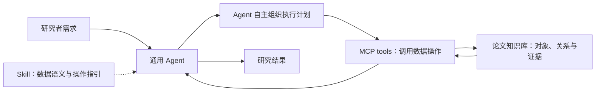
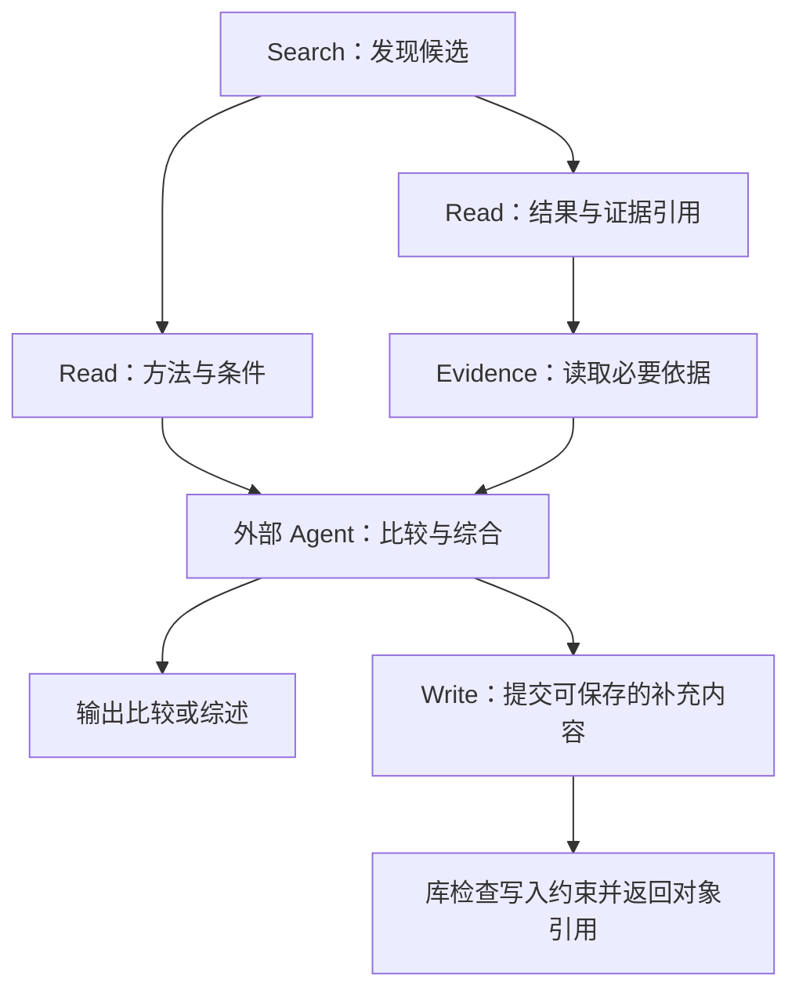

# P4A：面向外部 Agent 的论文数据库、算子设计与研究活动叙事

日期：2026-09-15。

本文整理“论文库类似 SQLite，通用 Agent 作为数据库用户”的设计构想，以及 MCP tools、skill 和外部执行计划之间的关系，并提出 A1–A3 的活动叙事草案。配合 [Introduction 中文讨论稿](../../paper/introduction.zh.md)阅读；相关文献比较见 [P4A 相近工作讨论](2026-09-11-p4a-related-work-and-method-directions.md)。

当前已明确的方向是：以 SIGMOD 为投稿目标，提供本地优先、可由通用 Agent 使用的论文资源库，并至少在计算机科学和经济学中评价。具体数据模型、算子集合、skill 组织、活动命名和评测协议仍待确定。本文的接口、执行图和效果描述是设计示意与待验证目标，不代表已经实现。

## 1. 设计定位：Agent 是论文数据库的用户

研究者使用自己的通用 Agent 决定研究步骤。Agent 可以读取论文、构建知识产物，将其写入资源库，并在后续任务中查询、引用和补充已有知识。资源库独立于单次会话和具体 Agent 应用持续存在。

SQLite 的类比用于说明职责边界：应用通过明确的数据操作使用数据库；在 P4A 中，通用 Agent 承担应用的角色，论文库提供数据表示与管理能力。该类比不预设实际采用 SQLite、SQL 语法或某种存储引擎。

论文中的研究内容是管理对象。正文、图表和附录应能支持有价值的产物构建；代码、配置和数据说明在可用时补充依据。代码完整性和实验可复现性不作为每篇论文入库的前提。

核心设计问题是：

> 如何提供具有共同语义的论文知识对象及可组合的数据操作，使外部 Agent 能够自主组织研究流程，并使不同会话和应用能够接续使用与维护已有知识？

[AgenticScholar 原文](../../references/papers/2026-AgenticScholar-reread/paper.txt)的 Fig. 2、§3–5 展示了知识组织、内部查询规划与算子执行的一体化设计。它已有知识持久化、抽取、核查与多类学术分析能力。P4A 关注外部 Agent 作为数据生产者与消费者的访问和管理约定；这一职责划分有助于明确问题，但不能单独证明技术创新，也不意味着 AgenticScholar 无法扩展来支持这些需求。

## 2. 数据模型、算子、skill 与 Agent 的分层

| 层次 | 职责 | 需要明确的内容 |
| --- | --- | --- |
| Artifact schema | 定义论文库中的知识对象及其关系 | 对象身份、语义范围、成立条件、来源证据及扩展方式 |
| Operators | 对知识对象执行可组合的数据操作 | 输入输出、适用条件、读写作用、返回状态与错误语义 |
| MCP tools | 向外部 Agent 暴露可调用接口 | 将算子能力映射到工具参数、结果和调用反馈 |
| Skill | 向 Agent 解释数据与操作的用法 | 能力入口、对象含义、操作选择、组合示例及边界情况 |
| 通用 Agent | 根据研究需求组织和调整执行过程 | 选择工具、传递结果、安排依赖、判断与综合、使用其他研究工具 |

图中的规划与研究决策发生在库外。库内部可以使用模型辅助抽取、整合或核查，也可以实现单个操作所需的计算，但不要求使用者采用一套由库接管的研究工作流。

MCP 支持工具输入 schema、可选的输出 schema 和结构化结果，可承载上述接口；它本身不定义论文知识的语义与算子组合规则。参见 [MCP 工具规范](https://modelcontextprotocol.io/specification/2025-11-25/server/tools)。逻辑算子与 MCP 工具也不必机械地一一对应，映射粒度仍需设计。

## 3. 算子与 skill 应如何设计

### 3.1 算子操作稳定的知识对象

下面仅列出候选能力，名称、参数与划分均未固定：

| 候选能力 | 输入与输出示意 | 组合时需要保留的含义 |
| --- | --- | --- |
| Search | 研究需求与范围 → 论文或知识对象候选 | 候选对象具有稳定标识；相关性与满足具体条件的判断可区分 |
| Read | 对象标识与所需内容 → 知识记录 | 返回内容保留对象归属、条件、来源和未知项 |
| Follow | 对象标识与关系类型 → 关联对象及关系依据 | 区分引文、方法沿用、实验使用等不同关系 |
| Evidence | 知识或关系引用 → 来源位置与必要上下文 | 来源可访问与来源支持主张是两个不同判断 |
| Write / Update | 新知识或修订及其来源 → 写入结果与对象引用 | 明确补充、修订及保留不同描述的含义，检查可验证的约束 |

组合能力来自数据语义的衔接。例如，Search 返回的对象标识可以交给 Read，Read 中的证据引用可以交给 Evidence；后续写入能够关联到原有对象。读取结果不应因为进入下一步而丢失成立条件或证据归属。

生成的任务报告、Agent 对当前需求的判断和论文报告的事实，需要分别表达。保存一份综述不意味着其中每个综合判断都自动变成原论文的结论。

类型、引用是否存在、操作作用对象等可以由系统检查；事实是否受到证据支持还需要语义核查。接口约束通过不能替代内容正确性评价。

### 3.2 Skill 是操作说明与组合指引

Skill 可以包含以下内容：

- 入口说明：论文库适合提供哪些数据能力，何时使用。
- 数据说明：知识对象、条件、证据和关系分别表示什么。
- 操作说明：何时选择某个操作、怎样理解返回结果、如何处理缺失或不一致。
- 组合示例：展示检索、比较、引用、补充等局部操作模式。
- 领域扩展：在共同核心之外，说明 CS 与经济学中的特定内容。

说明可以按需展开，但不预设必须是一棵复杂的说明树。Agent Skills 的规范支持指令、引用材料及渐进加载，能够承载这种组织；它没有自动保证 Agent 正确规划或执行的能力。参见 [Agent Skills 规范](https://agentskills.io/specification)。

Skill 中的组合示例用于帮助理解操作，不应把 A1–A3 固化为必须依次执行的脚本。必须保持的数据约束应落实到操作实现中，不能完全依靠 Agent 遵循自然语言说明。

已有 [Living Review 协议讨论](p4a-v1-protocol.md)中的分类树与多视图，可以作为库内知识组织的候选。分类视图、skill 的说明层次和任务执行 DAG 是三种不同结构，分别服务于知识组织、操作理解和执行依赖表达。

## 4. DAG 的位置：外部 Agent 对操作的编排

DAG 可以表示某次研究任务中已经确定的数据与执行依赖。下面以比较研究方案为例，操作名称仅为示意：

图中的比较与综合由外部 Agent 完成，也可结合其他工具。库提供被调用的数据能力。包含写入的计划需要考虑操作顺序和读写依赖，不能仅凭读取输入不同就认定操作可以任意并行。

研究过程可能需要根据中间结果补充检索、核查和修改计划。DAG 可以逐步形成或调整，不要求 Agent 一开始编写完整的静态计划，也不要求所有客户端提交统一 DAG 文件或使用专用执行引擎。出现迭代时，可以按轮次描述执行依赖，不能把循环过程强行当作一个固定 DAG。

DAG 用于说明组合方式与观察执行过程。是否需要显式计划格式、可检查的计划约束或其他支持，应由实验中的实际困难决定；生成 DAG 本身不作为独立贡献。

## 5. A1–A3：按研究活动组织使用叙事

本文暂沿此前合并“甄别”的讨论，采用下面三类活动。A 表示 Activity；编号不表示顺序，也不对应三个固定算子或三个内部 Agent。命名仍可调整。

| 活动 | 研究者需要的结果 | 论文库提供的支持 | 对应困难 |
| --- | --- | --- | --- |
| A1：发现与筛选 | 相关研究集合、纳入理由与待核查项 | 按问题与条件查找对象，读取关键知识，沿关系扩展候选 | 主题相似不等于满足需求；关键条件可能分散在不同位置 |
| A2：理解、比较与引证 | 比较表、综述段落、带依据的研究判断 | 访问方法、结果、条件及证据，关联不同论文的相关知识 | 需要保持归属和适用范围，避免错误比较、归因或引用 |
| A3：复现与使用 | 采用已有研究的方法说明、所需条件与使用准备，条件允许时进一步执行 | 获取方法、协议和关联资源的已有记录，定位缺失信息，记录补充观察 | 已有知识能否支撑当前使用，哪些步骤仍缺依据或材料 |

此前 A1“发现”与 A2“甄别”合并为这里的 A1；沿关系扩展候选进入 A1，引证与综合进入 A2；此前 A4“复现与使用”对应这里的 A3。论文库的构建、补充和维护贯穿三类活动，不单独占用一个活动编号。

### A1：发现与筛选

叙事应从研究需求出发：研究者需要找到在问题、方法或条件上相关的工作，并知道这些工作为什么值得纳入。外部 Agent 可以组合搜索、关键知识读取和关系访问，形成有依据的候选集合。

CS 中可以寻找从执行轨迹形成并使用经验的工作；经济学中可以寻找研究某种经济关系、采用指定样本或研究设计的工作。这些是任务形态示例，不是已经选定的测试问题。

本节应展示：哪些产物或关系帮助识别候选，哪些条件影响筛选，以及库中证据不足时如何返回原文继续检查。评价关注检索覆盖、排序质量和筛选理由的正确性。库外论文发现由所声明的证据环境与外部工具能力决定，不能将本地语料检索成绩直接当作开放检索能力。

### A2：理解、比较与引证

叙事从“已有相关论文，但还需要形成有依据的认识”展开。Agent 需要同时理解各篇论文的方法、条件和结果，判断哪些内容可以比较，哪些差异必须保留，并将形成的综合认识与支持它的来源联系起来。

论文库可以提供独立可访问的知识对象与证据关系，Agent 据此编排读取、核查和综合步骤。输出可以是多论文比较表、相关工作段落或围绕研究问题的综述，不要求库自身实现一个固定的综述生成 Agent。

CS 示例可以比较不同经验使用路线及其实验设置；经济学示例可以比较研究发现、样本、变量定义与研究设计。观察到条件差异不自动说明它造成了结果差异，需要保留来源能够支持的解释范围。评价关注关键内容覆盖、事实与比较正确性、引证支持和无依据概括。

### A3：复现与使用

叙事从“准备采用某项已有研究”展开。Agent 需要了解怎样使用方法或资源、哪些条件必须满足，以及现有材料是否足以支持下一步工作。论文库提供已有方法说明、实验协议、适用条件与资源关联，Agent 在自己的工作环境中决定如何开展后续行动。

初始切面可以是使用准备：形成方法采用说明、实验或估计设置清单、必要材料和未解决事项。具备材料和执行条件时，再进一步观察实际运行或复现表现。CS 与经济学分别按任务检查所需条件，不要求所有论文都有可执行代码。

评价必须区分准备质量、成功执行和复现结果。若首轮只评价检索与综述，A3 可作为使用场景或补充案例保留，不能在贡献中宣称已经验证完整复现能力。是否把 A3 纳入正式任务集，仍需讨论。

## 6. 三类活动怎样关联，怎样体现积累

三类活动通过共同的论文知识对象联系起来。A1 获得的论文和对象引用可以供 A2 使用；A2 确认的方法与条件可以帮助 A3 准备采用；A3 的补充阅读或执行观察可以按证据状态写回资源库，供后续筛选与综合使用。它们也可以独立发生，或由不同会话、不同 Agent 应用完成。

每个活动章节可以采用相同的展开结构：

1. **研究需求与交付物：** Agent 要帮助研究者完成什么。
2. **具体困难：** 哪些信息、语义关系或上下文必须保持。
3. **数据支持与操作组合：** 使用哪些已有产物和算子，哪些判断由外部 Agent 完成。
4. **产物与持续使用：** 本次活动得到什么，哪些有依据的新增内容值得保存。
5. **独立评价：** 怎样确认任务效果，怎样区分数据能力与消费 Agent 的作用。

建库、补充和修订不必在每次活动中都发生，也不是完成一次查询的强制步骤。应展示既有知识如何帮助当前活动，以及新获得的知识在何种情况下能够被后续工作接续使用。

## 7. 可用于正文的活动叙事草稿

以下段落表达拟支持的能力，不包含尚未取得的效果结论：

> 研究者使用论文开展的工作具有不同目标。发现与筛选相关研究（A1）需要将研究需求与已有工作的问题、方法和条件联系起来；理解、比较与引证研究（A2）需要综合多篇论文的内容，同时保留结论的依据与适用范围；复现与使用已有研究（A3）则需要进一步获取方法、实验协议和关联材料，确认当前使用所需的条件。这些活动可以由不同会话和不同 Agent 应用完成，并反复涉及同一批论文知识。
>
> 我们将论文库设计为这些 Agent 共同使用的数据资源。库以具有明确语义和来源的知识对象保存研究内容，并通过可组合的数据操作提供查询、读取、关联和维护能力。操作说明帮助通用 Agent 理解数据与接口，Agent 根据当前需求自主选择操作、组织执行依赖，并结合自身能力完成研究判断与综合。
>
> 在这一模式下，前一次阅读形成的知识可以被后续活动访问，新的阅读成果也可以补充到已有对象及其关联中。我们关注这种表示与管理方式能否提高研究知识的使用质量，并在跨会话、跨 Agent 的使用过程中减少重复阅读与解释。其作用分别通过产物质量、各类研究活动的效果和累计处理成本检验。

引言可以用这三类活动说明需求的广度，再引出共同的表示、管理和访问问题。方法部分先集中说明数据模型、构建与关联机制、操作语义；随后可为 A1–A3 分别安排使用章节或小节，按上一节的结构展开，避免在每个活动章节重新定义一套系统。

示意图可以采用三行活动展示：每行包含研究需求、外部 Agent 的操作组合及交付物；三行共同连接底部的论文知识库，并标出可选的补充写入。图的落脚点是同一数据资源怎样支持不同研究活动和持续积累，不要求复用一个递进查询案例。

## 8. 与数据库贡献及评价的对应

| 候选贡献 | A1–A3 中可以观察的作用 | 需要的独立证据 |
| --- | --- | --- |
| 论文知识数据模型与操作语义 | 知识对象可独立读取、关联与组合，条件和来源得到保留 | 产物与关系正确性；相同初始内容下不同组织方式的比较 |
| 构建与关联管理方法 | 不同位置和阅读过程的知识能够进入同一资源库 | 对象对应、关联、补充与修订质量，以及构建和维护成本 |
| 面向通用 Agent 的访问与复用 | 不同客户端能够完成活动，并接续使用已有知识 | 同一消费 Agent 内的公平对照；跨会话与跨应用的任务质量和成本 |

主评价暂以 CS 与经济学的检索、综述任务为基础，并独立核查产物。跨会话清除原上下文，跨 Agent 交接只提供共同资源与接口说明；不同方案都应有合理的持久化和工具访问能力。比较原始论文检索、良好组织的持久笔记、常规结构化抽取加数据库，以及 P4A 的拟议机制。

对 skill 可以比较仅有工具说明与增加数据语义、组合指引后的使用表现，判断帮助来自哪里；不预设更长的说明或显式 DAG 一定有效。接口调用成功只是接入指标，核心仍是数据能否被正确使用和补充。

成本包括初始构建、维护和多次任务使用。应在不同论文重合程度的需求上检验复用效果，未来测试需求和答案不能提前参与定制建库。A1–A3 的覆盖、MCP 接入或外部 DAG 编排本身不替代技术机制和有效性证据。

## 9. 后续需要明确的选择

- A1–A3 的名称与边界，以及 A3 首轮评价到使用准备还是实际执行。
- 首批知识对象的粒度、共同核心与 CS／经济学扩展。
- 算子的输入输出、写入语义和可由系统检查的约束。
- Skill 需要说明哪些内容，哪些内容可直接由工具与数据描述提供。
- 是否有必要显式表示计划，以及不同客户端怎样记录可比较的执行过程。
- 各领域的独立标注、任务集、基线、预算及正式实验范围。

这些选择应通过样本和任务讨论逐步确定；本文不预先要求新的查询语言、专用 DAG 引擎或完整的研究 Agent 产品。
