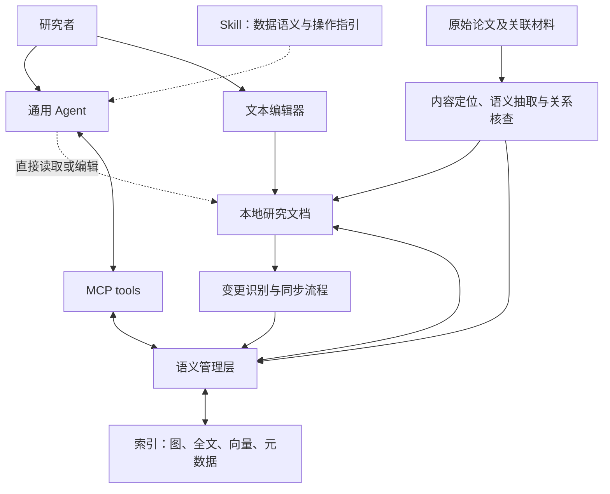

# P4A：Agent-native Research Document Management 设计与叙事

日期：2026-09-15。

本文记录当前的设计思路：以研究文档承载长期积累的知识，围绕 narrative、evidence、resource 定义最小且可扩展的 schema，从原始论文中抽取内容与关系，通过语义管理层支持外部 Agent 的访问、操作和维护，再用 A1–A3 组织研究活动的叙事。投稿目标仍为 SIGMOD，实证范围至少包括计算机科学和经济学。以下 schema、算子、同步机制和评测协议均为设计草案。

[Introduction 中文讨论稿](../../paper/introduction.zh.md)保留了此前的问题背景与叙事；本文进一步明确文档在系统中的地位。相关文献比较见 [P4A 相近工作讨论](2026-09-11-p4a-related-work-and-method-directions.md)。

## 1. 设计理念：文档是长期载体，语义层提供 Agent 能力

我们将论文阅读后形成的理解作为 Agent 可长期使用和维护的知识载体。

在从工程上来看，论文阅读笔记、方法说明、资源描述、综述和实验记录等产物仍然保存在用户的本地文件空间中，保持人类可读、可编辑和可迁移的特点。研究者可以通过普通文本编辑器查看和修改文档，Agent 也可以直接读取、编辑和搜索其中的内容。单个文档应能独立阅读和使用。

在文档之上，系统建立语义管理层（semantic management layer），这个语义管理层可能以知识图谱的形式存在，实体存储索引直接关联到文件系统中的原始知识，组织资源身份、内容类型、来源依据、实体关系及使用记录。Agent 通过 MCP tools 调用具有明确语义的操作，发现相关文档、读取特定内容、追踪关系、补充证据和更新已有记录。操作同时关联文档内容及其语义信息，skill 则说明这些数据和操作的含义与用法。

我们的研究不等同于单纯的 AgentMemory 研究，AgentMemory 侧重探究，如何撰写多结构的记忆文档，让 agent 能够管理好长期短期的记忆文档，且记忆文档能够帮助 Agent 更好的清楚记得以前的工作。
[AutoSci 在写入侧有真实的 schema 与类型约束，在查询侧几乎没有机制——存储就是 Markdown + 一个 append-only jsonl 边表，读取就是全量扫描加 BFS。](../../references/papers/2026-AutoSci/close-read.md)
而我们则不同，我们虽然在经验积累这个角度提出我们需要 Agent 长期积累经验，但是我们并不关注“偏好”“记忆”等直接的词汇，我们关注的是“论文理解”被长期存储，只不过在使用这个经验时，可能通过memory 作用于 通用 agent，例如，我们要新开一个研究项目，打算研究 embedding 模型，这是给 agent 提出初始化需求，他汇总以往的经验库中，获取这个领域相关的经验构成一个 agents.md ，再结合一些引导，能够让他在日常活动中使用工具主动去经验库中获取经验，更新经验库

研究者继续使用自己的通用 Agent 组织研究过程。论文库独立于单次会话和具体 Agent 应用持续存在：前一次阅读形成的文档可以被后续任务访问，新的阅读成果与实验观察可以继续补充到文档空间中。其核心是三个相互配合的能力：

- **文档可直接使用：** 人与 Agent 可以阅读、编辑和迁移长期保存的研究产物。
- **知识可按语义操作：** Agent 可以按研究对象、内容与关系访问和维护文档。
- **研究成果可持续积累：** 不同任务、会话和 Agent 应用能够接续使用已有文档及其来源记录。

“论文库类似 SQLite”的类比仍用于说明使用关系：通用 Agent 是数据系统的用户，自主决定研究步骤。当前进一步明确了数据载体与管理方式，即 **Agent-native Research Document Management**。

## 2. 文档、语义信息与索引怎样组织

### 2.1 研究文档是持久的数据对象

| 文档类型示意 | 保存的内容 | 后续使用方式 |
| --- | --- | --- |
| 论文阅读文档 | 问题、方法、条件、结果及来源位置 | 发现研究、理解内容、核查引用 |
| 方法或资源说明 | 方法使用条件、数据说明、关联材料及其角色 | 比较方案、准备采用方法或资源 |
| 综述与比较文档 | 围绕研究问题的综合认识、比较维度与证据 | 后续写作、补充阅读、修订判断 |
| 实验与使用记录 | 实际操作、环境、观察结果和未解决事项 | 接续实验、理解用法、检查既有判断 |

这些类型用于讨论对象范围，尚不要求固定目录结构、独立文件数量或统一章节模板。一个文档可以包含多个可定位的知识单元；同一篇论文也可以参与多份综述和使用记录。文档需要保留理解这些单元所需的上下文，并让重要内容和来源可以被单独定位。

原始论文、图表、代码库与数据仍是来源材料；阅读文档是对它们的整理，资源说明指向实际资源。论文报告的发现、Agent 的综合判断和实际执行观察需要明确归属。论文正文及其附录能够支撑基本建库，关联材料在可用时补充依据。

### 2.2 语义层组织文档，知识图谱可以承担索引功能

语义层定义如何识别文档及其中的研究对象、表达内容类型与关系、连接来源证据，以及解释读写操作。知识图谱可以保存对象关系和内容定位，支持查询与关系遍历；全文、向量和元数据索引也可以共同参与访问。Agent 找到相关对象后，可以继续读取对应文档与原始来源。

当前可以从“**知识图谱索引 + 文档存储 + 应用层同步流程**”探索实现。图中表示什么、如何指向文档、哪些修改会影响索引，都属于需要定义的管理语义。

| 层次 | 主要职责 |
| --- | --- |
| 研究文档 | 持久保存可阅读、编辑和复用的研究内容 |
| 语义模型与管理操作 | 定义身份、类型、关系、证据、版本及读写含义 |
| 语义索引 | 支持按对象、关系、内容和条件定位文档及其片段 |
| 同步流程 | 识别文档变化，维护与当前内容对应的语义信息和索引 |
| MCP tools 与 skill | 暴露操作接口，提供语义说明和组合指引 |
| 外部通用 Agent | 组织研究步骤、作出判断、综合内容并使用其他工具 |



文档内容与管理信息的保存位置需要明确：可由文档重新计算的索引属于派生数据；人工确认的对象身份、关系或证据批注，则需要保存在文档或配套的持久元数据中。若某项信息只存在于图中，就应将它作为需要保存和迁移的数据管理。哪些内容可以重建，取决于这项划分。

### 2.3 最小 schema：narrative、evidence、resource

当前采用“**最小公共框架 + 开放的内容类型与关系**”：统一记录的身份、内容说明和来源，使外部 Agent 能够理解和访问；具体角色、领域字段和关系可以随论文内容扩展。Narrative、evidence、resource 是三个主要语义入口，可以共同存在于一份可读文档中，也可以展开为相互关联的独立记录。

| 入口 | 回答的问题 | 可组织的内容 |
| --- | --- | --- |
| `narrative` | 为什么提出这个研究问题，如何形成回应，贡献建立在哪里？ | 背景、观察、缺口、研究问题、假设、方法思路、贡献主张、限制及其论证关系 |
| `evidence` | 哪些依据支持或限制研究主张，在什么条件下成立？ | 实验、实证分析、理论证明、模拟、案例分析的设计、条件、结果及对应主张 |
| `resource` | 研究引入、使用或引用了哪些对象？ | 论文、数据集、benchmark、模型、代码库、工具及其位置、版本与使用关系 |

**Narrative 保存作者的论证组织。** 它需要表达问题为何重要、现有认识缺少什么、方法或研究设计如何回应问题，以及结果支持了哪些贡献。可以使用 `observation`、`gap`、`question`、`hypothesis`、`approach`、`claim`、`limitation` 等角色，并由 Agent 按论文需要增补。方法单元可以继续展开算法、模型、变量或研究设计，保留公式与具体内容的定位。论证可以具有分支和交叉联系；论文章节顺序与实际研究发生顺序分别理解，Agent 重构出的解释性联系应记录其判断来源。

**Evidence 保存论证依据及其适用条件。** CS 实验可以展开数据、配置、比较对象、指标和结果；经济学实证可以展开样本、变量、识别假设、估计方法与稳健性分析；理论证明可以展开命题、假设、推导及适用范围。具体字段由材料决定，缺失内容按未知或未报告保留。论文报告某项证据支持主张，与我们核查后认为该支持成立，是不同的记录。

ARA 为这一设计提供了参考。其 `problem.md` 组织观察、缺口与洞见，`claims.md` 将主张与证据联系起来；Compiler 从原始材料恢复跨层联系，也能从只有 PDF 的输入开始构建。ARA 的四层协议面向 CS，实证集中在机器学习。本方案借鉴其中的论证单元和来源联系，将实验、证明和领域资源组织为可按需展开的内容。参见 [ARA 原文](../../references/papers/2026-ARA/paper.txt) §2、§4、§10 和附录 A.3。

### 2.4 记录与关系的共同外壳

下面的 YAML 表达概念性字段，具体序列化和必填约束仍待确定。记录身份、语义说明和来源约定构成共同核心，领域细节放入扩展字段：

```yaml
record:
  id: 稳定标识
  kind: narrative | evidence | resource | 扩展类型
  description: 可独立理解的说明
  provenance:
    origin: 作者报告、Agent 解释、用户补充或实际观察
    source_refs: 来源记录、具体位置及版本的引用列表
  content_ref: 对应研究文档及片段的引用（按需提供）
  attributes: 按内容类型扩展的字段

relation:
  id: 稳定标识
  source: 起点记录的标识
  target: 终点记录的标识
  predicate: 关系名称或定义标识
  description: 这条关系具体表达什么
  context: 成立条件或使用情境
  provenance: 关系的来源引用、提出者及判断方式
```

较长的叙事、方法说明和证明过程保存在可读文档中，通过 `content_ref` 访问。记录可以对应文档片段，关系可以跨片段和跨文档连接；当前方案不要求把每个知识单元拆成独立文件。

`provenance` 回答“我们从哪里得到这个描述”，例如论文的某段正文、某张表或某个证明；evidence 与 claim 之间的 `supports` 关系回答“作者用什么依据支持这个主张”。抽取忠实性与论证支持程度需要分别核查。关系本身也保留来源和条件，以便后续 Agent 理解其适用范围。

### 2.5 开放关系与跨领域扩展

初始可以提供以下公共关系词汇，供 Agent 复用和扩展：

| 关系 | 含义示意 |
| --- | --- |
| `motivates` | 某项观察或缺口引出研究问题或设计选择 |
| `addresses` | 方法、分析或论证回应某个问题 |
| `supports` / `qualifies` | 证据支持某项主张，或限定其成立范围 |
| `introduces` | 某项研究提出或发布一种方法、资源 |
| `uses` | 某项方法、实验或分析使用某个资源 |
| `cites` | 某份文档或内容单元引用另一研究 |
| `derived_from` | 某份内容或资源由其他内容或资源整理、加工而来 |

具体使用关系尽量指向实验或分析，保留数据版本、用途和条件。例如，CS 实验可以通过 `evaluates_on` 关联评测数据，经济学分析可以通过 `estimated_on` 关联估计样本。需要新关系时，Agent 给出定义和示例；在语义兼容时可以映射到 `uses` 等公共关系，原有细节继续保留。

扩展约定可以保持简洁：优先复用已有定义；新增类型或关系时保存含义；跨论文整合时检查定义、方向和条件是否兼容。定义随文档库持久保存，供后续 Agent 查询。名称相近的关系可以先保留各自表述，待有依据时再建立对应。

GraphRAG 的默认抽取提示要求实体类型落在指定集合中，同时让模型以自然语言描述实体间的关系；其提示调优支持发现实体类型。这提供了固定基本输出结构、开放内容语义的参考。本方案进一步约定研究记录的来源、条件和关系定义，支持后续读写与复用。参见 [GraphRAG 官方抽取提示](https://github.com/microsoft/graphrag/blob/main/packages/graphrag/graphrag/prompts/index/extract_graph.py)与[类型发现说明](https://microsoft.github.io/graphrag/prompt_tuning/auto_prompt_tuning/)。

### 2.6 Resource 的基础字段与类型扩展

Resource 继承共同记录外壳，并可以按下面的字段组织资源描述：

| 字段 | 含义 |
| --- | --- |
| `id`、`type`、`name`、`description` | 资源身份、开放的资源类型、名称与说明；`kind` 为 `resource` |
| `identifiers` | DOI、资源注册号、仓库标识等外部身份线索 |
| `locations[]` | 在线入口、本地副本或快照的 URI，以及其角色、版本、获取时间等信息 |
| `record_created_at` | 本库中资源记录的创建时间；资源发布时间另行记录 |
| `provenance` | 从哪些材料和位置识别到该资源 |
| `checks[]` | 针对具体资源版本或位置进行的检查记录 |
| `attributes` | 该类资源需要的领域字段 |

同一资源可以对应官网、下载入口和本地快照等多个位置。快照可以记录版本、提交号或内容摘要，以便辨认实际读取的材料；尚未访问的资源也可以根据论文中的描述登记，并保留其来源状态。论文资源标识原作，阅读文档保存对原作的整理，两者通过明确的引用或描述关系连接。

`checks[]` 至少说明检查对象、检查内容、结果、时间和依据。例如，“本地快照可读取”“仓库包含所述文件”“程序成功运行”分别作为有范围的观察保存。若提供 `is_verified` 一类摘要字段，其含义必须由具体检查项目定义，不能覆盖所有资源属性和使用情境。

类型扩展可以包括数据集的覆盖范围与版本、模型的假设或配置、代码库的提交与环境、论文的书目信息等。经济学中的调查数据、行政数据和理论模型，与 CS 中的数据集、训练模型和实现库共享资源身份与位置框架，各自的内容由 Agent 按材料展开。资源在某篇论文中的用途放在相应关系上，以支持同一资源被多项研究以不同方式使用。

### 2.7 从原始论文到文档与语义索引

论文抽取是语义管理层的显式构建过程。初始流程可以分为四步，执行时根据证据缺口回到前一步补充读取：

| 步骤 | 处理内容 | 形成的产物 |
| --- | --- | --- |
| 来源定位 | 解析正文、图表、公式和附录，记录来源版本与位置；登记可用关联材料 | 可回访的来源片段与资源位置 |
| 论证组织 | 识别问题、方法思路、主张与限制，组织它们的联系 | narrative 单元、方法内容与论证关系 |
| 证据与资源关联 | 读取实验、分析、证明和结果，连接对应主张，识别资源及具体用途 | evidence、resource 及带条件和来源的关系 |
| 保存、核查与索引 | 保存可读文档，检查抽取内容和关系依据，建立对象与片段的索引 | 文档、语义记录、索引和未解决事项 |

论证组织需要覆盖全文；引言中的贡献概括应与方法、结果和限制相互核对。原始来源中的图表、证明和结果均保留定位，后续 Agent 可以继续查看其上下文。关联材料可用时补充资源信息和实际观察，论文未报告的研究过程保留为未知。

可以借助公共类型和关系引导抽取，再由 Agent 为具体论文扩展角色与字段；随后检查新增定义能否被已有操作理解、相应关系是否有来源支持。结构检查验证身份、引用和字段约定，语义核查验证描述与关系的依据。二者的结果分别记录，未核查或依据不足的内容保留明确状态。

经过这一过程，语义管理层具体管理的是**论文的论证单元、证据单元、资源及其带条件的关系**。后续文档编辑可以根据来源与片段对应，定位需要更新的记录和索引；维护机制见第 4 节。

## 3. 算子、MCP tools、skill 与外部执行计划

### 3.1 算子围绕文档的语义访问与维护设计

算子要说明它操作什么对象、返回什么内容、改变哪些状态，以及组合时如何保留来源与版本。操作对象包括文档、第 2 节中的记录和关系；例如 Read 可以读取论证单元或证据设计，Follow 可以沿主张找到支持证据，也可以沿使用关系找到资源。下面是一组候选能力，尚未确定每项是否对应独立工具：

| 候选能力 | 输入与输出示意 | 需要保持的语义 |
| --- | --- | --- |
| Search | 研究需求与范围 → 文档或内容候选 | 返回可继续访问的对象引用；保留匹配依据与待核查条件 |
| Locate / Read | 文档或对象引用、所需内容 → 文档或片段 | 内容归属、所在版本、必要上下文及来源可追溯 |
| Follow | 对象与关系类型 → 关联对象及关系依据 | 区分引用、方法沿用、实验使用等关系及其方向 |
| Evidence / Trace | 主张、关系或文档片段 → 来源及整理过程 | 区分原始来源、派生描述与当前判断；能回到支撑内容 |
| Create | 新文档内容、类型与来源 → 持久文档引用 | 建立身份与来源记录，并使文档进入后续发现和维护范围 |
| Update | 文档引用、修改内容与所依据的版本 → 修订结果 | 保留既有编辑，识别版本冲突，报告受影响的关系与索引状态 |
| Link / Attach | 对象、关系或证据 → 可追踪的关联记录 | 关联具有明确含义和依据，能够随相关内容变化而检查 |

例如，Search 返回文档及记录引用，Read 获取 narrative 中的方法与主张，Follow 访问对应 evidence 和 resource，Evidence / Trace 定位原始来源，外部 Agent 据此形成比较文档，再通过 Create 保存。这里的小写 `evidence` 表示数据类别，Evidence / Trace 是候选访问操作名，其最终命名可以再统一。后续 Agent 可以重新发现这份比较文档，也可以沿引用检查其依据。写入和关联使一次研究活动的成果成为后续活动可操作的数据。

Extract、Compare、Synthesize 和 Verify 可以由外部 Agent 结合这些能力完成，也可以在有明确需求时提供辅助操作。若由库提供，仍需定义输入材料、输出文档或判断记录、证据范围与检查状态。具体下沉哪些计算，应围绕所选任务确定。

MCP 承载工具参数、结构化结果和调用反馈；领域对象与操作语义由系统定义。Skill 说明文档类型、来源状态、工具用途、组合示例和缺失信息的处理方式，可按需展开。参见 [MCP 工具规范](https://modelcontextprotocol.io/specification/2025-11-25/server/tools)与 [Agent Skills 规范](https://agentskills.io/specification)。可由程序检查的身份、引用和版本约束应落实到工具实现中；语义正确性需要另行核查。

### 3.2 Skill 帮助组合操作，执行计划由外部 Agent 形成

Skill 可以作为分层的操作说明，帮助通用 Agent 理解“有哪些文档、如何访问、何时补充、怎样检查结果”。分类视图用于组织知识，skill 的层次用于组织说明，DAG 则用于表达一次任务的数据与执行依赖。


Agent 可以根据中间结果追加读取和核查，逐步形成或调整执行依赖。DAG 是描述组合方式的一种形式；是否需要显式计划格式或执行支持，留待任务设计确定。库内同步流程负责文档与索引的维护，外部研究计划负责研究任务，两者各自处理对应的依赖。

## 4. 直接编辑与语义操作如何共同维护文档

允许普通编辑器和 Agent 直接修改文档，意味着语义层需要应对工具接口之外的变化。例如，研究者修改了某条结论的适用条件，原有检索结果、关系和综述引用可能仍指向旧描述。系统需要识别哪些内容发生了变化，以及哪些派生信息需要重新检查。

可以区分两条维护路径：

- **通过工具写入：** 操作获得文档身份、修改范围和预期版本，检查约束、保存修订，并启动相关语义信息与索引的维护。返回结果说明写入和索引更新各自的状态。
- **通过编辑器或文件工具写入：** 同步流程识别变更，重新定位受影响的片段和关系，再刷新对应索引。过期或无法重新对应的记录应有明确状态，供查询与后续维护处理。

这里的研究问题包括：文档改写后如何保持对象身份与证据定位，怎样判断一次局部编辑影响了哪些关系，以及怎样保留用户确认的批注。更新文档、刷新索引、重新核查主张是不同的处理步骤，各自需要记录对应的文档版本。

初步设计可以先采用版本或内容摘要、片段定位和按需同步，考察典型编辑下的对应质量与维护成本。同步触发方式、一致性保证、失败恢复和冲突处理仍待确定。自动同步工作流提供维护过程，其中的语义对应与失效判断决定它能否可靠工作。

## 5. A1–A3：用研究活动展示文档的使用与积累

A 表示 Activity。三类活动分别展开研究需求、困难、操作支持和产物；编号用于组织叙事，活动可以独立发生或交织开展。文档创建、补充和维护贯穿其中。

| 活动 | 主要困难 | 系统提供的支持 | 可持续使用的产物 |
| --- | --- | --- | --- |
| A1：研究发现 | 找到符合问题与条件的研究，沿相关关系扩展，并解释纳入理由 | 检索文档与片段，读取关键条件，遍历有依据的研究关系 | 候选清单、主题文档、筛选依据与待核查项 |
| A2：研究理解与综合 | 理解和比较多篇论文，保留适用条件与引证依据 | 定位方法和结果，访问来源，关联既有阅读与比较记录 | 综述、比较文档、带来源的综合认识 |
| A3：研究使用 | 将已有方法或资源用于当前研究，识别所需材料与缺失条件 | 获取方法和使用记录，追踪关联资源，补充新观察 | 方法采用说明、实验准备文档、实验与复现记录 |

### A1：研究发现

研究者提出需求后，Agent 通过语义索引定位相关文档，再读取关键内容完成筛选，并沿引文、方法或资源关系扩展。CS 中可以查找解决某类问题且满足特定实验条件的方法；经济学中可以查找采用特定样本、变量定义或研究设计的工作。已有笔记和综述也可以帮助定位研究及其纳入依据。

本节需要展示系统提供了哪些可检索内容和关系，它们怎样帮助完成发现任务，以及结果怎样形成可继续补充的研究清单。评价关注覆盖、排序和筛选依据的正确性；库外发现能力按实际提供的语料与外部工具确定。

### A2：研究理解与综合

Agent 围绕研究问题读取已有论文文档、比较记录及其来源，整理方法、条件和结果之间的异同。系统需要支持片段定位、关系访问和证据追踪，使 Agent 能够检查一份综合认识来自哪些论文、依赖哪些条件，并在已有认识上补充新研究。

本节可以用比较表或综述文档展示这种支持。CS 中的方法和实验设置、经济学中的样本和研究设计具有不同内容，但都需要保留归属与比较范围。生成的综合文档具有自己的身份和来源关系，后续修订可以继续引用和检查已有依据。评价关注内容覆盖、事实与比较正确性，以及引用对主张的支持。

### A3：研究使用

Agent 准备采用某种方法、数据或实验协议时，可以访问已有方法说明、关联材料和使用记录，识别当前环境所需的条件，再结合其他工具开展工作。形成的准备说明和实际观察可以保存为新的研究文档，供后续任务接续使用。

本节可以先展示方法采用或实验准备，再在材料允许时展示执行与复现。评价相应区分准备质量、成功执行和结果复现。论文中的发布声明、仓库中的实际材料与运行观察分别保留来源；每篇论文的入库价值由可提取的研究内容决定。A3 是否进入首轮正式任务集仍需确定。

三类活动通过共同文档关联：发现清单可以支撑综述，综述中的方法比较可以帮助使用准备，使用记录又能补充后续筛选和综合。不同 Agent 无需共享原会话，也应能从文档、来源和操作说明中理解这些成果。每个活动章节都应回答：**完成这个活动需要什么知识，系统如何提供和维护这些知识，最终产物能否支持后续工作。**

## 6. 数据库研究问题与评价

当前问题可以表述为：

> 如何管理人和 Agent 共同使用、持续编辑的研究文档，使其中的知识能够按语义发现、读取、关联和更新，并在跨会话、跨应用的研究活动中保持可追溯与可复用？

这一问题涉及文档数据模型、语义访问、派生索引维护和应用间的数据使用约定。可以围绕以下三方面形成候选贡献；具体技术增量需在设计和实验中落实。

| 候选贡献 | 需要解决的内容 | 对应评价 |
| --- | --- | --- |
| 研究文档数据模型与语义操作 | 以最小公共框架组织 narrative、evidence、resource，支持领域类型和关系扩展 | 内容、关系和证据正确性；不同领域记录能否被独立定位和组合使用 |
| 文档与语义索引的构建及维护方法 | 从原始论文抽取论证、证据和资源联系，处理直接编辑、补充和修订引起的变化 | 抽取覆盖与忠实性、对象对应、关系更新、证据定位、过期识别与维护成本 |
| 面向外部 Agent 的使用与持续积累 | 不同客户端如何理解、使用和补充同一文档库 | A1–A3 任务效果，跨会话和跨应用交接质量，以及累计成本 |

主任务可以先采用 CS 与经济学中的检索筛选、多论文比较与综述，另行确定 A3 的评价范围。产物质量从原始材料独立核查，分别检查抽取内容、关系、证据及后续写入。直接编辑后的维护评价应加入条件修改、来源变更、片段移动或删除等情形，检查查询和证据访问是否仍对应有效内容，以及系统如何表达尚未同步的状态。

围绕最小 schema，可以分别核查 narrative 是否忠实表达问题、方法与贡献之间的论证联系，evidence 是否保留关键条件并对应正确的主张，resource 是否识别了正确对象、版本及用途。扩展性评价关注新角色、新资源类型和新关系进入后，通用操作与其他 Agent 能否正确理解和使用；其价值通过覆盖与使用质量检验，不能仅以允许新增字段来证明。

基线包括原始论文检索、良好组织且可持久编辑的文档库、常规结构化抽取或知识图谱方案。各方案使用相同的信息范围，在声明的可比预算下提供合理的持久化和工具访问能力。表示方式、语义索引、维护机制和 skill 指引的作用可以分别比较；保持消费 Agent 可比，并计入接入和适配成本。

跨会话测试清除原上下文，保留允许持久保存的资料；跨应用测试由不同客户端接续访问和补充同一资源，分别与其自身对照比较。需求应涉及部分重合的论文与新的研究问题，未来任务和答案不能提前参与定制建库。总成本包括初始构建、维护和多次任务使用，分别报告质量、模型消耗、耗时与原文重读量。

AgenticScholar 可作为相关的数据组织与分析系统讨论。其已有知识持久化、细粒度操作及 taxonomy 渐进更新，参见[原文](../../references/papers/2026-AgenticScholar-reread/paper.txt) §3–5。当前拟研究的范围是：可直接编辑的文档作为持久产物，语义层随之维护，外部 Agent 共同使用和补充这些产物。相关工作的能力比较与实验应围绕这些具体要求展开。

## 7. 可用于正文的设计与活动叙事草稿

> Agent 辅助研究者发现文献、综合已有研究和开展实验时，不断形成阅读笔记、方法说明、综述与使用记录。研究工作跨越多次会话和多种 Agent 应用，这些成果需要能够独立保存、继续编辑，并被后续任务发现和理解。已有文档中的结论、条件和来源关系也会随补充阅读而变化，要求访问和维护过程能够跟随内容演化。
>
> 我们探索 Agent-native Research Document Management，将研究文档作为人和 Agent 可长期使用的知识载体。系统从原始论文中组织研究叙事、证据与资源，以最小公共 schema 保存内容、关系和来源，并支持按论文及领域扩展类型与描述。在此基础上，语义管理层通过索引支持发现与定位，通过可组合的操作支持读取、关联和修订，并维护文档变化与语义信息之间的对应。通用 Agent 根据研究需求自主组织这些操作，接续使用和补充已有成果。
>
> 我们以研究发现（A1）、研究理解与综合（A2）、研究使用（A3）组织使用叙事，展示同一文档库如何支持不同目标：发现相关工作并形成研究清单，综合多篇论文并保存有依据的比较，以及采用方法或资源并积累使用记录。这些产物可以在不同活动、会话和 Agent 应用间继续使用，其价值通过文档与关系质量、下游任务效果和持续使用成本评价。

正文可以先说明共同的数据模型、操作与维护机制，再为 A1–A3 分别安排章节或小节。活动图可以采用三行展示，各行包含需求、操作组合和文档产物，共同连接文档库与语义层，并标出后续使用与补充关系。

## 8. 下一步需要收敛的选择

- 用 CS 与经济学样例细化 narrative、evidence、resource 的粒度、必填字段及扩展约定。
- 明确原始论文抽取与关系核查的初始范围，以及公共关系和新增定义的对应方式。
- 文档与配套元数据各自保存什么，哪些索引可以从持久数据重建。
- 最小操作集合，以及直接编辑后的身份保持、同步和过期状态语义。
- 首轮任务、独立标注与基线，特别是哪些维护情形和 A3 使用需求进入评价。

这些选择围绕具体材料与任务继续讨论，确定后再进入实现与实验。
