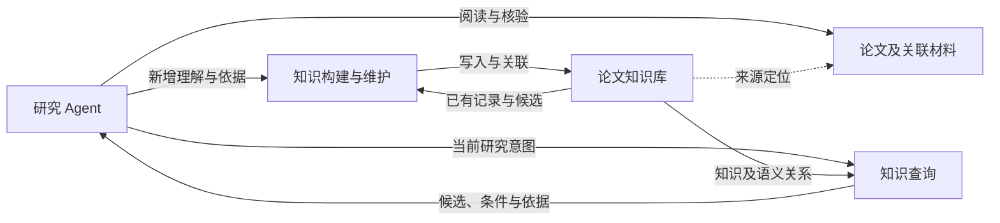

# Abstract（中文讨论初稿）

研究 Agent 在长期科研活动中需要反复利用论文中的方法、实验经验和研究判断。阅读形成的理解若仅保留在单次会话中，后续任务就需要重新建立对象、条件与证据之间的联系。本文研究面向研究 Agent 的论文知识数据库，将阅读与相关核验形成的理解组织为可持续积累、检索和组合的知识。围绕方法选择、评测设计、结果解释等研究需求，我们设计一种语义数据模型，区分跨论文共享的对象身份、带条件和来源的具体主张，以及资源使用、实验和核验记录，并通过语义关系连接不同论文中的经验。在此基础上，我们进一步研究知识构建、候选检索、证据访问与维护机制，使 Agent 能够在保留适用条件和依据的情况下复用已有理解。效果评测将同时考察知识及关系的语义正确性、跨任务复用的有效性，以及构建和使用成本。

> 续写说明（2026-09-28）：本稿按完整论文的结构展开，原有引言文字保留。新增内容中的架构与方法用于讨论设计，实验章节为评测方案；尚未确定的机制和结果以“待补”标明。

# Introduction（中文讨论初稿）

> 2026-09-17 按思路图中的蓝色草稿整理背景，挑战暂留空。

<!--
背景逻辑：
1. 通用 Agent 进入科研活动，具备论文理解能力。
2. 科研需要长期积累和复用论文知识，Agent 需要持久化阅读形成的理解。
3. 论文知识具有复杂关联与多模态特性，文本形式的记忆难以直接满足其组织和使用需求。
4. 引出适合 Agent 使用的论文知识数据库。

待展开的表示思路：
Agent-native
Object = usable knowledge artifact
Relation = executable context / provenance / dependency

挑战：
-->

近年来，以 Claude Code、Codex 等为代表的通用 Agent 正在大量进入科学研究活动，协助研究者开展文献调研、研究方案比较和论文撰写等工作。论文是这些活动的重要知识来源，Agent 通过阅读和理解论文，将相关研究知识用于当前任务。

相较于主要依赖单次会话上下文开展工作的 Agent，研究者能够在长期研究过程中不断积累、回顾和组合领域中的已有工作，将相关论文中的关键思想、实验结果、方法选择，以及与其他工作（论文、代码、数据集）的联系，沉淀为长期记忆、研究笔记和知识体系，并在后续任务中持续复用。Agent 阅读形成的理解若仅保留在当前会话的上下文窗口中，就难以积累为长期知识。在跨会话科研场景下，Agent 可能需要重新理解原始论文，带来大量重复的上下文开销。因此，需要将 Agent 阅读论文后的理解转化为可检索、可组合的持久化知识表示，以支持长期科研活动中的知识复用。

然而，需要持久化的论文知识具有复杂的结构和丰富的语义关系。这些知识不仅包括单篇论文的关键信息，还包含跨论文的语义联系，涉及方法、实验、代码、数据集、基准和引用关系等多模态、相互关联的内容。这类知识随着科研成果的增长持续扩展，需要以支持检索、比较、关联和推理的方式加以组织，以便在后续科研任务中复用。

以 AGENTS.md 等文本文档为载体的项目记忆，可以记录经验和阅读要点，但仅靠文本的线性组织，难以直接支持上述复杂关联的管理与使用。因此，需要面向论文知识特性的专门数据管理机制，将阅读形成的理解及其联系组织为适合 Agent 使用的论文知识数据库，支持知识的长期积累与复用。

## 挑战

**不同知识具有不同的复用粒度与身份判定规则。** 同一方法或资源可能在多篇论文中以不同名称出现，需要识别其共同身份；多篇论文也可能讨论同一个问题，却给出不同条件下的判断。与此同时，各论文中的具体实验、使用方式与结果依据需要分别保留。若始终按论文独立保存这些内容，跨论文联系就需要在每次使用时重新建立；若仅凭名称或文本相似性合并，又可能混淆不同对象、条件和来源。因此，需要明确知识的共享范围，并将共享对象与具体语境中的记录联系起来。

**跨论文知识的组合需要保留条件与证据。** 方法选择和实验设计不仅需要找到相关知识，还需要判断这些知识是否适用于当前任务。例如，两篇论文使用同名 benchmark，并不足以说明其结果可以直接比较；两条结论方向不同，也不足以说明它们相互矛盾。Agent 需要同时取得所讨论的对象、适用条件、实验设置与支持依据，才能决定哪些经验能够沿用，哪些仍需重新验证。如何在组织和检索知识时保留这些联系，是支持可靠复用的关键问题。

**持续积累需要处理新证据与已有认识之间的关系。** 新论文可能限定先前结论，资源版本变化可能改变方法的使用前提，外部检查也可能发现论文声明与实际材料不一致。知识库需要保存这些发现的来源、时间和适用范围，使后续任务能够区分作者主张、Agent 整理的理解与第一手核验结果，并据此重新判断已有经验。仅增加新记录不足以完成这一过程，还需要明确新记录如何补充、限定或修订既有联系。

## 研究思路与内容

针对上述挑战，本文从长期研究活动中的知识访问和复用需求出发，设计论文知识的持久化表示与管理机制。我们将阅读及相关核验形成的知识记录称为 knowledge artifacts：它们具有可引用的身份、明确的语义角色，并保留与其他知识及其依据的联系。研究 Agent 可以围绕当前意图访问这些记录，沿关系取得必要的条件和证据，并在获得新材料后继续补充已有理解。

本文围绕三个方面展开。首先，从典型研究活动中归纳需要保留的语义区别，设计同时支持共享对象与具体知识记录的语义数据模型。其次，围绕这一表示研究知识构建与访问方式，将候选召回、身份判断、关系组织和证据访问衔接起来。最后，通过知识质量与后续任务效果两个层面的评测，考察所积累的理解是否能够被正确取得、组合和复用，以及这一过程的成本。

> 待补：在构建、查询与维护机制确定后，将上述研究内容收敛为正式贡献陈述，并补充相应实验发现。

# 2. 研究背景、典型意图与问题定义

## 2.1 典型研究意图与知识复用

以一个具体研究任务为例：利用有限的领域标注数据，改善通用 embedding model 在专业文献检索中的表现，提出一种适配方法并完成实验验证。Agent 需要理解任务与数据、形成研究假设、选择和实现方法、设计评测，并根据结果不断调整方案。过去阅读形成的方法理解、条件辨析与证据联系，可以在这些活动中被重新使用。

下表列出这一任务中可能出现的研究意图。表中的经验与问题均为示意，用于说明数据模型需要支持的访问方式；它们尚不构成固定的评测任务集。

| 研究意图 | 需要复用的已有理解 | 对知识组织的要求 |
|---|---|---|
| 寻找研究切入点 | 不同工作如何处理训练文本、查询分布和负样本，各自声称的收益由哪些实验支持 | 连接研究问题、方法机制、具体主张与实验，保留尚未充分解释的因素 |
| 选择和改进方法 | 某个少样本方案是否还依赖大量领域语料或教师模型，哪些组件适合当前资源条件 | 识别共同方法及其变体，关联资源要求与适用条件 |
| 设计有解释力的评测 | 使用同名 benchmark 的论文是否采用相同切分、训练样本量、候选集合与后续处理 | 分别保存共同资源、论文中的使用方式和具体实验设置 |
| 把方案落实为实验 | 论文方法对应哪个实现、模型版本与配置，资源是否经过实际检查 | 连接方法与资源，区分论文声明、实现线索和核验结果 |
| 解释结果并调整假设 | 哪些既有发现能为当前异常提供解释，其条件与当前设置有何差异 | 联合访问主张、作者解释、实验依据及其条件，保留相互竞争的解释 |
| 形成结论并说明贡献 | 当前方案沿用了什么、修改了什么，增加了哪些证据或适用范围 | 保留贡献、方法、主张与已有工作之间的联系，支持有依据的比较 |

这些意图可以交替出现，也可能在不同任务中重复出现。例如，Agent 在准备实验时发现资源版本与论文描述不一致，可能重新检查方法选择；实验结果未达到预期，又可能触发新的文献阅读和条件比较。知识库需要支持在不同意图之间访问共同的知识，同时保留每项经验形成时的依据与适用范围。

长期复用还要求区分经验积累与当前判断。先前记录可以帮助 Agent 发现相关方法、识别设置差异和提出解释，但当前任务中的结论仍需结合当前材料与新实验确认。本文希望保存的是后续研究能够继续使用的理解及其依据，使 Agent 能够从已有认识出发推进任务。

## 2.2 相关研究与建模依据

**Agent Memory 与科学研究记忆。** Agent Memory 研究已经探索了历史经验的结构化组织、关联和更新。A-MEM 将记忆组织为具有上下文描述等属性的笔记，并在新增记忆时建立联系、调整已有记忆的表示；Zep 通过时序知识图谱整合持续到来的信息并保留历史关系。这些工作为知识的持续组织与维护提供了参考。[A-MEM](https://arxiv.org/abs/2502.12110)、[Zep](https://arxiv.org/abs/2501.13956v1)

科学研究场景进一步涉及文献理解、实验记录和跨项目经验。AutoSci 将持久化科学记忆作为研究系统的基础，区分可复用的长期知识与项目中的研究产物，并将记忆与研究活动及反馈相联系。本文与这一方向共享持续积累科研知识的动机，具体聚焦论文阅读及相关核验形成的理解：这些理解如何被表示、跨论文关联，以及在后续任务中保持语义和证据上的正确性。[AutoSci](https://arxiv.org/abs/2605.31468v1)

**学术知识的数据管理。** AgenticScholar 面向学术语料上的检索、信息综合与知识发现，将细粒度文档内容与问题、方法 taxonomy 结合，并通过查询规划和算子执行支持多步分析。它展示了从典型学术查询推导知识组织与访问机制的设计路径。本文从长期研究活动中的经验复用出发，关注已有理解在后续任务中如何被再次访问，以及来源、条件和核验状态如何随之保留。与 AgenticScholar 的具体能力差异需要通过相同材料与任务下的比较进一步界定。[AgenticScholar](https://arxiv.org/abs/2603.13774v1)

**科学知识的语义表示。** ORKG 以研究贡献连接研究问题、方法与结果，为论文内容的结构化提供了领域参照。Micropublications 组织自然语言主张、证据、来源及支持和质疑关系，并通过共同表述关联具有相近含义的主张。IBIS 则区分问题、回应问题的立场，以及支持或反对立场的论据。这些工作为本文区分研究对象、具体主张、共同命题和研究问题提供了基本参考。[ORKG](https://arxiv.org/abs/1901.10816)、[Micropublications](https://link.springer.com/article/10.1186/2041-1480-5-28)、[gIBIS](https://ase.in.tum.de/lehrstuhl_1/files/teaching/Lehrstuhl/DesignRationaleWiSe2003/conklin_1988.pdf)

上述研究分别提供了记忆组织、学术查询与科学论证表示的基础。本文结合第 2.1 节中的复用需求，选择和组织相应的建模要素。模型需要解释每项结构支持什么判断与操作，其有效性则需要通过构建质量和实际任务效果验证。

> 待补：围绕身份归并、条件保留、证据组织和持续维护，对科学 Agent Memory 与结构化记忆方法进行更细致的比较；在完成核查前，不将这些需求直接写成已有系统普遍缺失的能力。

## 2.3 问题定义与研究范围

本文研究的输入包括逐步获得的论文、与论文相关的可访问材料，以及在阅读和核验中形成的知识记录。研究 Agent 在不同时间提出查询，利用已有知识完成当前研究任务，并可能带来新的材料和发现。论文知识数据库需要将这些增量纳入持久化表示，使已经形成的理解能够在后续任务中继续被访问。

一项知识记录需要说明所讨论的内容及其语义角色，并能够取得解释该内容所需的条件与依据。共享对象提供跨论文查找的入口；具体主张、实验和使用记录保留其来源语境；核验记录说明在什么时间、针对哪个对象或版本进行了什么检查。知识之间的关系需要表达有依据的联系，而不只表示文本相似或共同出现。

知识访问的输出可以是对象候选、相关主张、实验与使用记录，以及它们的关系和依据。Agent 根据当前任务选择所需内容，判断是否为同一对象、结论是否适用、结果是否可比，必要时回到原始材料进一步核对。数据库为这些判断提供持久化的知识与访问机制；将候选判定为同一对象或将两条知识用于同一结论，仍需要相应的语义依据。

本文初步关注阅读理解、跨论文关联和外部核验所产生的知识。完整研究流程的调度、所有活动轨迹的建模以及自动完成整项科研任务，不作为当前必须实现的前提。已有理解在多大程度上帮助后续研究，将通过范围明确、能够检查依据与结果的任务进行评价。

# 3. 系统概览

系统围绕材料访问、知识构建与维护、知识查询三个部分组织。研究 Agent 在阅读或执行当前任务时调用这些能力，并将获得的新理解与已有知识联系起来。以下描述这些部分的职责及数据流，具体执行机制仍需结合原型与任务进一步确定。

## 3.1 材料访问与依据定位

论文正文、表格、图和附录共同提供理解研究内容的材料。外部代码、数据和模型等资源还可以补充实现与使用方面的信息。系统保留已获得材料的可访问副本及位置标识，使知识记录能够指向相关原文或检查产物。对于暂未获得的材料，保留已知入口和来源，不据此补出尚未观察到的内容。

知识库保存 Agent 整理的理解，并通过依据位置连接原始材料。例如，一条关于方法效果的主张可以关联实验设置与结果所在的表图；某次代码检查则关联被检查的版本和实际检查记录。Agent 在取得知识后，可以沿这些联系进一步核对细节。

## 3.2 知识构建与维护

构建过程接收阅读及核验产生的候选记录，在写入前查找已有对象和相关主张，判断需要复用、补充还是新建。共享对象及跨论文联系用于连接已有知识，具体实验、主张来源和检查过程则分别保留。构建记录应当使新建节点、建立关系和修改已有内容的依据可检查。

持续维护需要处理新知识对已有记录的影响。例如，新论文可能补充某项方法的适用条件，新检查可能改变对某个资源当前可用性的判断。系统需要保留先前记录与新发现之间的关系。具体的归并修正、判断修订和影响传播机制仍待设计。

## 3.3 面向研究意图的知识访问

Agent 可以从对象称呼、完整陈述或研究问题进入知识库，再沿关系取得相关方法、主张、实验和资源经验。不同入口对应不同的候选检索方式，但都需要返回足以支持后续判断的语义信息。对于知识库尚未覆盖或依据不足的问题，Agent 可以继续读取原文、获取材料或进行核验。

图中展示的是知识积累与使用的设计关系。一次研究任务可以多次交替使用这些能力；新的研究活动既消费已有知识，也可能为后续任务留下新的理解。系统不要求每次访问都重新构造完整的论文表示，也不要求每篇论文包含全部节点类型。

# 4. 面向知识复用的语义模型与操作设计

## 4.1 共享身份与具体知识记录

第 2.1 节中的研究意图要求知识库同时支持跨论文查找和具体条件核对。模型因此将对象的共同身份与论文中的具体描述、使用和发现分别表示，再通过关系连接。下表按设计作用组织当前节点类型。

| 设计作用 | 节点类型 | 保存的内容与复用方式 |
|---|---|---|
| 为对象提供共享身份 | Paper、Method、MethodConcept、Task、Resource、Metric | 保存名称或标题、其他称呼及定义性描述；在确认对象身份一致后共同引用 |
| 为跨论文判断提供语义入口 | ClaimConcept、Issue | 分别组织共同命题与共同问题，连接表达该命题或回应该问题的具体主张 |
| 保留论文中的具体内容与条件 | Contribution、Claim、ResourceRecord、Experiment | 保存贡献、主张、资源使用和实验经验，并保留各自的原文依据 |
| 保留第一手核验发现 | Observation | 保存检查内容、时间、目标版本与证据，并与被检查的说法或资源关联 |

这些分组说明节点的身份与来源作用，不将检索、归并和溯源划分为互斥的操作层。具体 Claim 可以被其他论文或研究任务检索和引用，其来源记录仍保持独立。Observation 来自一次检查活动，也不要求隶属于单篇论文。

共享对象的识别需要结合名称、定义与版本。例如，某个方法方案、同名模型权重与实现仓库可以相关，但承担不同角色；两个实验使用同一数据集，也可能采用不同切分或处理方式。因此，共同名称只提供候选线索，具体使用方式需要保存在 ResourceRecord、Experiment 或相应关系中。

模型采用图结构与自然语言相结合的表示。节点和关系明确知识的身份、角色与连接方式，描述文字保存机制、条件及难以预先穷举的限定。原文中的具体数值和表图通过依据位置按需读取。这样的组织使 Agent 能够先访问已整理的理解，再根据任务需要展开材料细节。

## 4.2 区分共同命题、共同问题与具体主张

跨论文的语义组织需要区分“表达相同判断”与“讨论同一问题”。Claim 保存某篇论文中的具体主张及其条件和依据；ClaimConcept 为表达同一命题的主张提供共同入口；Issue 则组织回应同一研究问题的主张，允许回答不同或相反。

例如，“更难的负样本是否改善领域检索”可以作为一个研究问题。不同论文可能报告改善、下降或只在部分查询上有效，这些主张可以共同回应该问题。是否进一步将其中若干主张连接到同一个 ClaimConcept，需要比较它们表达的命题及其必要限定。仅仅讨论相同对象、同时成立或具有相近文字，都不足以认定它们表达同一命题。

模型通过 `ABOUT` 连接主张与所讨论的对象，通过 `EXPRESSES` 和 `RESPONDS_TO` 分别表达共同命题和共同问题的联系。主张之间还可以记录支持、质疑或限定关系。各关系的描述说明联系成立的范围，必要时同时指向多篇论文中的依据。

这些联系为 Agent 提供组织相关经验的路径。沿支持关系找到的内容需要结合实验条件阅读；共同问题下的不同回答也需要检查其差异来源。模型不将图上的可达性直接解释为结论成立，也不把经验支持直接等同于逻辑蕴含。

> 待补：明确 ClaimConcept 的判定标准和困难样例，区分同义命题归并与对多个具体发现的概括；完善 Agent 自己形成的跨论文判断及其来源表示。

## 4.3 从候选召回到身份与关系判断

知识构建首先需要找到与新内容可能相关的已有记录。实体与命题的检索目标不同，因此采用不同的查询入口。实体检索以论文中的称呼为起点，结合名称、其他称呼和描述寻找可能指向同一对象的候选；命题与问题检索以完整陈述或问题为起点，寻找含义相关、需要进一步比较的记录。

当前实体检索原型采用两个阶段。第一阶段比较名称、标题与 aliases，包括基本的字符串归一化，提供直接称呼匹配的候选。第二阶段结合名称词匹配、描述词匹配与向量检索，并融合各通道的候选次序。检索结果返回节点内容、邻接关系及召回依据，供 Agent 结合新材料判断其身份。

命题与问题检索拟结合陈述内容的词匹配与语义检索。候选范围还需要考虑已有的论文级 Claim：当库中尚未形成共同命题时，先前论文的具体主张仍可能提供建立跨论文联系的线索。返回结果需要区分具体主张、共同命题与研究问题，使 Agent 能够选择引用已有记录、建立语义联系或保留独立记录。

候选召回与语义判断分别承担不同职责。前者希望减少遗漏相关记录，后者需要核对定义、条件、版本和来源。名称命中与语义相近都不能单独决定归并；无法确认时保留独立记录与不确定性，避免通过省略条件获得表面一致。

> 待补：命题检索的候选范围与输入组织、实体和命题判断的具体程序、关系生成与校验方法。上述检索方式为当前原型与设计起点，尚未构成经过验证的完整构建算法。

## 4.4 条件与依据的联合访问

完成候选定位后，Agent 需要取得与当前判断有关的上下文。以比较两个方法的实验结果为例，访问过程需要连接被测方法、具体 Experiment、所用资源与指标，并读取数据切分、处理方式和后续步骤等条件。共享 benchmark 节点帮助定位相关实验，实验描述和资源使用记录提供判断可比性所需的区别。

对于方法适用性问题，可以从 Method 取得相关主张和资源要求，再沿实验及原文依据核对这些前提。对于结果解释问题，可以从 Issue 或相关 Claim 出发，取得不同解释及支持材料，比较它们与当前设置的对应关系。查询返回的知识范围应当随研究意图确定，同时保留影响判断的条件与依据。

当前模型将许多实验条件保存在描述文字中，因此它提供的是条件可访问的表示基础。自动识别关键条件、判断条件是否相容，以及在有限上下文内选择必要记录，仍需要进一步研究。表示中存在相应字段，并不直接说明这些任务已经解决。

## 4.5 来源区分与持续维护

知识的来源决定其能够支持什么判断。论文中的发布声明按声明保存；实际检查代码、成功执行程序和复现实验分别形成 Observation。核验记录关联被检查对象的版本、检查时间与证据，并通过 `CHECKS` 等关系说明与论文说法的一致、差异或尚不能判断之处。

新的检查产生新的记录，使先前发现仍可追溯。例如，一次检查发现某仓库缺少实现，后续版本补充代码后再次检查，两次记录分别反映不同时间和版本的状态。Agent 需要结合当前任务和资源版本选择相关记录，而不是将任意一次观察扩展为长期有效的结论。

同样，新的论文主张可以补充或限定既有认识，但不能据此抹去原论文中的说法及其依据。维护机制需要区分新增证据、对象身份修正和判断修订，并说明它们如何影响已有联系。对完整研究活动的输入、决策和后续使用过程进行溯源，则需要更明确的活动表示；当前模型首先覆盖论文依据和核验来源。

> 待补：误归并的修正方式、知识修订的记录单位与影响范围，以及新证据出现后的维护流程。

# 5. 实现细节

## 5.1 知识与材料存储

当前原型采用 Neo4j 的属性图表示节点、关系及其属性。节点使用不带语义的图内标识，名称、类型与来源通过独立属性和关系表达。名称变化不直接改变节点身份，对象是否相同仍由内容与来源判断。

已处理的论文材料通过 Markdown 位置标识访问，知识记录中的 anchor 指向相应章节或内容块。实验设置与结果可以关联多个位置；外部检查则通过 evidence 指向日志或产物。知识内容、原始材料和执行记录分别保存，并通过标识关联。

## 5.2 检索索引与派生表示

原型分别定义名称全文索引、描述全文索引与陈述全文索引，并为共享实体和陈述内容准备向量索引。已有实体检索实现使用名称与 aliases 匹配、全文检索和语义检索提供候选，对混合召回结果采用 Reciprocal Rank Fusion（RRF）进行排序融合。

当前向量表示使用 Qwen3-Embedding-8B。embedding 属于用于检索的派生属性，原型通过模型标识与输入文本的哈希判断已有向量是否需要更新。检索配置与模型选择属于实现和实验设置，后续需要记录其具体版本、参数与成本，并检验它们对候选质量的影响。

## 5.3 原型范围与可复现记录

当前探索原型包含种子写入、约束和索引定义、向量补齐以及实体候选检索。命题检索、完整论文知识构建与持续维护仍需补充和验证。现阶段的实现用于检查接口和数据组织，不据此认定完整系统的有效性。

后续实验需要保存输入材料及其版本、模型与提示配置、工具交互、写入增量和评价结果，使最终知识能够回溯到构建过程。构建成本与使用成本分别记录；检索候选质量、Agent 的判断与最终写入内容也需要分别观察，以定位召回、理解和更新中的错误。

> 待补：完整实现流程、运行环境、参数配置、失败处理和可复现入口。本节不将当前 notebook 探索描述为已经完成的实验流水线。

# 6. 实验评测

实验需要同时回答两个问题：所构建的论文知识是否正确保留了内容、关系和依据，以及这些知识是否有助于后续研究任务。仅检查图结构是否合法，或观察最终回答是否流畅，都不足以评价知识库质量。以下为拟开展的评测，具体任务、材料与判分协议仍待确定。

## 6.1 任务与材料组织

评测拟从第 2.1 节中的研究意图选取范围明确的任务，并为每项任务规定可访问的论文、外部材料、已有记忆与计算预算。静态任务考察具体知识的召回、组合与条件判断；长期任务则明确区分经验积累阶段与后续使用阶段，并控制各阶段能够获得的信息。

例如，先前任务记录某个 benchmark 的使用差异或资源检查结果，后续任务再要求 Agent 设计评测或准备实验。评价需要检查 Agent 是否正确利用先前记录，以及面对新版本或新证据时是否重新核对其适用性。后续材料和答案不能提前进入积累阶段，避免将预先获得的信息误认为长期记忆的作用。

## 6.2 知识及关系质量

知识质量评价需要检查对象身份是否正确、主张是否忠实保留必要条件、实验和使用记录是否对应正确，以及跨论文联系是否得到材料支持。对于身份归并，同时检查错误合并与重复记录；对于语义关系，检查端点、关系含义和适用范围；对于证据，分别检查位置是否可访问、内容是否相关，以及是否足以支持所保存的判断。

评价应当具有独立于构建过程的核查依据。对容易混淆的对象、条件相近的主张及不同版本记录，需要设置能够暴露错误的样例。若使用模型辅助评价，需要说明评价模型、核查材料与人工复核方式，避免仅让构建模型确认自己的输出。

## 6.3 研究记忆能力与后续任务效果

后续任务评价围绕以下能力展开。它们可以由同一项任务共同检验，不要求每种能力对应独立的系统模块。

| 能力 | 需要检验的效果 |
|---|---|
| C1：知识召回 | 能否准确取得具体事实、使用记录及相应依据 |
| C2：跨记录组合 | 能否连接多个论文或历史记录，形成有依据的综合判断 |
| C3：条件意识 | 能否辨认影响可比性和适用性的条件，避免错误组合 |
| C4：记忆演化 | 新论文、版本或核验结果出现后，能否调整对已有知识的使用 |
| C5：证据与认识状态 | 能否区分作者主张、第一手观察和未知内容，给出恰当依据 |
| C6：经验复用 | 先前积累能否帮助后续任务，并减少重新建立已有理解的工作 |

任务效果需要与具体研究判断联系起来。例如，方法选择是否遗漏关键前提，实验对照是否采用可比条件，结果解释是否得到材料支持，以及引用是否对应实际证据。评测还需检查积累过程中的错误是否被后续任务继承或放大。

## 6.4 对照方法与成本

对照方法拟覆盖直接访问原始材料、使用文本阅读笔记或检索记忆，以及使用已有结构化记忆方法等设置。对于采用相同数据模型的构建方法，可以固定表示，比较知识获取、关联与维护的效果；对于采用不同表示的完整系统，则通过共同任务、材料和判分标准比较其最终能力。具体方法及适配方式需要在实验前确定。

各方法应当具有等价的信息访问条件，并明确积累阶段与使用阶段的预算。成本分别统计知识构建、更新和任务使用所消耗的模型调用、输入输出 token、时间与工具开销，避免只计算在线查询而忽略预先构建。重复任务中的收益还需要与先前投入的成本共同分析。

对具体机制的分析围绕最终贡献主张开展，例如检查候选召回、语义判断、条件访问和核验记录分别影响哪些错误。若将某项模型结构作为效果来源，则需要针对相应语义区别设置对照；不以机械删除全部节点类型代替有明确问题的分析。

## 6.5 结果与案例分析

> 待补：材料与任务规模、知识质量结果、后续任务效果、成本分析及机制对照。本节目前没有可报告的实验结果。

案例分析将沿具体研究意图展示取得了哪些已有知识、这些知识如何影响判断，以及哪些内容仍需重新查证。成功与失败案例都需要保留相关记录、条件和证据，使读者能够判断收益来自已有理解的复用，还是来自额外信息访问、模型差异或更高预算。

# 7. 结论

本文围绕研究 Agent 对论文知识的长期积累与复用，提出以研究活动需求组织语义数据模型与管理机制的研究方案。模型区分共享对象、带条件和来源的主张，以及具体使用、实验和核验记录，并通过语义关系连接不同论文中的经验。这一设计为对象识别、知识检索、条件比较与证据追溯提供表示基础，使阅读形成的理解能够作为后续研究继续使用的知识被保存。

后续需要通过知识质量与研究任务效果的共同评价，检验这一表示及配套机制的实际价值，并明确知识构建、维护与使用之间的成本关系。

> 待补：在实验完成后，用经过验证的主要发现、适用范围与局限替换本节中的研究展望。
